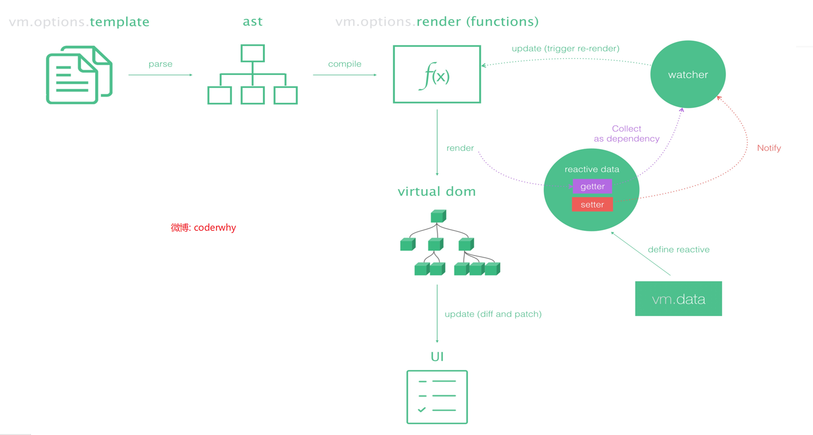
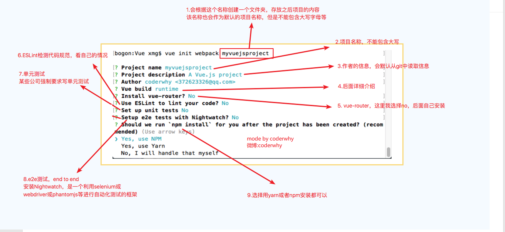
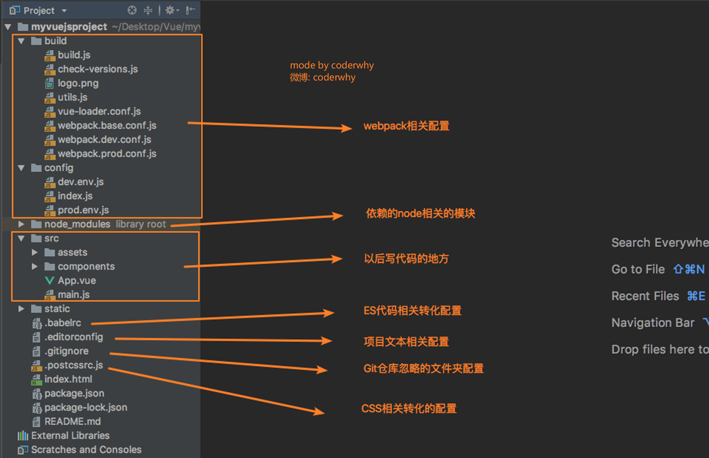
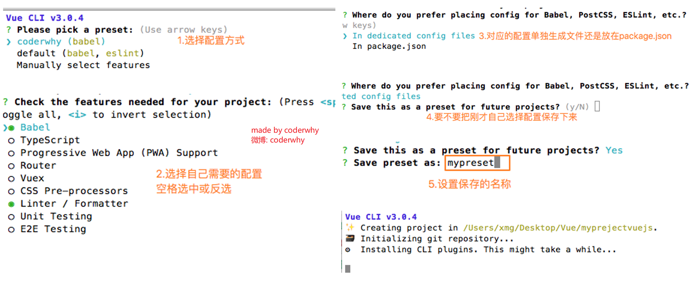
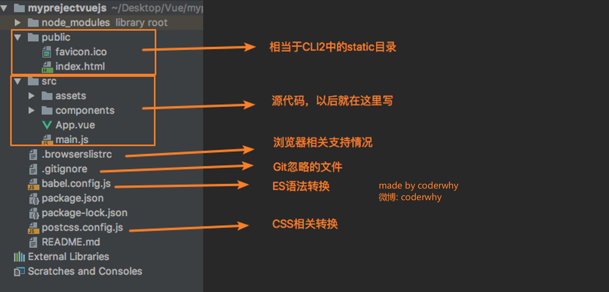
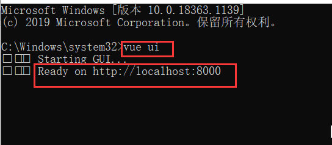
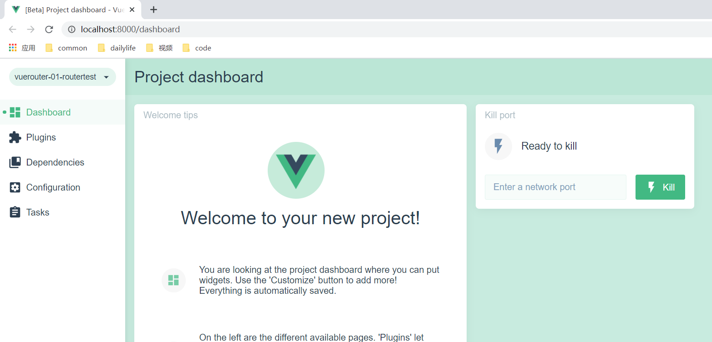
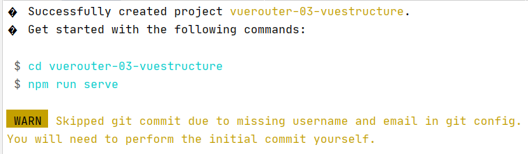
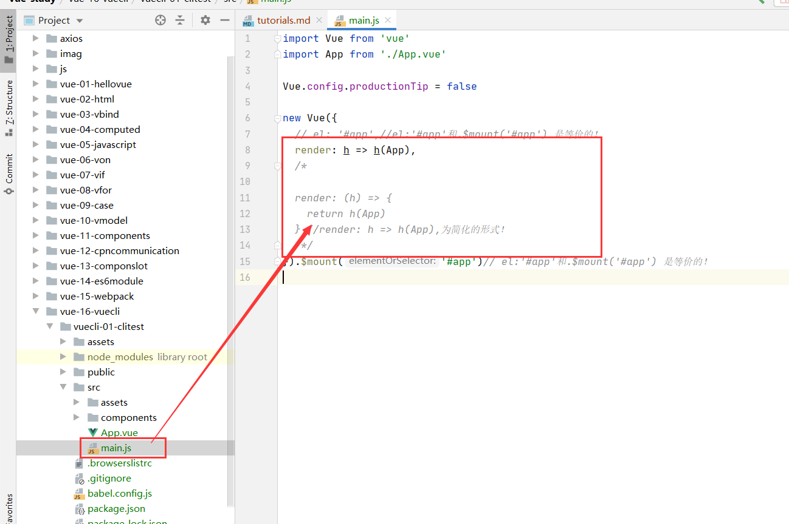

#vuecli
##前期准备
###runtime-only 和 runtime-compiler的区别
***********
####简单总结
* 如果在之后的开发中，你依然使用template,就需要选择runtime-compiler
* 如果你之后的开发中,使用的是.vue文件夹开发,那么可以选择runtime-only
*********
####详情
如果你需要在客户端编译模板(例如,向template 选项传入一个字符串，或者需要将模
板中的非DOM的HTML挂载到一个元素),你需要带有编译器的版本，因而需要完整构建版本。

* 这种情况需要编译器(runtime-compiler)
```vue
new Vue({
template:`<div>{{ hi }}</div>`
})

```
* 这种情况不需要编译器(runtime-compiler)
```vue
new Vue({
render (h) {
return h('d1v', this.h1)
})
```
*****

####分析
* runtime-only和runtime-compiler为什么存在这样的差异呢？

我们需要先理解Vue应用程序是如何运行起来的。Vue中的模板如何最终渲染成真实DOM。
 

* template -> ast -> render -> vdom -> 真实DOM
* render: (h) => h, -> createElement


####小结
* 在使用vue-loader 或vueify时,*.vue文件中的模板会在构建时(build time)预编译
(pre-compile)为JavaScript。最终生成的bundle中你不再需要编译器(compiler),因此可以
直接使用只含有运行时的构建版本(runtime-only)。

* 由于只含有运行时构建版本(runtime-only)比完整构建版本(runtime-compiler)轻量大约30%，你应该
尽可能使用只含有运行时的构建版本。如果你还是希望使用完整构建版本,则需要在打包器中配置别名。

**********
##安装vue-cli
###vue-cli
* 引言

开发大型项目的时候你需要并且必然需要使用Vue CLI。使用Vue.js开发大型应用时，我们需要考虑代码目录结构、项目结构和部署、热加载、代码单元测试等事情。
如果每个项目都要手动完成这些工作，那无以效率比较低效，所以通常我们会使用一些脚手架工具来帮助完成这些事情。
* CLI是什么意思?

CLI是Command-Line Interface, 翻译为命令行界面, 但是俗称脚手架.Vue Cli是一个官方发布 vue.js 项目脚手架。
使用vue-cli 可以快速搭建Vue开发环境以及对应的webpack配置.
* 脚手架长什么样子(脚手架是建筑名词)?

****
###安装vue-cli
####前期准备
* Vue CLI使用前提 - Node
* Vue CLI使用前提 - Webpack

####安装
npm install -g  @vue/cli@3.2.1
* 如果报错记得删除npm cache

*****
###vue-cli3部署项目
* vue-cli3是基于webpack 4打造,vue-cli2还是webapck 3
* vue-cli3的设计原则是“零配置”,移除的配置文件根目录下的build和config等目录
* vue-cli3 提供了vue ui命令,提供了可视化配置,更加人性化
* 移除了static文件夹，新增了public文件夹，并且index.html移动到public中
#####vuecli2



#####vuecli3




****
###vue-cli 配置
* 我们有一个疑惑,vue-cli 3 把配置文件放哪了？

在控制台(terminal)启动配置服务器: vue ui





###注意事项
* 构建完项目vuecli-01-clitest
```vue
 $ cd vuecli-01-clitest
 
 $ npm run serve
```


* main.js分析
```vue
import Vue from 'vue'
import App from './App.vue'

Vue.config.productionTip = false

new Vue({
  render: h => h(App),
}).$mount('#app')//el:'#app'和.$mount('#app') 是等价的！

```
```vue
import Vue from 'vue'
import App from './App.vue'

Vue.config.productionTip = false

new Vue({
  el:'#app',//el:'#app'和.$mount('#app') 是等价的！
  render: h => h(App),
})

```

*****
###补充知识
* Javascript箭头函数
```vue
import Vue from 'vue'
import App from './App.vue'

Vue.config.productionTip = false

new Vue({
  // el: '#app',//el:'#app'和.$mount('#app') 是等价的！
  render: h => h(App),
  /*
  
  render: (h) => {
    return h(App)
  },//render: h => h(App),为简化的形式！
   */
}).$mount('#app')// el:'#app'和.$mount('#app') 是等价的！

```


