#vue-router
##路由
* 路由（routing）就是通过互联的网络把信息从源地址传输到目的地址的活动. --- 维基百科
* 路由器提供了两种机制: 路由和转送.
* 路由是决定数据包从来源到目的地的路径.
* 转送将输入端的数据转移到合适的输出端.
* 路由中有一个非常重要的概念叫路由表.
* 路由表本质上就是一个映射表, 决定了数据包的指向.
***
##后端路由
###什么是后端路由
* 早期的网站开发整个HTML页面是由服务器来渲染的.服务器直接生产渲染好对应的HTML页面, 返回给客户端进行展示.
但是, 一个网站这么多页面服务器如何处理呢?一个页面有自己对应的网址, 也就是URL.
URL会发送到服务器, 服务器会通过正则对该URL进行匹配, 并且最后交给一个Controller进行处理.
Controller进行各种处理, 最终生成HTML或者数据, 返回给前端.这就完成了一个IO操作.
###后端路由图示
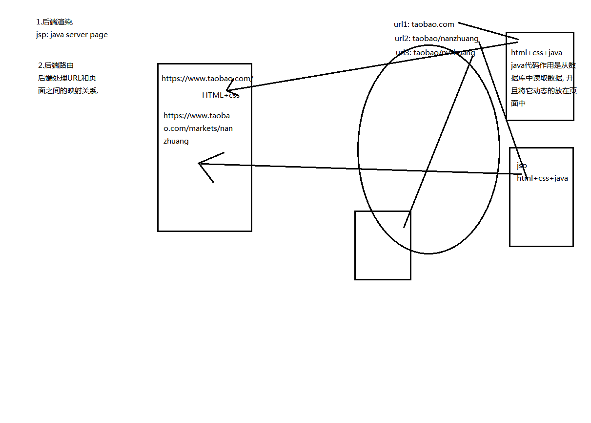

###后端路由的缺点:
* HTML代码和数据以及对应的逻辑会混在一起, 编写和维护都是非常糟糕的事情.

***
##前后端分离阶段
###简介
* 随着Ajax的出现, 有了前后端分离的开发模式.
后端只提供API来返回数据, 前端通过Ajax获取数据, 并且可以通过JavaScript将数据渲染到页面中.
这样做最大的优点就是前后端责任的清晰, 后端专注于数据上, 前端专注于交互和可视化上.
并且当移动端(iOS/Android)出现后, 后端不需要进行任何处理, 依然使用之前的一套API即可.
###前后端分离阶段图示
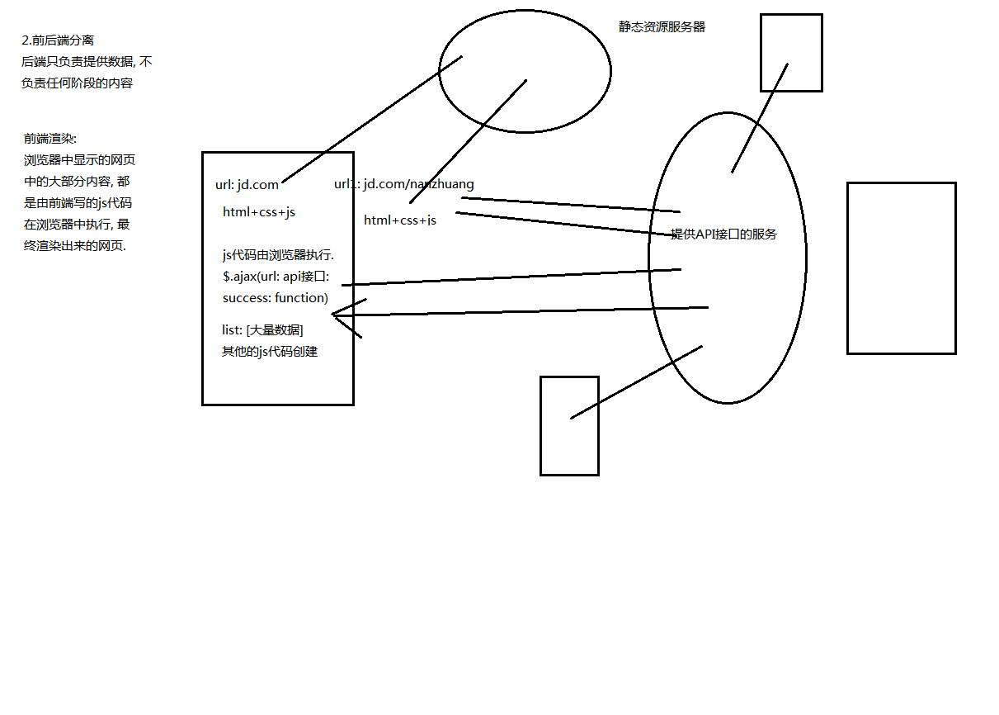
***
##前端路由阶段
###单页面富应用阶段(SPA)
* 其实SPA(single page application)最主要的特点就是在前后端分离的基础上加了一层前端路由.
* 前端路由的核心是什么呢？改变URL，但是页面不进行整体的刷新。

###SPA图示
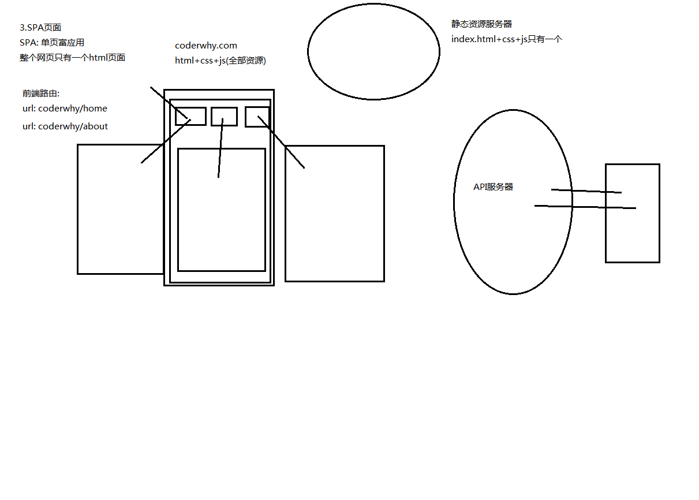
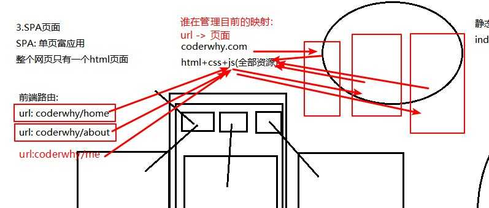

##hash和history
###URL的hash
URL的hash也就是锚点(#), 本质上是改变window.location的href属性.我们可以通过直接赋值location.hash来改变href, 但是页面不发生刷新
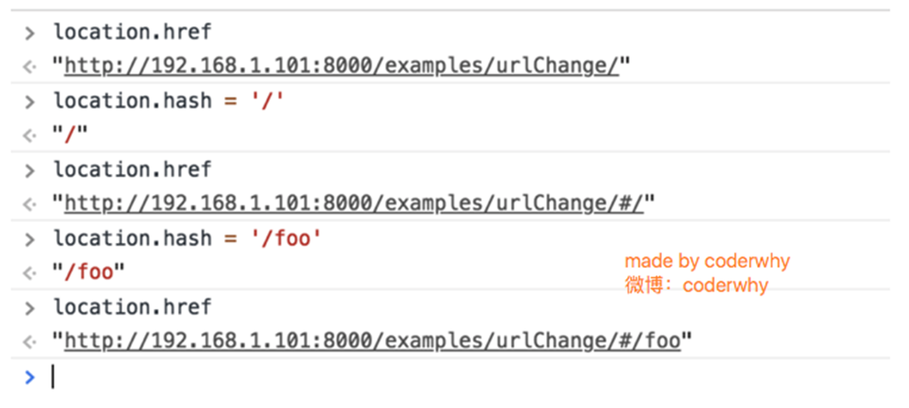
###HTML5的history模式
* history接口是HTML5新增的, 它有五种模式改变URL而不刷新页面.
####history.pushState()
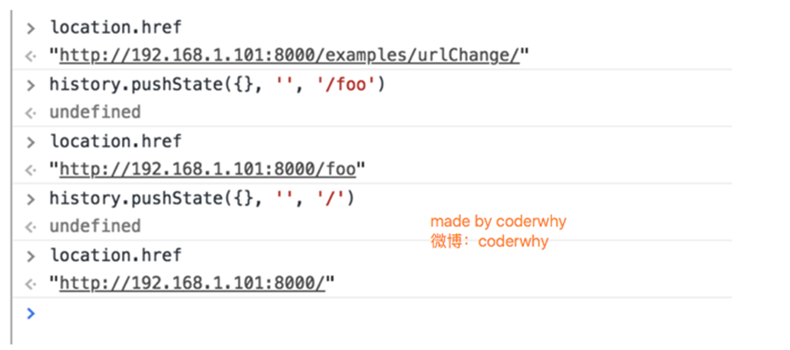
####history.replaceState()
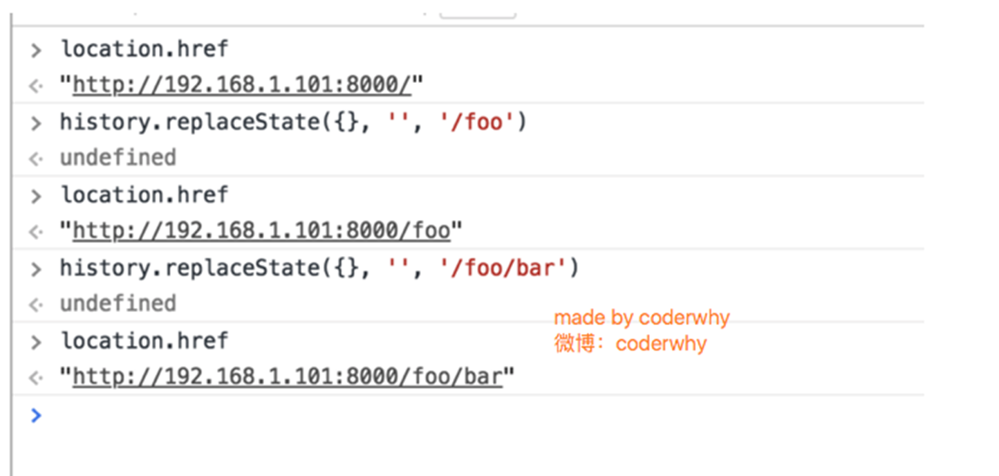
####history.go()
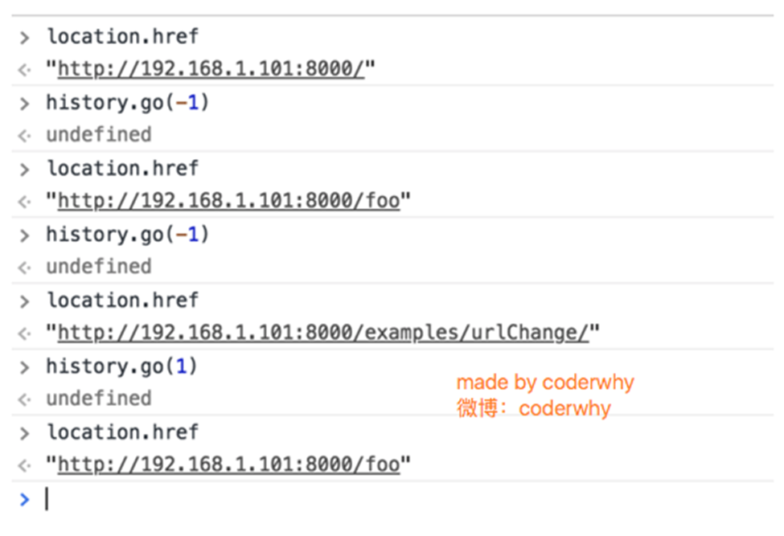
####补充说明：
* history.back() 等价于 history.go(-1)
* history.forward() 则等价于 history.go(1)
* 这三个接口等同于浏览器界面的前进后退

***
##vue-router
###简介
* vue-router是Vue.js官方的路由插件，它和vue.js是深度集成的，适合用于构建单页面应用。
vue-router是基于路由和组件的。路由用于设定访问路径, 将路径和组件映射起来.
在vue-router的单页面应用中, 页面的路径的改变就是组件的切换.
###安装
步骤一: 安装vue-router(如果通过vue-cli构建工程,直接在构建项目的时候勾选vue-router即可,不需要我们手动执行命令)
```vue
npm install vue-router --save

```
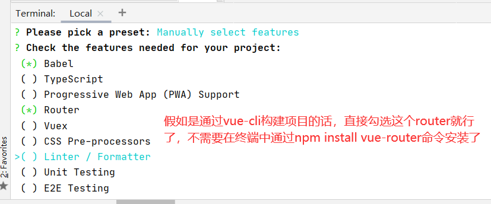


步骤二: 在模块化工程中使用它(因为是一个插件, 所以可以通过Vue.use()来安装路由功能)

第一步：导入路由对象，并且调用 Vue.use(VueRouter)
```vue
//配置路由相关信息
//1.通过Vue.use()安装vue-router插件
import VueRouter from 'vue-router';//因为我们要使用vue-router,所以要导入vue-router相关的包
import Vue from 'vue';//为什么要导入vue呢？因为vue-router是vue的一个插件,安装插件需要用到Vue.use(),因此我们需要导入vue
Vue.use(VueRouter);
```
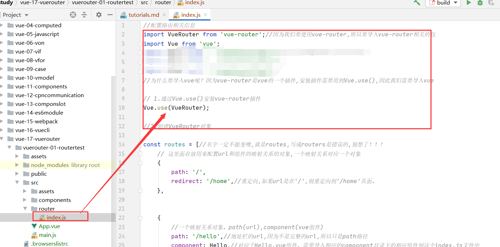

第二步:创建路由实例，并且传入路由映射配置
```vue
//2.创建VueRouter对象
const routes = [//名字一定不能变噢,就是routes,写成routers是错误的,别想了！！！
    // 这里面存放用来配置url和组件的映射关系的对象,一个映射关系对应一个对象

    {
        //一个映射关系对象。path(url),component(vue组件)
        path: '/hello',//地址栏的url,因为不是完整的url,所以只是path路径
        component: Hello,//对应于Hello.vue组件。需要导入相应的component目录下的相应组件到这个index.js文件中
    },


    {
        path: '/about',
        component: About,
    },


    {
        path: '/home',
        component: Home,
    },


];// 对应于router对象里面的routes数组
const router = new VueRouter({

  //配置路由(也就是url,或者说是path)和组件之间的关系
  /*
  routes: [
       // 我们习惯把这个数组对象抽离出去,在这个里面只保留routes这个数组名,这样看着舒服些
         这里面存放用来配置url和组件的映射关系的对象
  ],

   */

    routes,//是routes:routes 的简写。routes定义在外面看着简洁(这里的名字是不能改的,就是routes!!!!!!!!!!!!)

});

```
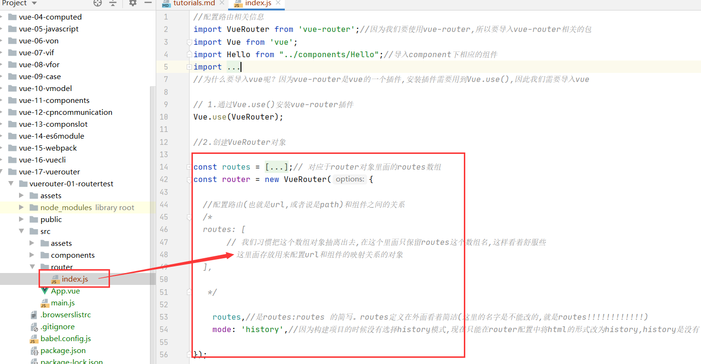


第三步:在Vue实例中挂载创建的路由实例
```vue
import Vue from 'vue'
import App from './App.vue'
//4.导入router
import router from './router';//和 import router from './router/index.jsp';等价。当我们导入的是目录的时候,会自动地去找index.js文件。所以可以简写为import router from './router';


Vue.config.productionTip = false

new Vue({
  router,  //等价于 router: router,//将router挂载在vue实例下面,表示使用new出来的router对象了！
  render: h => h(App),//render会替换 '#app',而render里面是App.vue组件,即App.vue会替换'#app'
}).$mount('#app')

```
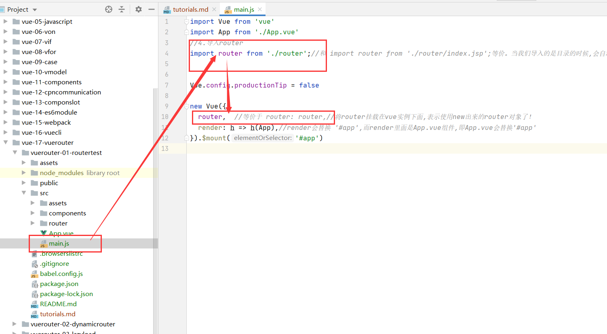


步骤三:使用vue-router

第一步: 创建路由组件
* 在component目录下面创建vue组件(Home.vue,About.vue,Hello.vue)
```vue
<template>
  <div>
    <h4>This is an about page</h4>
  </div>
</template>

<script>
  export default {
    name: "About"
  }
</script>

<style scoped>

</style>
```
```vue
<template>
  <div>
    <h4>This is a hello page</h4>
  </div>
</template>

<script>
  export default {
    name: "Hello"
  }
</script>

<style scoped>

</style>
```

```vue

<template>
  <div>
    <h4>This is a home page</h4>
  </div>
</template>

<script>
  export default {
    name: "Home"
  }
</script>

<style scoped>

</style>
```

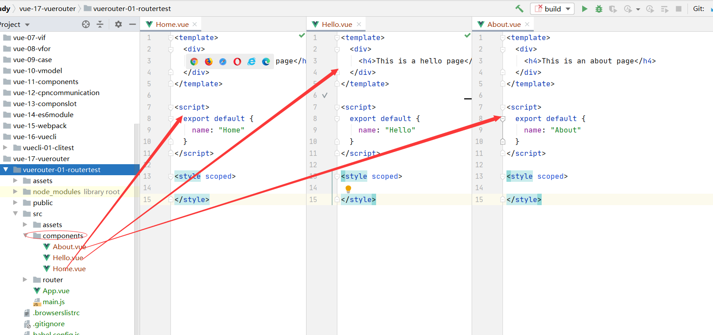


第二步: 配置路由映射: 组件和路径映射关系
* 在routes对象数组中添加组件的路径映射关系
```vue
const routes = [//名字一定不能变噢,就是routes,写成routers是错误的,别想了！！！
    // 这里面存放用来配置url和组件的映射关系的对象,一个映射关系对应一个对象

    {
        //一个映射关系对象。path(url),component(vue组件)
        path: '/hello',//地址栏的url,因为不是完整的url,所以只是path路径
        component: Hello,//对应于Hello.vue组件。需要导入相应的component目录下的相应组件到这个index.js文件中
    },


    {
        path: '/about',
        component: About,
    },


    {
        path: '/home',
        component: Home,
    },


];// 对应于router对象里面的routes数组
const router = new VueRouter({

  //配置路由(也就是url,或者说是path)和组件之间的关系
  /*
  routes: [
       // 我们习惯把这个数组对象抽离出去,在这个里面只保留routes这个数组名,这样看着舒服些
         这里面存放用来配置url和组件的映射关系的对象
  ],

   */

    routes,//是routes:routes 的简写。routes定义在外面看着简洁(这里的名字是不能改的,就是routes!!!!!!!!!!!!)

});
```
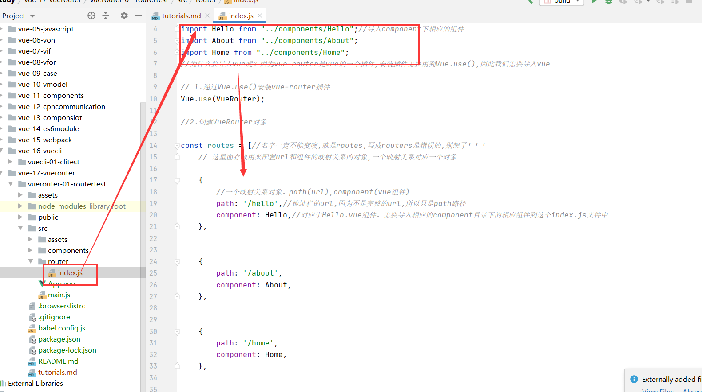

第三步: 使用路由: 通过<router-link>和<router-view>
* 在App.vue中使用vue组件(Home.vue,Hello.vue,About.vue)
```vue
<template>
  <div id="app">
    <div id="nav">

      <router-link to="/hello">你好</router-link>|
      <router-link to="/home">首页</router-link>|
      <router-link to="/about">关于</router-link>
      <router-view></router-view>

    </div>

  </div>
</template>

<style>
#app {
  font-family: Avenir, Helvetica, Arial, sans-serif;
  -webkit-font-smoothing: antialiased;
  -moz-osx-font-smoothing: grayscale;
  text-align: center;
  color: #2c3e50;
}

#nav {
  padding: 30px;
}

#nav a {
  font-weight: bold;
  color: #2c3e50;
}

#nav a.router-link-exact-active {
  color: #42b983;
}
</style>

```
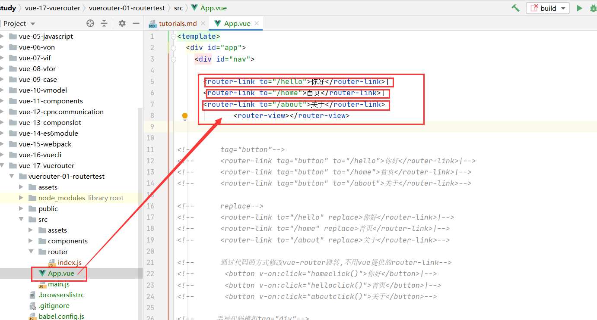

***
####知识补充
* <router-link>: 该标签是一个vue-router中已经内置的组件, 它会被渲染成一个<a>标签.
```vue

```
* <router-view>: 该标签会根据当前的路径, 动态渲染出不同的组件.在路由(url)切换时, 切换的是<router-view>挂载的组件, 其他内容不会发生改变
```vue

```
* 在前面的<router-link>中, 我们只是使用了一个属性: to, 用于指定跳转的路径.
```vue

```
* tag: tag可以指定<router-link>之后渲染成什么组件, 比如上面的代码会被渲染成一个<li>元素, 而不是<a>
```vue
<!--      tag="button"-->
      <router-link tag="button" to="/hello">你好</router-link>|
      <router-link tag="button" to="/home">首页</router-link>|
      <router-link tag="button" to="/about">关于</router-link>
```
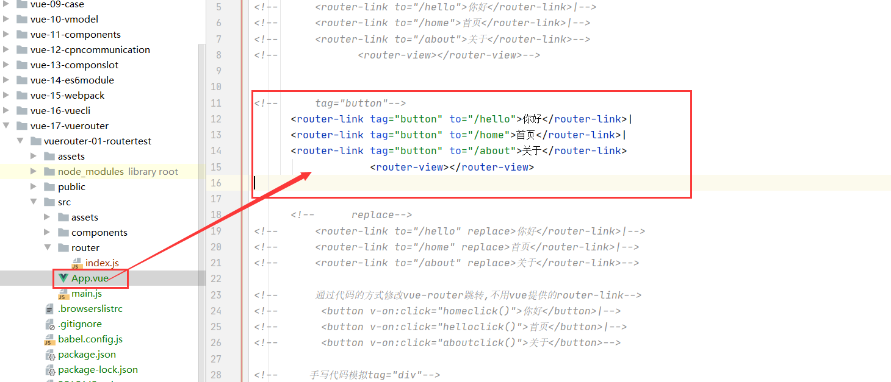


* replace: replace不会留下history记录, 所以指定replace的情况下, 后退键返回不能返回到上一个页面中
```vue
<!--      replace-->
      <router-link to="/hello" replace>你好</router-link>|
      <router-link to="/home" replace>首页</router-link>|
      <router-link to="/about" replace>关于</router-link>

```
* active-class: 当<router-link>对应的路由匹配成功时, 会自动给当前元素设置一个router-link-active的class, 设置active-class可以修改默认的名称。


##通过代码跳转路由
* 通过代码改变路由跳转
```vue

  <template>
    <div id="app">
      <div id="nav">
  
  <!--      tag="a"-->
  <!--      <router-link to="/hello">你好</router-link>|-->
  <!--      <router-link to="/home">首页</router-link>|-->
  <!--      <router-link to="/about">关于</router-link>-->
  
  <!--      tag="button"-->
  <!--      <router-link tag="button" to="/hello">你好</router-link>|-->
  <!--      <router-link tag="button" to="/home">首页</router-link>|-->
  <!--      <router-link tag="button" to="/about">关于</router-link>-->
  
  <!--      replace-->
  <!--      <router-link to="/hello" replace>你好</router-link>|-->
  <!--      <router-link to="/home" replace>首页</router-link>|-->
  <!--      <router-link to="/about" replace>关于</router-link>-->
  
  <!--      通过代码的方式修改vue-router跳转,不用vue提供的router-link-->
         <button v-on:click="homeclick()">你好</button>|
         <button v-on:click="helloclick()">首页</button>|
         <button v-on:click="aboutclick()">关于</button>
  
  <!--     手写代码模拟tag="div"-->
  <!--       <div v-on:click="homeclick()">你好</div>|-->
  <!--       <div v-on:click="helloclick()">首页</div>|-->
  <!--       <div v-on:click="aboutclick">关于</div>-->
         <router-view></router-view>
  
      </div>
  
    </div>
  </template>
  
  <script>
    export default {
      name: 'App',
      methods: {
  
        //不要直接用history来修改,需要通过router代理分发。
        //vue在每一个组件里面都加了一个$router这个属性(这个属性没有显式地在data(),但是确实存在vue源码中),我们可以通过$router修改vue-router跳转
        homeclick() {
          console.log('homeclick');
          // this.$router.push('/home');//$router是vue为每一个vue实例提供地属性,可以直接用
          this.$router.replace('/home');//$router是vue为每一个vue实例提供地属性,可以直接用
        },
  
        helloclick() {
          console.log('helloclick');
          // this.$router.push('/hello');//$router是vue为每一个vue实例提供地属性,可以直接用
          this.$router.replace('/hello');//$router是vue为每一个vue实例提供地属性,可以直接用
  
        },
  
        aboutclick() {
          console.log('aboutclick');
          // this.$router.push('/about');//$router是vue为每一个vue实例提供地属性,可以直接用
          this.$router.replace('/about');//$router是vue为每一个vue实例提供地属性,不能返回上一页。
  
        },
      },
    }
  
  </script>
  
  <style>
  #app {
    font-family: Avenir, Helvetica, Arial, sans-serif;
    -webkit-font-smoothing: antialiased;
    -moz-osx-font-smoothing: grayscale;
    text-align: center;
    color: #2c3e50;
  }
  
  #nav {
    padding: 30px;
  }
  
  #nav a {
    font-weight: bold;
    color: #2c3e50;
  }
  
  #nav a.router-link-exact-active {
    color: #42b983;
  }
  </style>

```
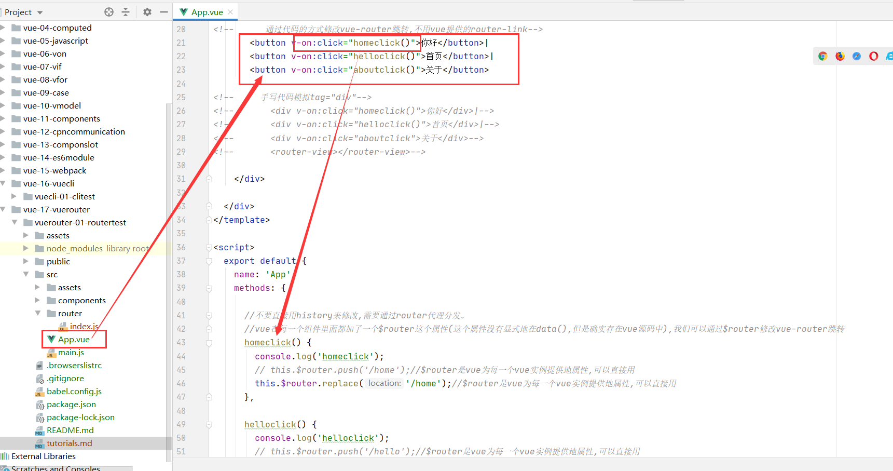

* 改变tag
```vue

<!--      通过代码的方式修改vue-router跳转,不用vue提供的router-link-->
       <button v-on:click="homeclick()">你好</button>|
       <button v-on:click="helloclick()">首页</button>|
       <button v-on:click="aboutclick()">关于</button>

<!--     手写代码模拟tag="div"-->
<!--       <div v-on:click="homeclick()">你好</div>|-->
<!--       <div v-on:click="helloclick()">首页</div>|-->
<!--       <div v-on:click="aboutclick">关于</div>-->
<!--       <router-view></router-view>-->

```
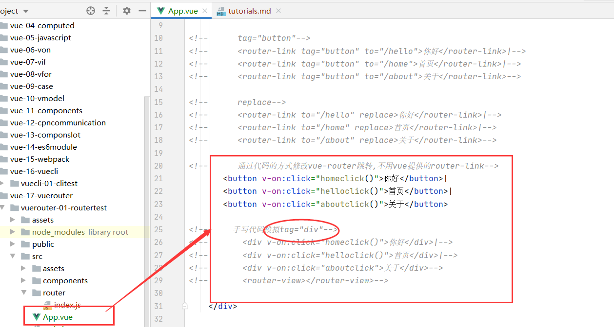
