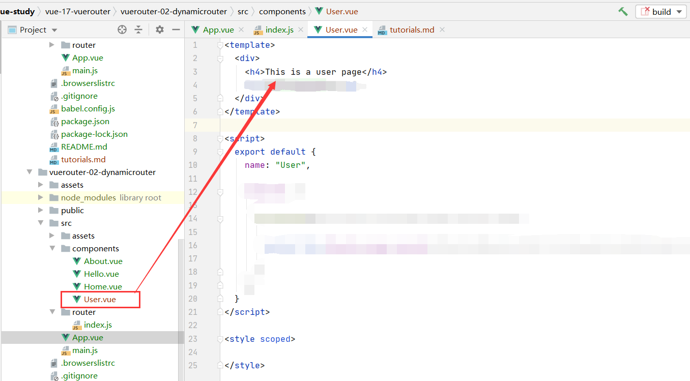
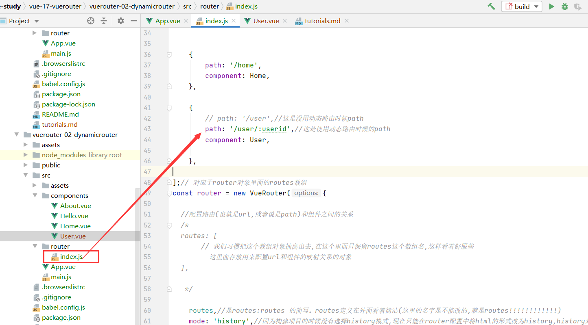
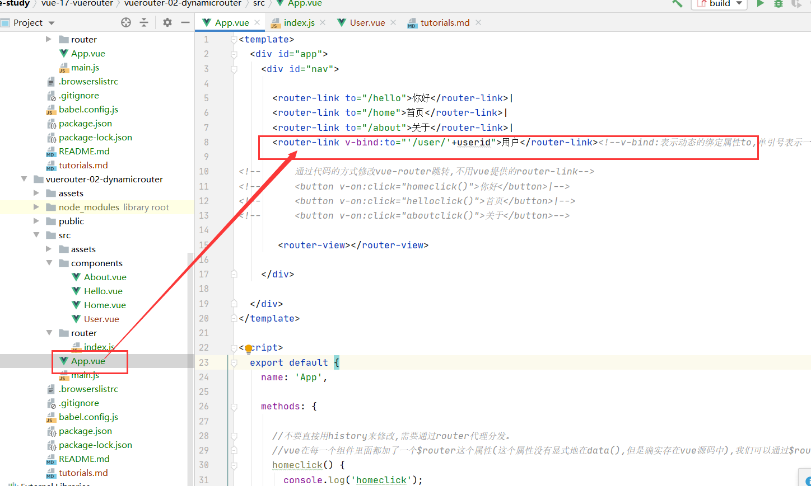
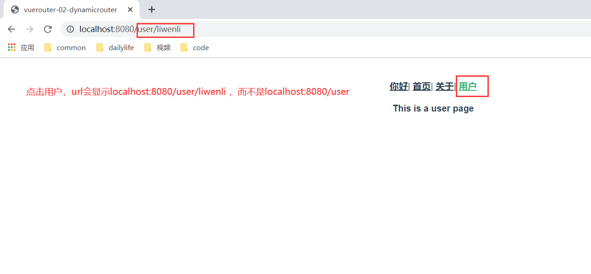
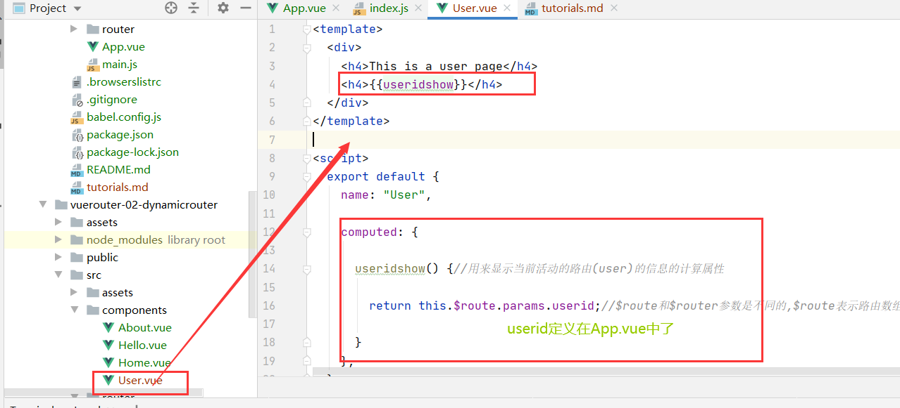
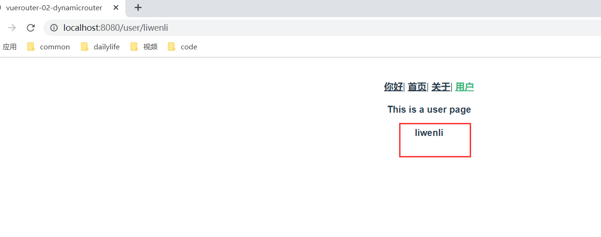

 #dynamic-router
 ##引言
在某些情况下，一个页面的path路径可能是不确定的，比如我们进入用户界面时，希望是如下的路径：/user/liwenli或/user/wangshwei。除了有前面的/user之外，后面还跟上了用户的userid。
这种path和component的匹配关系，我们称之为动态路由(也是路由传递数据的一种方式)。
***
##创建动态路由
###创建User.vue
```vue
<template>
  <div>
    <h4>This is a user page</h4>
  </div>
</template>

<script>
  export default {
    name: "User",

  }
</script>

<style scoped>

</style>
```



###配置路由映射表
```vue

    {
        // path: '/user',//这是没用动态路由时候path
        path: '/user/:userid',//这是使用动态路由时候的path
        component: User,

    },

```


###父组件App.vue中使用User.vue子组件
```vue
     <router-link v-bind:to="'/user/'+userid">用户</router-link><!--v-bind:表示动态的绑定属性to,单引号表示一个真实的字符串，userid是一个变量-->
```


###最终效果


***

##显示哪个user登录
###修改User.vue
```vue

<template>
  <div>
    <h4>This is a user page</h4>
    <h4>{{useridshow}}</h4>
  </div>
</template>

<script>
  export default {
    name: "User",

    computed: {

      useridshow() {//用来显示当前活动的路由(user)的信息的计算属性

        return this.$route.params.userid;//$route和$router参数是不同的,$route表示路由数组(映射表)中的一个路由(因为当前是在User.vue组件下面,那么就会去找User.vue组件对应的路由),$router表示路由对象

      }
    },
  }
</script>

<style scoped>

</style>
```


###最终效果



