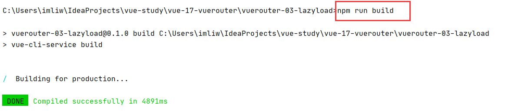
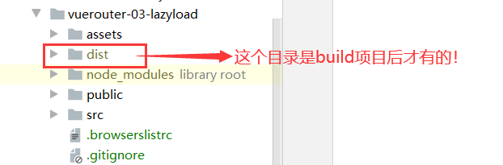
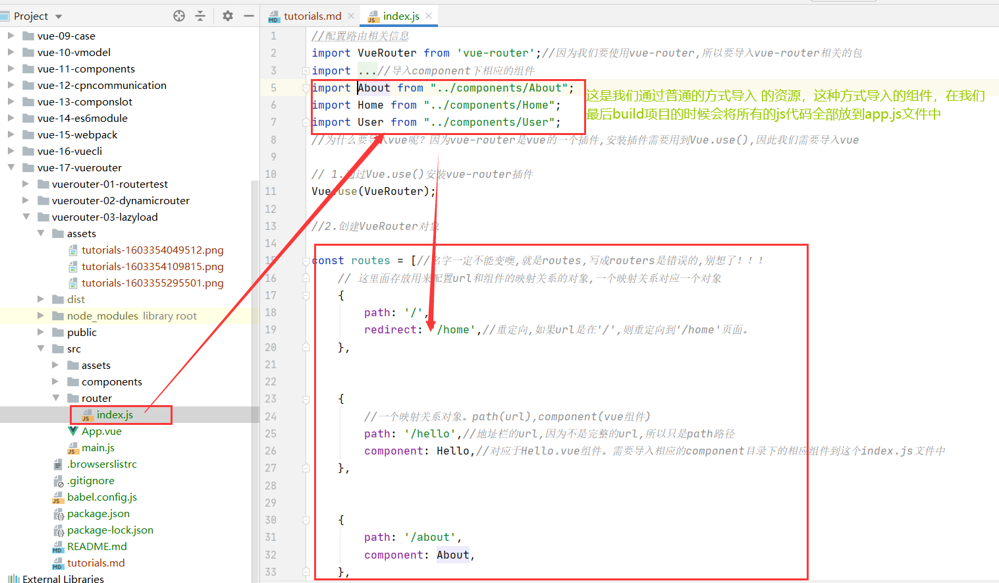
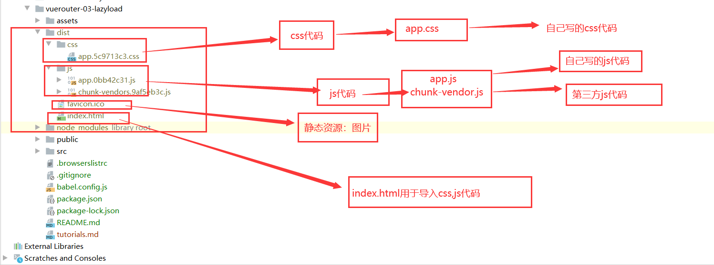
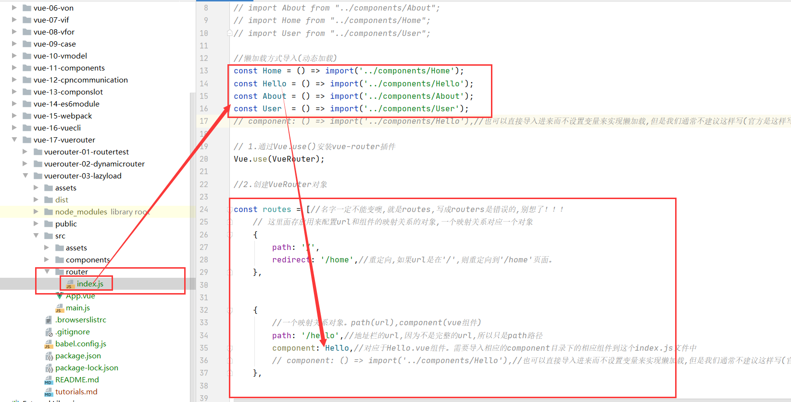
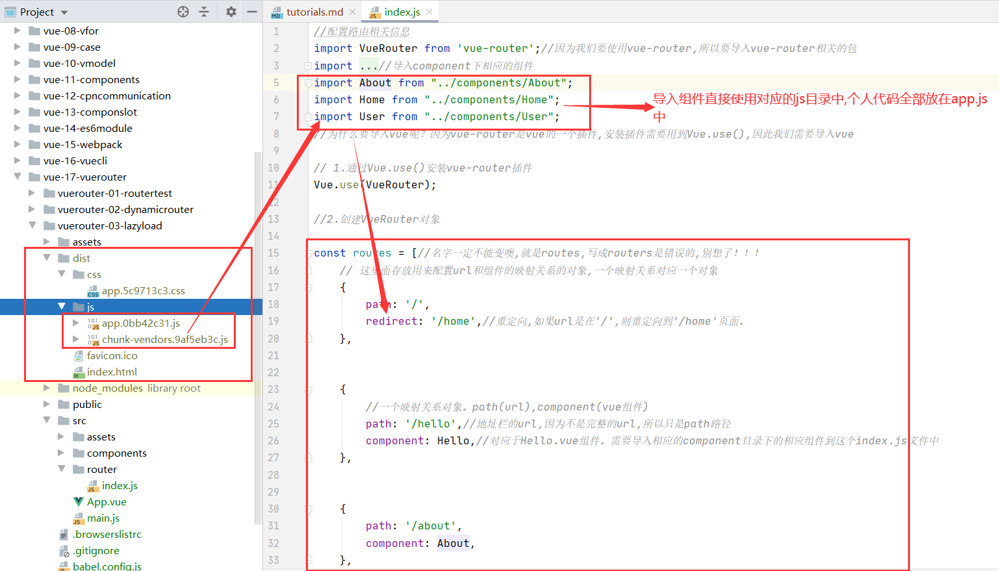
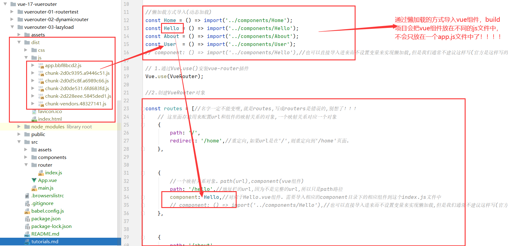

 #lazyload(懒加载)
 ##build目录结构
 ###build项目
 * 我们构建项目后执行了命令 npm run serve 这个命令是开发环境 ，我们现在执行生产命令 npm run build 后会产生一个dist目录。这个目录是我们最后发布的目录
 

###dist目录结构




***
##懒加载
###引言
* 什么是懒加载

当打包构建应用时(build)，Javascript 包会变得非常大，影响页面加载。如果我们能把不同路由对应的组件分割成不同的代码块，然后当路由被访问的时候才加载对应组件，这样就更加高效了
* 懒加载的原理 

路由中通常会定义很多不同的页面，这些页面最后被打包在放在一个js文件中.
但是, 页面这么多放在一个js文件中, 必然会造成这个页面非常的大.
如果我们一次性从服务器请求下来这个页面, 可能需要花费一定的时间, 甚至用户的电脑上还出现了短暂空白的情况.
如何避免这种情况呢? 使用路由懒加载就可以了.

* 路由懒加载做了什么?

路由懒加载的主要作用就是将路由对应的组件打包成一个个的js代码块.
只有在这个路由被访问到的时候, 才加载对应的组件

###懒加载的实现
* 实现方式有三种，但是我们只要掌握es6的一种就行

方式一: 结合Vue的异步组件和Webpack的代码分析.
```vue
const Home = resolve => { require.ensure(['../components/Home.vue'], () => { resolve(require('../components/Home.vue')) })};

```

方式二: AMD写法
```vue
const About = resolve => require(['../components/About.vue'], resolve);

```
方式三: 在ES6中, 我们可以有更加简单的写法来组织Vue异步组件和Webpack的代码分割.

```vue
const Home = () => import('../components/Home.vue')

```


###对比
* 直接导入相应组件后直接使用


* 使用es6实现懒加载



