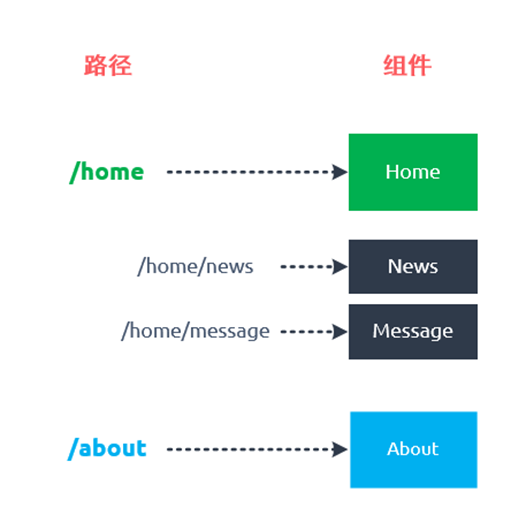
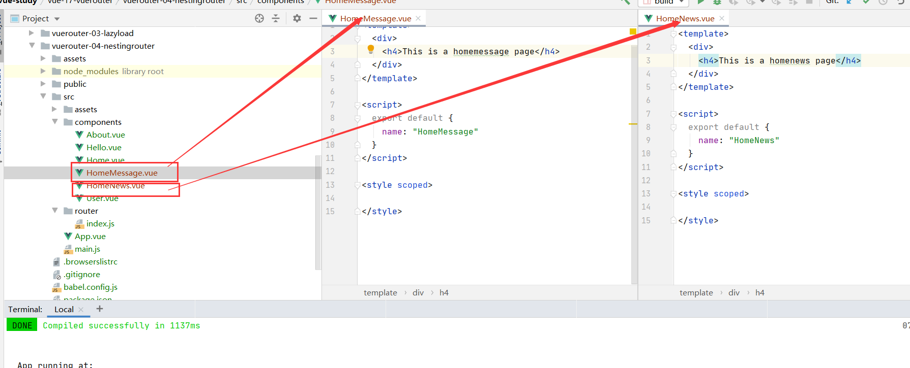
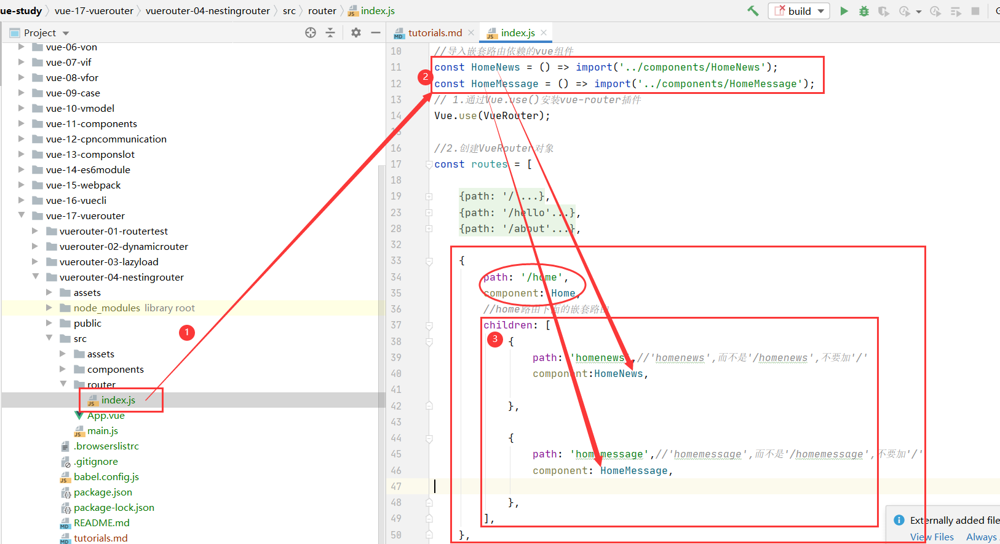
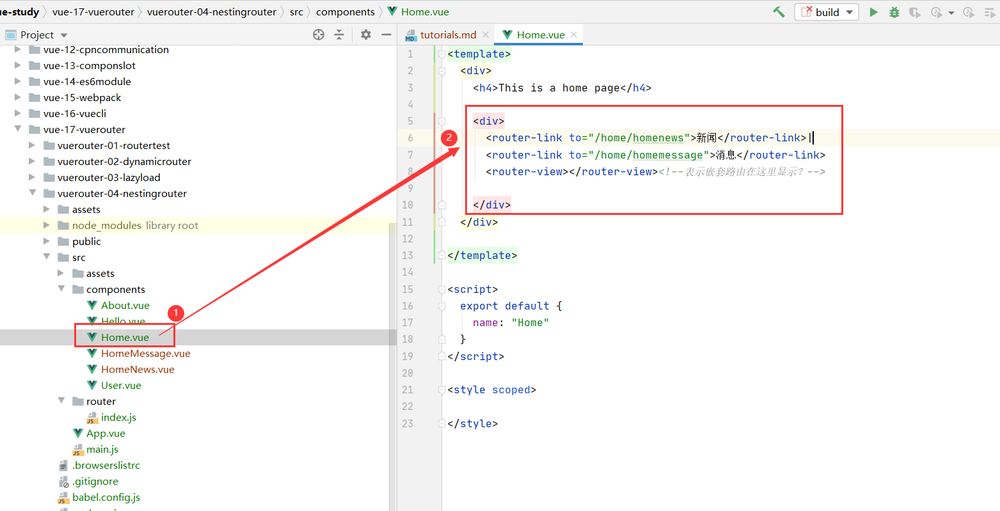
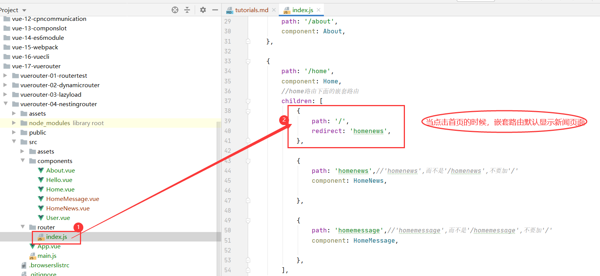
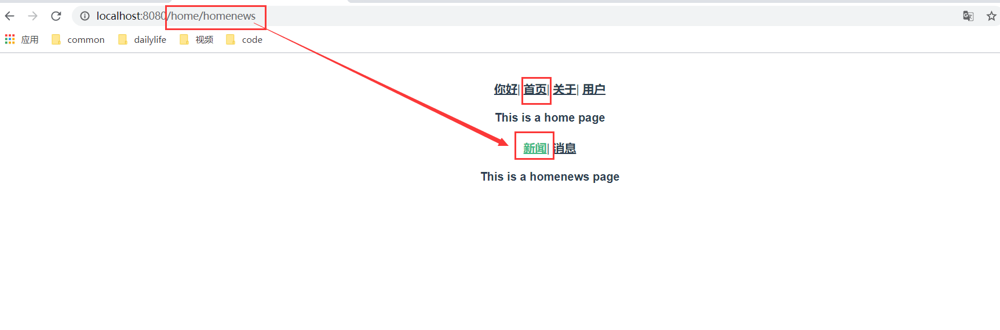

#nest-router(嵌套路由)
##认识嵌套路由
* 嵌套路由很常见，比如在home页面中，我们希望通过/home/news和/home/message

##实现嵌套路由
* 创建对应的子组件。
```vue
<template>
  <div>
    <h4>This is a homemessage page</h4>
  </div>
</template>

<script>
  export default {
    name: "HomeMessage"
  }
</script>

<style scoped>

</style>
```

```vue
<template>
  <div>
    <h4>This is a homenews page</h4>
  </div>
</template>

<script>
  export default {
    name: "HomeNews"
  }
</script>

<style scoped>

</style>
```

***
* 在路由映射中配置对应的子路由。

```vue
//导入嵌套路由依赖的vue组件
const HomeNews = () => import('../components/HomeNews');
const HomeMessage = () => import('../components/HomeMessage');

```
```vue
{
        path: '/home',
        component: Home,
        //home路由下面的嵌套路由
        children: [
            {
                path: 'homenews',//'homenews',而不是'/homenews',不要加'/'
                component:HomeNews,

            },

            {
                path: 'homemessage',//'homemessage',而不是'/homemessage',不要加'/'
                component: HomeMessage,

            },
        ],
    },
```

***
* 在组件内部(父路由home)使用<router-view>标签。
```vue
<template>
  <div>
    <h4>This is a home page</h4>

    <div>
      <router-link to="/home/homenews">新闻</router-link>|
      <router-link to="/home/homemessage">消息</router-link>
      <router-view></router-view><!--表示嵌套路由在这里显示？-->

    </div>
  </div>

</template>

<script>
  export default {
    name: "Home"
  }
</script>

<style scoped>

</style>
```


* 设置默认嵌套路由

```vue
   {
                path: '/',
                redirect: 'homenews',
            },

```

***
##嵌套路由展示


