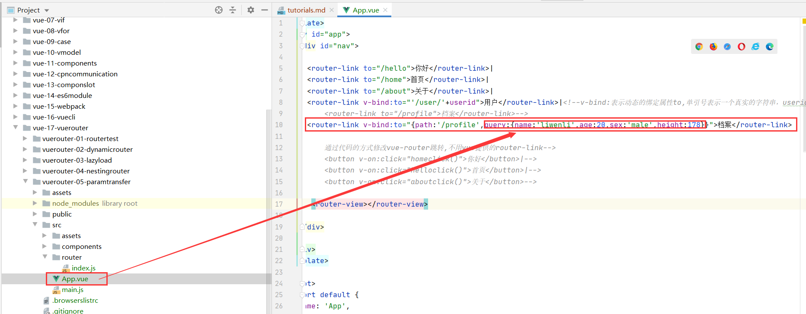

# Parameter transfer
##参数传递
* 传递参数主要有两种类型: params和query
###params
* 配置路由格式: /router/:id
* 传递的方式: 在path后面跟上对应的值
* 传递后形成的路径: /router/123, /router/abc

###query(本章节)
* 配置路由格式: /router, 也就是普通配置
* 传递的方式: 对象中使用query的key作为传递方式
* 传递后形成的路径: /router?id=123, /router?id=abc

##query(<router-link>)
###前期准备
* 添加一个profile.vue组件
```vue

<template>
  <div>
    <h4>This is profile page</h4>

  </div>
</template>

<script>
  export default {
    name: "Profile"
  }
</script>

<style scoped>

</style>
```


* 配置路由映射 
```vue
//参数传递依赖的vue组件
const Profile = () => import('../components/Profile');

```

```vue
 {
        path:'/profile',
        component: Profile,

    },

```


* 添加跳转的<router-link> 
```vue
  <router-link to="/profile">档案</router-link>
```


***

###通过query传递参数
* 修改<router-link> 
```vue
  <router-link to="/profile">档案</router-link>
    // router-link 标签的to属性的值是一个字符串，但是字符串不能传递参数，所以我们需要将to属性值改为对象。
```
```vue
   <router-link v-bind:to="{path:'/profile'}">档案</router-link>
    //要想to 属性的值是对象，就必须要通过v-bind:绑定to属性
```


* 添加to属性中添加query对象
```vue
  <router-link v-bind:to="{path:'/profile',query:{name:'liwenli',age:20,sex:'male',height:178}}">档案</router-link>
```

* 获取参数
```vue
 <h4>{{$route.query.name}}</h4>
    <h4>{{$route.query.age}}</h4>
    <h4>{{$route.query.sex}}</h4>
    <h4>{{$route.query.height}}</h4>
```


* query传递参数展示


***

##query(javascript)
* 前面通过router-link实现了query参数传递，现在我们通过javascript代码实现
###前期准备
* 添加一个profile.vue组件
```vue

<template>
  <div>
    <h4>This is profile page</h4>

  </div>
</template>

<script>
  export default {
    name: "Profile"
  }
</script>

<style scoped>

</style>
```


* 配置路由映射 
```vue
//参数传递依赖的vue组件
const Profile = () => import('../components/Profile');

```

```vue
 {
        path:'/profile',
        component: Profile,

    },

```


* 添加跳转的<router-link> 
```vue
  <router-link to="/profile">档案</router-link>
```


***
###通过query传递参数
```vue
<!--      通过javascript实现query的传递参数-->
      <button v-on:click="profileclick()" v-bind:to="{path:'/profile',query:{name:'liwenli',age:20,sex:'male',height:178}}">档案</button>
```
```vue
  profileclick() {
        console.log('profileclick');
        this.$router.push({

          path: '/profile',
          query: {
            name: 'liwenli',
            age: 20,
            sex:'male',
            height: 178,
          },
        });
      },
```


###获取参数
* 获取参数通过$route对象获取的.
```vue
<!--    注意这里是{{$route.query.name}}，而不是{{$route.params.name}}，因为这里是query传递参数而不是params传递参数！！-->
    <h4>{{$route.query}}</h4>
    <h4>{{$route.query.name}}</h4>
    <h4>{{$route.query.age}}</h4>
    <h4>{{$route.query.sex}}</h4>
    <h4>{{$route.query.height}}</h4>
```


###query传递参数展示


##$route和$router
* $router为VueRouter实例，想要导航到不同URL，则使用$router.push方法
* $route为当前router跳转对象里面可以获取name、path、query、params等 

