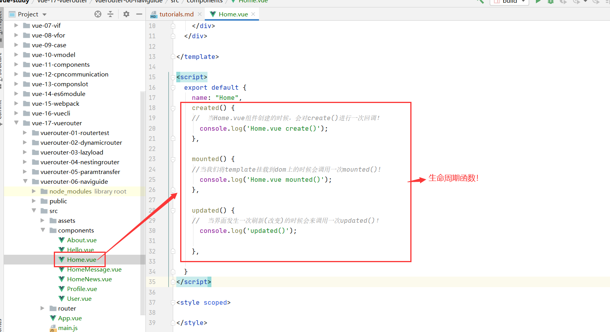
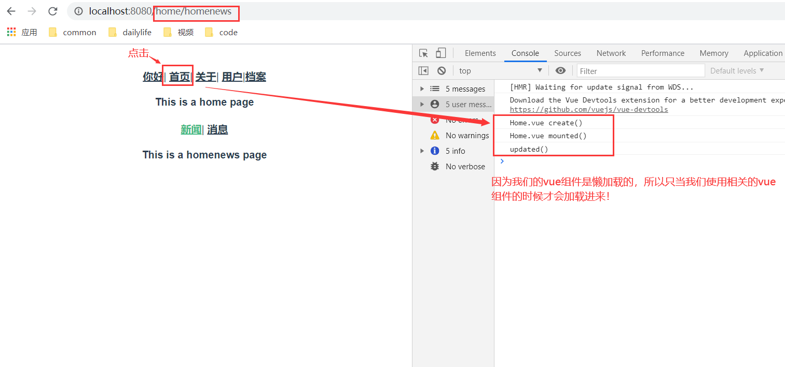
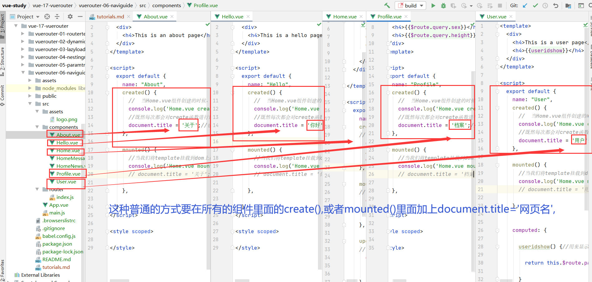
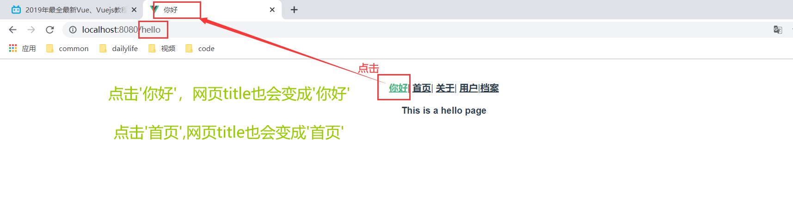
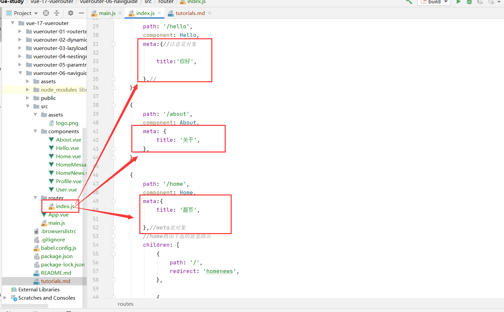
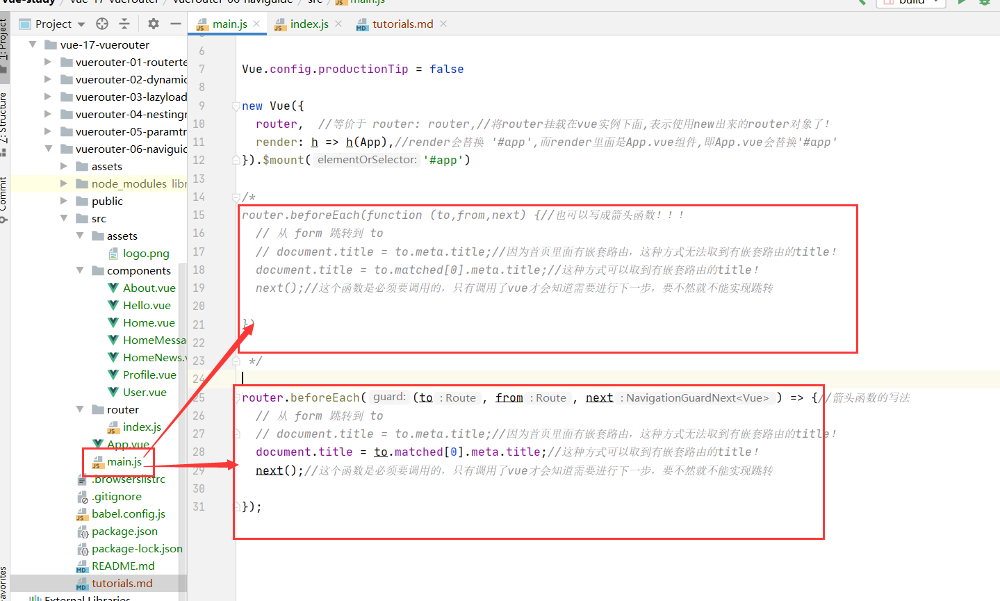
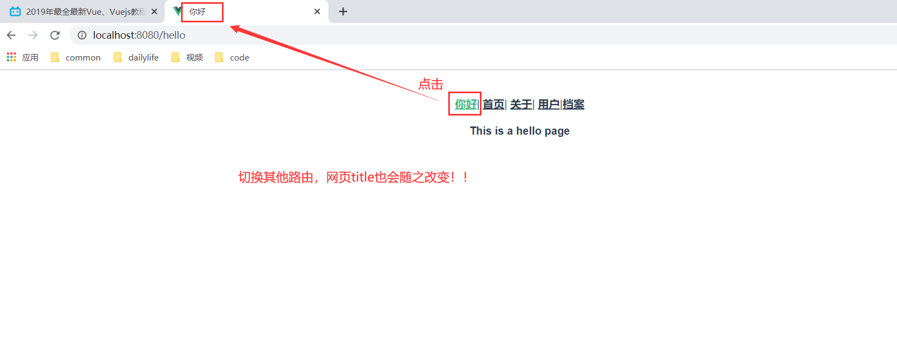

#NavigationGuard
##vue生命周期
```vue
created() {
    //  当Home.vue组件创建的时候，会对create()进行一次回调！
      console.log('Home.vue create()');
    },

    mounted() {
    //当我们将template挂载到dom上的时候会调用一次mounted()!
      console.log('Home.vue mounted()');
    },

    updated() {
    //  当界面发生一次刷新(改变)的时候会来调用一次updated()！
      console.log('updated()');

    },

```


***

##修改网页的title
###引言
网页标题是通过title标签来显示的, 但是SPA只有一个固定的HTML, 切换不同的页面时, 标题并不会改变。
但是我们可以通过JavaScript来修改title标签的内容window.document.title = '新的标题'。
那么在Vue项目中, 在哪里修改? 什么时候修改比较合适呢?

###普通的修改方式
我们比较容易想到的修改标题的位置是每一个路由对应的组件.vue文件中。
通过mounted声明周期函数, 执行对应的代码进行修改即可。
```vue
 created() {
    //  当Home.vue组件创建的时候，会对create()进行一次回调！既然每次都会对create函数进行回调，那么我们可不可以加点自己的"私货",将网页的title改为自己想要的title呢？当然可以！！
      console.log('Home.vue create()');
      //既然每次都会对create函数进行回调，那么我们可不可以加点自己的"私货",将网页的title改为自己想要的title呢？当然可以！！
      document.title = '首页';//也可以放在mounted()函数里面
    },

    mounted() {
    //当我们将template挂载到dom上的时候会调用一次mounted()!
      console.log('Home.vue mounted()');
      // document.title = '首页';

    },

```



但是当页面比较多时, 这种方式不容易维护(因为需要在多个页面执行类似的代码)。
有没有更好的办法呢? 使用导航守卫！

###导航守卫
####导航守卫简介
vue-router提供的导航守卫主要用来监听路由的进入和离开的。vue-router提供了beforeEach和afterEach的钩子函数, 它们会在路由即将改变前和改变后触发。

####使用导航守卫
* 如果你想监听全局的路由跳转，那么你只需要拿到router对象！而router对象里面有一个beforeEach()函数！我们可以利用beforeEach()来完成标题的修改

#####首先, 我们可以在钩子当中定义一些标题, 可以利用meta来定义
```vue
const routes = [

    {
        path: '/',
        redirect: '/home',//重定向,如果url是在'/',则重定向到'/home'页面。
    },

    {

        path: '/hello',
        component: Hello,
        meta:{//注意是对象

            title:'你好',

        },//
    },

    {
        path: '/about',
        component: About,
        meta: {
            title: '关于',
        },
    },

    {
        path: '/home',
        component: Home,
        meta:{
            title: '首页',

        },//meta是对象
        //home路由下面的嵌套路由
        children: [
            {
                path: '/',
                redirect: 'homenews',
            },

            {
                path: 'homenews',//'homenews',而不是'/homenews',不要加'/'
                component: HomeNews,

            },

            {
                path: 'homemessage',//'homemessage',而不是'/homemessage',不要加'/'
                component: HomeMessage,

            },
        ],
    },
    {

        path: '/user/:userid',
        component: User,
        meta:{
            title: '用户',
        },

    },
    {
        path:'/profile',
        component: Profile,
        meta: {
            title: '档案',
        },//注意这里一定是一个对象，而不是字符串

    },
];
```


#####其次, 利用导航守卫,修改我们的标题.
```vue

/*
router.beforeEach(function (to,from,next) {//也可以写成箭头函数！！！
  // 从 form 跳转到 to
  // document.title = to.meta.title;//因为首页里面有嵌套路由，这种方式无法取到有嵌套路由的title！
  document.title = to.matched[0].meta.title;//这种方式可以取到有嵌套路由的title！
  next();//这个函数是必须要调用的，只有调用了vue才会知道需要进行下一步，要不然就不能实现跳转

})

 */

router.beforeEach((to, from, next) => {//箭头函数的写法
  // 从 form 跳转到 to
  // document.title = to.meta.title;//因为首页里面有嵌套路由，这种方式无法取到有嵌套路由的title！
  document.title = to.matched[0].meta.title;//这种方式可以取到有嵌套路由的title！
  next();//这个函数是必须要调用的，只有调用了vue才会知道需要进行下一步，要不然就不能实现跳转

});
```


* 导航守卫的三个参数解析:
  * to: 即将要进入的目标的路由对象.
  * from: 当前导航即将要离开的路由对象.
  * next: 调用该方法后, 才能进入下一个钩子.

***
####导航守卫修改title展示


