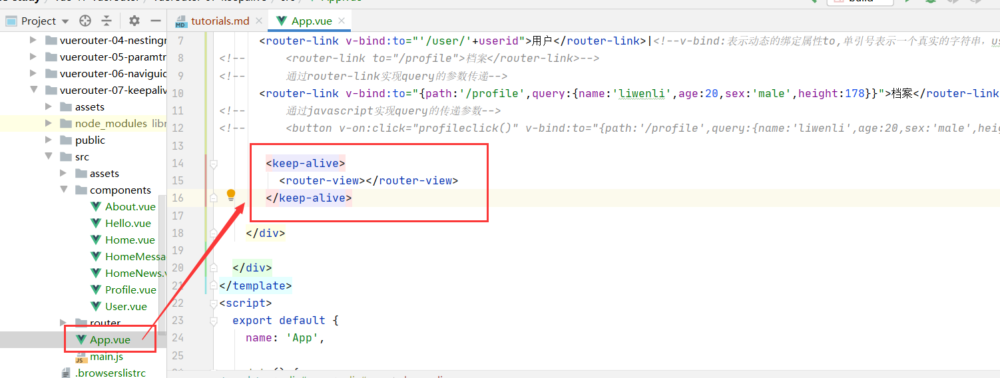
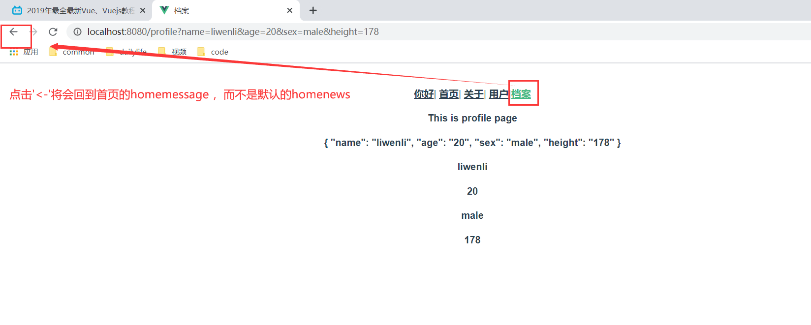
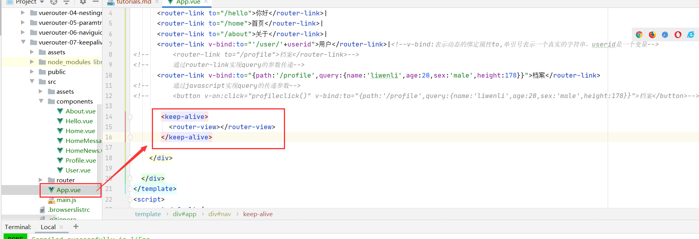

 #keep-alive
 ##keep-alive简介
 keep-alive 是 Vue 内置的一个组件，可以使被包含的组件保留状态，或避免重新渲染。
 ```vue
<keep-alive>
  <component>
    <!-- 该组件将被缓存！ -->
  </component>
</keep-alive>
```
 ##keep-alive的使用
```vue

       <keep-alive>
 <!-- 所有路径匹配到的视图组件都会被缓存！ -->
         <router-view></router-view>
       </keep-alive>

```

* 效果



 ##keep-alive属性
 
* include - 字符串或正则表达，只有匹配的组件会被缓存

```vue
// 组件 a
export default {
  name: 'a',
  data () {
    return {}
  }
}
```
```vue
<keep-alive include="a">
  <component>
    <!-- name 为 a 的组件将被缓存！ -->
  </component>
</keep-alive>
<!--可以保留它的状态或避免重新渲染-->
```
* exclude - 字符串或正则表达式，任何匹配的组件都不会被缓存
```vue
// 组件 a
export default {
  name: 'a',
  data () {
    return {}
  }
}
```
```vue
<keep-alive exclude="a">
  <component>
    <!-- 除了 name 为 a 的组件都将被缓存！ -->
  </component>
</keep-alive>可以保留它的状态或避免重新渲染
```

*  router-view 也是一个组件，如果直接被包在 keep-alive 里面，所有路径匹配到的视图组件都会被缓存：
```vue
<keep-alive>
    <router-view>
        <!-- 所有路径匹配到的视图组件都会被缓存！ -->
    </router-view>
</keep-alive>
```


