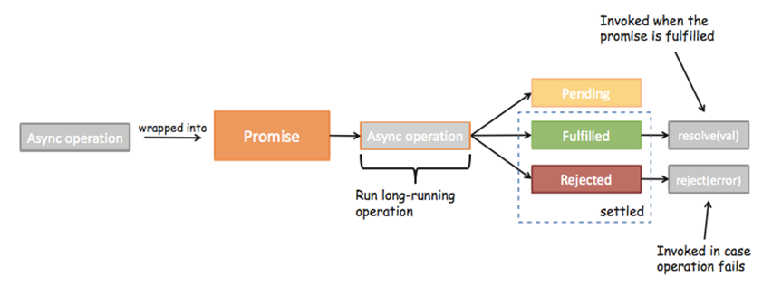
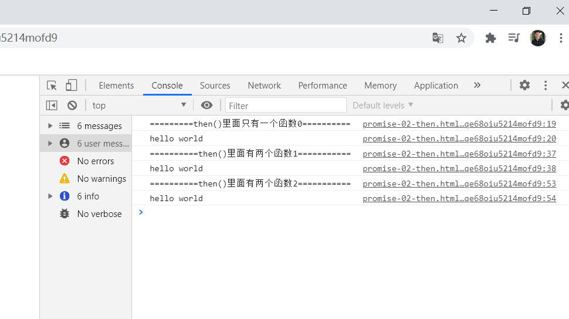
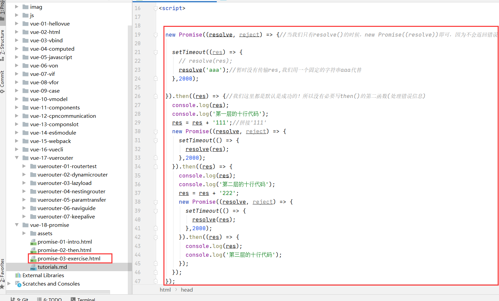
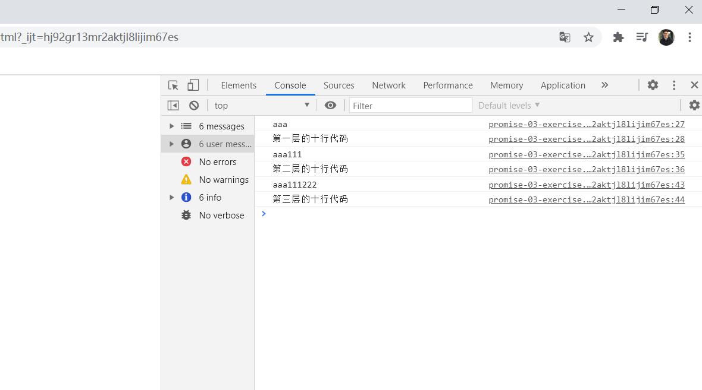
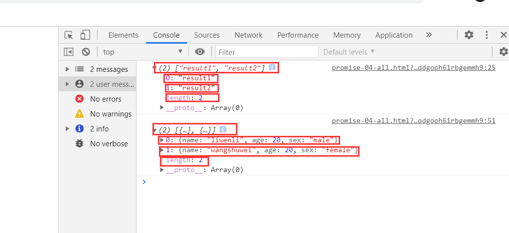

#Promise
##准备
###单线程
Javascript语言的执行环境是"单线程"（single thread）。
所谓"单线程"，就是指一次只能完成一件任务。如果有多个任务，
就必须排队，前面一个任务完成，再执行后面一个任务，以此类推。
好处是实现起来比较简单，执行环境相对单纯。
坏处是只要有一个任务耗时很长，后面的任务都必须排队等着，会拖延整个程序的执行。
###同步（Synchronous）
"同步模式"：后一个任务等待前一个任务结束，然后再执行，程序的执行顺序与任务的排列顺序是一致的、同步的。
###异步（Asynchronous）
"异步模式"：每一个任务有一个或多个回调函数（callback），前一个任务结束后，不是执行后一个任务，
而是执行回调函数，后一个任务则是不等前一个任务结束就执行，所以程序的执行顺序与任务的排列顺序是不一致的、异步的。
 
##Promise-intro
###Promise的基本使用
new Promise很明显是创建一个Promise对象。
小括号中((resolve, reject) => {})也很明显就是一个函数，而且我们这里用的是之前刚刚学习过的箭头函数。
我们先知道一个事实：在创建Promise时，传入的这个箭头函数是固定的（一般我们都会这样写）
resolve和reject它们两个也是函数，通常情况下，我们会根据请求数据的成功和失败来决定调用哪一个。
如果是成功的，那么通常我们会调用resolve(data)，这个时候，我们后续的then会被回调。
如果是失败的，那么通常我们会调用reject(error)，这个时候，我们后续的catch会被回调。 

###使用setTimeout()模拟网络请求
* 没有使用Promise对象的网络请求代码
```js
 new Promise((resolve,reject) => {
    //resolve ,reject 本身又是函数！
    setTimeout(() => {

      console.log('hello world!');
      console.log('hello world!');
      console.log('hello world!');
      console.log('hello world!');
      console.log('hello world!');
      setTimeout(() => {
        console.log('hello vue!');
        console.log('hello vue!');
        console.log('hello vue!');
        console.log('hello vue!');
        console.log('hello vue!');
        setTimeout(() => {
          console.log('hello js!');
          console.log('hello js!');
          console.log('hello js!');
          console.log('hello js!');
          console.log('hello js!');
          setTimeout(() => {
            console.log('this is data!');
          },2000);

        },2000);

      },2000);

    }, 2000);

  });//这种写法太啰嗦，太烦琐了，太混乱了
```
* 使用Promise对象的网络请求代码
* 当返回的是reslove()的时候
```js

//new Promise((resolve,reject)=>{//这里只负责网络请求，不负责处理数据}).then(()=>{//这里负责处理数据，以及第二次请求})
  new Promise((resolve, reject) => {//Promise是一个对象
    //resolve ,reject 本身又是函数！
    setTimeout(() => {
      resolve();//一旦调用了resolve()便会调用then()函数，我们会在then()函数里面处理我们的数据，一旦调用了resolve()便会调用then()函数，执行第一次网络请求代码
    }, 2000);

  }).then(() => {//then()紧跟着new Promise()的后面，即new Promise().then().执行第一次网络请求代码

        console.log('hello world!');
        console.log('hello world!');
        console.log('hello world!');
        console.log('hello world!');
        console.log('hello world!');

        return new Promise((resolve, reject) => {
          setTimeout(() => {
            resolve();//一旦调用了resolve()便会调用then()函数，执行第二次次网络请求代码
          }, 2000);
        }).then(() => {
          console.log('hello vue!');
          console.log('hello vue!');
          console.log('hello vue!');
          console.log('hello vue!');
          console.log('hello vue!');
          return new Promise((resolve, reject) => {
            setTimeout(() => {
              resolve();//一旦调用了resolve()便会调用then()函数，执行第三次网络请求代码
            },2000);
          }).then(() => {

            console.log('hello js!');
            console.log('hello js!');
            console.log('hello js!');
            console.log('hello js!');
            console.log('hello js!');
            return new Promise((resolve, reject) => {
              setTimeout(() => {
                resolve();//一旦调用了resolve()便会调用then()函数，执行第四次网络请求代码
              }, 2000);
            }).then(() => {
              console.log('this is data!');
            //  假如还有请求，继续 return new Promise().then()!!
            });
          });
        });

      }
  );

```
* 当返回的是reject()的时候

```js
//new Promise((resolve,reject)=>{//这里只负责网络请求，不负责处理数据}).then(()=>{//成功调用负责处理数据，以及第二次请求}).catch(()=>{//失败调用})
  new Promise((resolve, reject) => {
    setTimeout((data) => {
      // resolve(data);//成功的时候调用resolve(data)函数，resolve()函数会调用then()函数处理data数据和第二次网络请求等。new Promise()里面没有处理data,而是放到了then()里面处理
      resolve('hello world')//data数据没有暂时没有，就先不处理了，先用自己固定的一个字符串hello world代替
      reject('error message');//失败的时候调用reject()函数，reject()函数会调用catch()函数返回错误信息！
    }, 2000);
  }).then((data) => {//如果new Promise()里面调用的是resolve()，则会进入then(()=>{})函数里面！！
  //   处理data数据的代码以及第二次网络请求！

  }).catch((err)=>{//如果new Promise()里面调用的是reject()，则进入到catch((err)=>{})函数里面
    console.log(err);//打印错误信息！
  })

```

##Promise-status

pending：等待状态，比如正在进行网络请求，或者定时器没有到时间。

fulfill：满足状态，当我们主动回调了resolve时，就处于该状态，并且会回调.then()
```js
//new Promise((resolve,reject)=>{//这里只负责网络请求，不负责处理数据}).then(()=>{//成功调用负责处理数据，以及第二次请求}).catch(()=>{//失败调用})
  new Promise((resolve, reject) => {
    setTimeout((data) => {
      resolve(data);//成功的时候调用resolve(data)函数，resolve()函数会调用then()函数处理data数据和第二次网络请求等。new Promise()里面没有处理data,而是放到了then()里面处理
      // reject('error message');//失败的时候调用reject()函数，reject()函数会调用catch()函数返回错误信息！
    }, 2000);
  }).then((data) => {//如果new Promise()里面调用的是resolve()，则会进入then(()=>{})函数里面！！
  //   处理data数据的代码以及第二次网络请求！

  }).catch((err)=>{//如果new Promise()里面调用的是reject()，则进入到catch((err)=>{})函数里面
    console.log(err);//打印错误信息！
  })
```
reject：拒绝状态，当我们主动回调了reject时，就处于该状态，并且会回调.catch()
```js
//new Promise((resolve,reject)=>{//这里只负责网络请求，不负责处理数据}).then(()=>{//成功调用负责处理数据，以及第二次请求}).catch(()=>{//失败调用})
  new Promise((resolve, reject) => {
    setTimeout((data) => {
      // resolve(data);//成功的时候调用resolve(data)函数，resolve()函数会调用then()函数处理data数据和第二次网络请求等。new Promise()里面没有处理data,而是放到了then()里面处理
      reject('error message');//失败的时候调用reject()函数，reject()函数会调用catch()函数返回错误信息！
    }, 2000);
  }).then((data) => {//如果new Promise()里面调用的是resolve()，则会进入then(()=>{})函数里面！！
  //   处理data数据的代码以及第二次网络请求！

  }).catch((err)=>{//如果new Promise()里面调用的是reject()，则进入到catch((err)=>{})函数里面
    console.log(err);//打印错误信息！
  })
```

##Promise的另外一种处理形式
* 我们上节课的Promise形式 new Promise().then().catch()。
上节课的then()函数里面只有一个函数，表示成功时候处理的数据和请求。
但是then()函数里面也可以有两个函数，第一个函数表示成功时候处理数据和请求，
第二个函数表示打印错误信息(相当于catch()方法)
```js
 //当返回的是reject()时候
  new Promise((resolve, reject) => {
    setTimeout((data) => {
      // resolve(data);//data数据没有暂时没有，就先不处理了，先用自己固定的一个字符串hello world代替
      resolve('hello world');//成功的时候调用resolve(data)函数，resolve()函数会调用then()函数处理data数据和第二次网络请求等。new Promise()里面没有处理data,而是放到了then()里面处理
      // reject('error message');//失败的时候调用reject()函数，reject()函数会调用catch()函数返回错误信息！
    }, 2000);
  }).then((data) => {
    //   处理data数据的代码以及第二次网络请求！
    console.log(data);
  }).catch((err)=>{
    console.log(err);//打印错误信息！
  })
```

* Promise的另外一种形式
```js
 
  new Promise((resolve, reject) => {
    setTimeout((data) => {
      // resolve(data);//data数据没有暂时没有，就先不处理了，先用自己固定的一个字符串hello world代替
      resolve('hello world'); //如果resolve()被调用，则会执行then(函数1，函数2)函数里面的函数1
      reject('error message'); //如果reject()被调用，则会执行then(函数1，函数2)函数里面的函数2
    }, 2000);
  }).then(//then(函数1,函数2)，函数1表示成功时候的处理数据和请求函数，函数2表示失败时候返回错误信息(相当于上节课的catch())
        (data) => {//函数1
                //处理data数据的代码以及第二次网络请求！
                   console.log(data);
                  },
        (err)=>{//函数2
                  // 打印错误信息
                  console.log(err);
                }
        ); 
```
* 进一步简化！
 ```js
  new Promise((resolve, reject) => {
    setTimeout((data) => {
      // resolve(data);//data数据没有暂时没有，就先不处理了，先用自己固定的一个字符串hello world代替
      resolve('hello world'); //如果resolve()被调用，则会执行then(函数1，函数2)函数里面的函数1
      reject('error message'); //如果reject()被调用，则会执行then(函数1，函数2)函数里面的函数2
    }, 2000);
  }).then(data =>{console.log(data)},err=>{console.log(err)})
```



##promise-exercise

* 处理网络请求(使用setTimeout()模拟)

第1层：res = 'aaa'

第2层：res = 'aaa111'

第3层：res = 'aaa111222'
```js

  new Promise((resolve, reject) => {//当我们只有resolve()的时候，new Promise((resolve))即可，因为不会返回错误！

    setTimeout((res) => {
      // resolve(res);
      resolve('aaa');//暂时没有传输res,我们用一个固定的字符串aaa代替
    },2000);

  }).then((res) => {//我们这里都是默认是成功的！所以没有必要写then()的第二函数(处理错误信息)
    console.log(res);
    console.log('第一层的十行代码');
    res = res + '111';//拼接'111'
    new Promise((resolve, reject) => {
      setTimeout(() => {
        resolve(res);
      },2000);
    }).then((res) => {
      console.log(res);
      console.log('第二层的十行代码');
      res = res + '222';
      new Promise((resolve, reject) => {
        setTimeout(() => {
          resolve(res);
        },2000);
      }).then((res) => {
        console.log(res);
        console.log('第三层的十行代码');
      });
    });
  });
```




##Promise.all(iterable) 

* 完成(Fulfillment)

如果所有传入的 promise 都变为完成状态，或者传入的可迭代对象内没有 promise，Promise.all 返回的 promise 异步地变为完成。
在任何情况下，Promise.all 返回的 promise 的完成状态的结果都是一个数组，它包含所有的传入迭代参数对象的值（也包括非 promise 值）。

* 失败/拒绝(Rejection)

如果传入的 promise 中有一个失败（rejected），Promise.all 异步地将失败的那个结果给失败状态的回调函数，而不管其它 promise 是否完成。

```js
 
  Promise.all([
    new Promise((resolve, reject) => {
          setTimeout(() => {
            resolve('result1');
          }, 2000);//result1延2秒才出现
        },
    ),//不要加then()要不然打印不出数组信息！

    new Promise((resolve, reject) => {
      setTimeout(() => {
        resolve('result2');
      }, 4000);//result2延迟4秒才出现
    }),//不要加then()要不然打印不出数组信息！

  ]).then((results) => {
    console.log(results);//会打印一个字符串数组,results是自己随便起的名字！
  });


  Promise.all([
    new Promise((resolve, reject) => {
      setTimeout(() => {
        resolve({
          name: 'liwenli',
          age: 20,
          sex: 'male',
        });
      },2000);//result1延2秒才出现
    }),//不要加then()要不然打印不出数组信息！

     new Promise((resolve, reject) => {
      setTimeout(() => {
        resolve({
          name: 'wangshuwei',
          age: 20,
          sex: 'female',
        });
      },4000);//result2延迟4秒才出现
    }),//不要加then()要不然打印不出数组信息！

  ]).then((results) => {
    console.log(results);//会打印一个对象数组,results是自己随便起的名字！
  });
 
```


