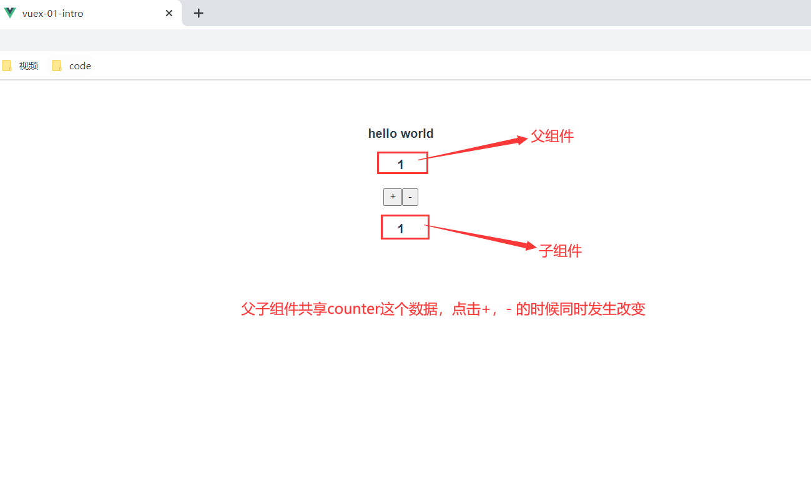
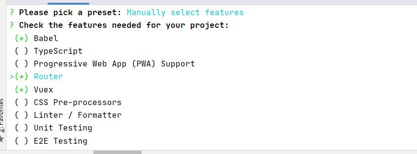

#vuex
##简介
* 什么是vuex

官方解释：Vuex 是一个专为 Vue.js 应用程序开发的状态管理模式

* 什么是状态管理

你可以简单的将其看成把需要多个组件共享的变量全部存储在一个对象里面。
然后，将这个对象放在顶层的Vue实例中，让其他组件可以使用。
Vuex就是为了提供这样一个在多个组件间共享状态的插件，并且是响应式的！

* 什么时候需要多组件共享

你一定遇到过多个状态，在多个界面间的共享问题。
比如用户的登录状态，用户名称，头像，地理位置信息，商品的收藏、购物车中的物品等等。
这些状态信息，我们都可以放在统一的地方，对它进行保存和管理，而且它们还是响应式的。

##状态管理
###单页面的状态管理
State：不用多说，就是我们的状态。（姑且可以当做就是data中的属性）

View：视图层，可以针对State的变化，显示不同的信息。(template模板中的html)

Actions：主要是用户的各种操作。点击、输入等等，会导致状态的改变。


###单页面管理实例

```vue
<template>
  <div id="app">
    <div id="nav">
      <h4>{{message}}</h4>
      <h4>{{counter}}</h4>
      <button v-on:click="counter++">+</button><!--this.counter++是错误的！-->
      <button v-on:click="counter--">-</button>
    </div>
  </div>
</template>
<script>
  export default {
    name:'App',
    data() {
      return {
        message:'hello world',
        counter: 0,
      };
    },

  };
</script>
<style>
#app {
  font-family: Avenir, Helvetica, Arial, sans-serif;
  -webkit-font-smoothing: antialiased;
  -moz-osx-font-smoothing: grayscale;
  text-align: center;
  color: #2c3e50;
}

#nav {
  padding: 30px;
}

#nav a {
  font-weight: bold;
  color: #2c3e50;
}

#nav a.router-link-exact-active {
  color: #42b983;
}
</style>

```


counter需要某种方式被记录下来，也就是我们的State。
counter目前的值需要被显示在界面中，也就是我们的View部分。
界面发生某些操作时（我们这里是用户的点击，也可以是用户的input），需要去更新状态，也就是我们的Actions

###多页面状态管理
####介绍
多个试图都依赖同一个状态(变量，数据)（一个状态改了，多个界面需要进行更新）。
也就是说对于某些状态(状态1/状态2/状态3)来说只属于我们某一个试图，
但是也有一些状态(状态a/状态b/状态c)属于多个试图共同想要维护的
状态1/状态2/状态3你放在自己的房间中，你自己管理自己用，这没问题。
但是状态a/状态b/状态c我们希望交给一个大管家来统一帮助我们管理！！！
没错，Vuex就是为我们提供这个大管家的工具。
全局单例模式（大管家）
我们现在要做的就是将共享的状态抽取出来，交给我们的大管家，统一进行管理。
之后，你们每个试图，按照我规定好的规定，进行访问和修改等操作。
这就是Vuex背后的基本思想。

####实例
* 父子组件状态管理

* 父组件App.vue
```vue
<template>
  <div id="app">
    <div id="nav">
      <h4>{{message}}</h4>
      <h4>{{counter}}</h4>
      <button v-on:click="counter++">+</button><!--this.counter++是错误的！-->
      <button v-on:click="counter--">-</button>
      <hello-world v-bind:counter="counter"></hello-world>
    </div>
  </div>
</template>
<script>
  import HelloWorld from "./components/HelloWorld";

  export default {
    name: 'App',
    data() {
      return {
        message: 'hello world',
        counter: 0,
      };
    },

    components: {

      HelloWorld:HelloWorld
    },

  };
</script>
<style>
#app {
  font-family: Avenir, Helvetica, Arial, sans-serif;
  -webkit-font-smoothing: antialiased;
  -moz-osx-font-smoothing: grayscale;
  text-align: center;
  color: #2c3e50;
}

#nav {
  padding: 30px;
}

#nav a {
  font-weight: bold;
  color: #2c3e50;
}

#nav a.router-link-exact-active {
  color: #42b983;
}
</style>

```

* 子组件HelloWorld.vue
```vue
<template>
  <div>
    <h4>{{counter}}</h4>
  </div>
</template>

<script>
  export default {
    name: "HelloWorld",
    props: {
      counter: {
        type: Number,
      },
    },

  }
</script>

<style scoped>

</style>
```



* 非父子关系的多页面状态管理怎么办呢？？

使用vuex这个插件

##vuex安装
* 安装插件

```vue
//vuex 上产环境的开发环境都是需要的，因此不需要加 --dev
npm install vuex --save

```
* 创建store目录及index.js文件


* 创建和导出对象
```vue
import Vue from 'vue'
import Vuex from 'vuex'//导入Vuex

//1.安装插件
Vue.use(Vuex)

//2.创建对象
const store = new Vuex.Store({//一定要记得new
  state: {
    counter: 100,//共享状态放这里
  },
  mutations: {
  },
  actions: {
  },
  modules: {
  }
})
//3.导出store对象
export default s
```


* 使用store对象
```vue
import Vue from 'vue'
import App from './App.vue'
import router from './router'
import store from './store'

Vue.config.productionTip = false

new Vue({
  router,
  store,
  render: h => h(App)
}).$mount('#app')

```


* 假如我们直接使用vue-cli只需勾选vuex这个选项即可！

***
##vuex 的使用
###准备
* APP.vue
```vue
<template>
  <div id="app">
    <div id="nav">
<!--      <h4>{{message}}</h4>-->
<!--      <h4>{{counter}}</h4>-->
<!--      <button v-on:click="counter++">+</button>&lt;!&ndash;this.counter++是错误的！&ndash;&gt;-->
<!--      <button v-on:click="counter&#45;&#45;">-</button>-->
<!--      <hello-world v-bind:counter="counter"></hello-world>-->

      <h4>{{message}}</h4>
      <h4>{{$store.state.counter}}</h4>
      <button v-on:click="$store.state.counter++">+</button>
      <button v-on:click="$store.state.counter--">-</button>
      <hello-world></hello-world>

    </div>
  </div>
</template>
<script>
  import HelloWorld from "./components/HelloWorld";

  export default {
    name: 'App',
    data() {
      return {
        message: 'hello world',
        // counter: 0,
      };
    },

    components: {

      HelloWorld:HelloWorld
    },

  };
</script>
<style>
#app {
  font-family: Avenir, Helvetica, Arial, sans-serif;
  -webkit-font-smoothing: antialiased;
  -moz-osx-font-smoothing: grayscale;
  text-align: center;
  color: #2c3e50;
}

#nav {
  padding: 30px;
}

#nav a {
  font-weight: bold;
  color: #2c3e50;
}

#nav a.router-link-exact-active {
  color: #42b983;
}
</style>

```

* HelloWorld.vue
```vue
<template>
  <div>
<!--    <h4>{{counter}}</h4>-->
    <h4>{{$store.state.counter}}</h4>
  </div>
</template>

<script>
  export default {
    name: "HelloWorld",
    /*
    props: {
      counter: {
        type: Number,
      },
    },

     */

  }
</script>

<style scoped>

</style>
```
*** 
###创建共享状态(相当于全局变量)
```vue
import Vue from 'vue'
import Vuex from 'vuex'//导入Vuex

//1.安装插件
Vue.use(Vuex)

//2.创建对象
const store = new Vuex.Store({//一定要记得new
  state: {
    counter: 100,//共享状态放这里
  },
  mutations: {
  },
  actions: {
  },
  modules: {
  }
})
//3.导出store对象
export default store;
```


***
###在任意组件中使用共享状态
```vue
   <h4>{{message}}</h4>
      <h4>{{$store.state.counter}}</h4>
      <button v-on:click="$store.state.counter++">+</button>
      <button v-on:click="$store.state.counter--">-</button>
      <hello-world></hello-world>


```

```vue
  <h4>{{$store.state.counter}}</h4>
```

###最终成果


