#mutations(修改共享状态)
##回顾
* 上节课中我们已经尝试修改过stats了，但是vue不推荐使用那种方式，因为不好管理！
```vue
      <button v-on:click="$store.state.counter++">+</button>
      <button v-on:click="$store.state.counter--">-</button>
```
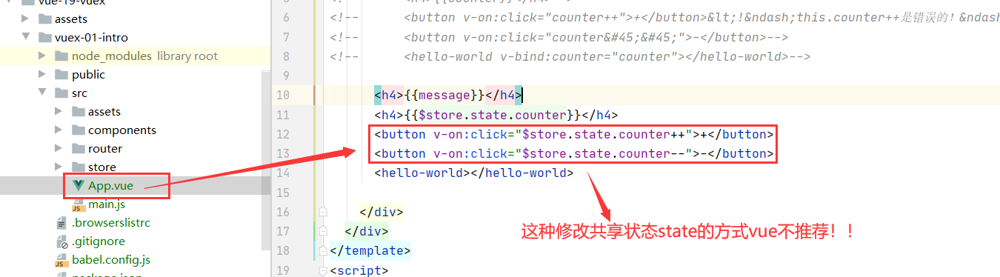

##Vuex状态管理图例
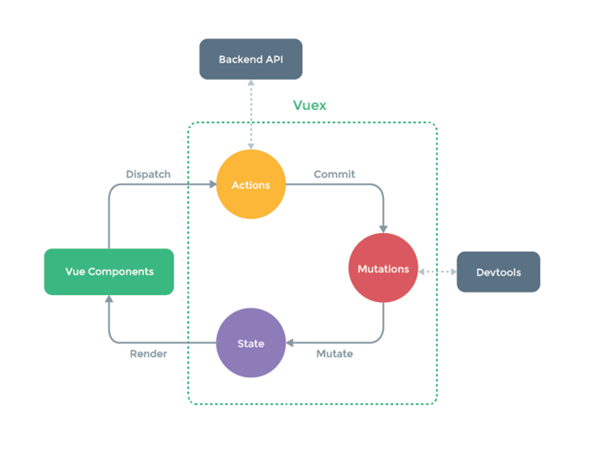
##如何通过mutations修改状态
1.在mutations:{}里面新建一些方法
```vue
mutations: {
    increment(state) {//这个参数state默认就存在，可以不用显式的写出来
      state.counter++;
    },

    decrement(state) {//默认存在一个state参数
      state.counter--;
    },

  },
```


2.在其他组件中使用store对象中保存的状态
* 通过this.$store.state.属性的方式来访问状态
```vue
 <h4>{{$store.state.counter}}</h4>
```

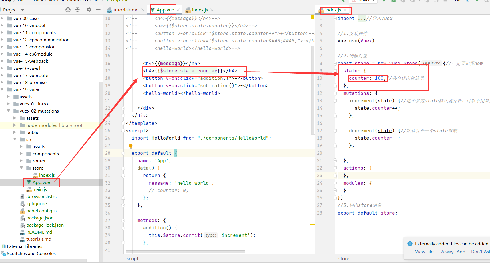

* 通过this.$store.commit('mutation中方法')来修改状态
```vue
      <button v-on:click="addition()">+</button>
      <button v-on:click="subtration()">-</button>
```

```vue

    methods: {
      addition() {
        this.$store.commit('increment');
      },

      subtration() {
        this.$store.commit('decrement');

      },

    },

```
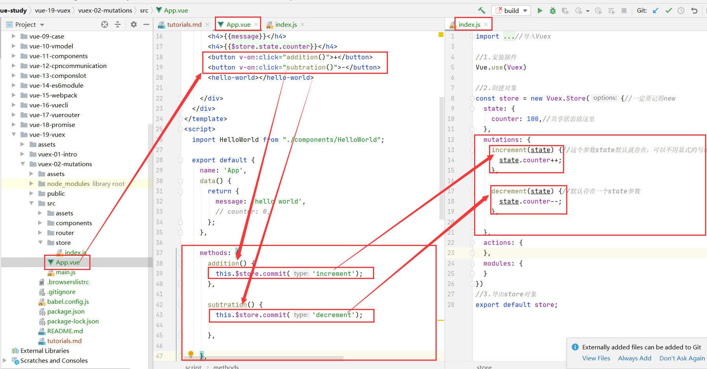

##注意
* 我们通过提交mutations的方式，而非直接改变store.state.counter。
* 这是因为Vuex可以更明确的追踪状态的变化，所以不要直接改变store.state.counter的值。

##mutations-payload(一个参数)
* 在通过mutation更新数据的时候, 有可能我们希望携带一些额外的参数。
参数被称为是mutation的载荷(Payload)。
1.在state中定义共享状态counter
```vue

state: {
    counter: 100,//共享状态放这里
  },
```

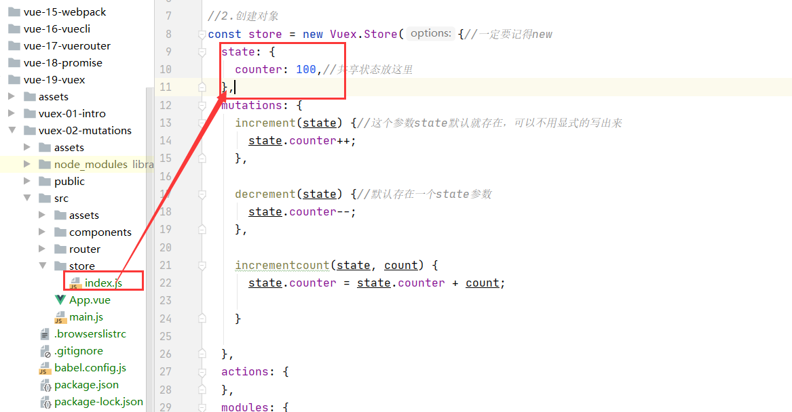

2.在mutations中定义函数
```vue
 mutations: {

    incrementcount(state, count) {//count是参数
      state.counter = state.counter + count;

    },

  },
```
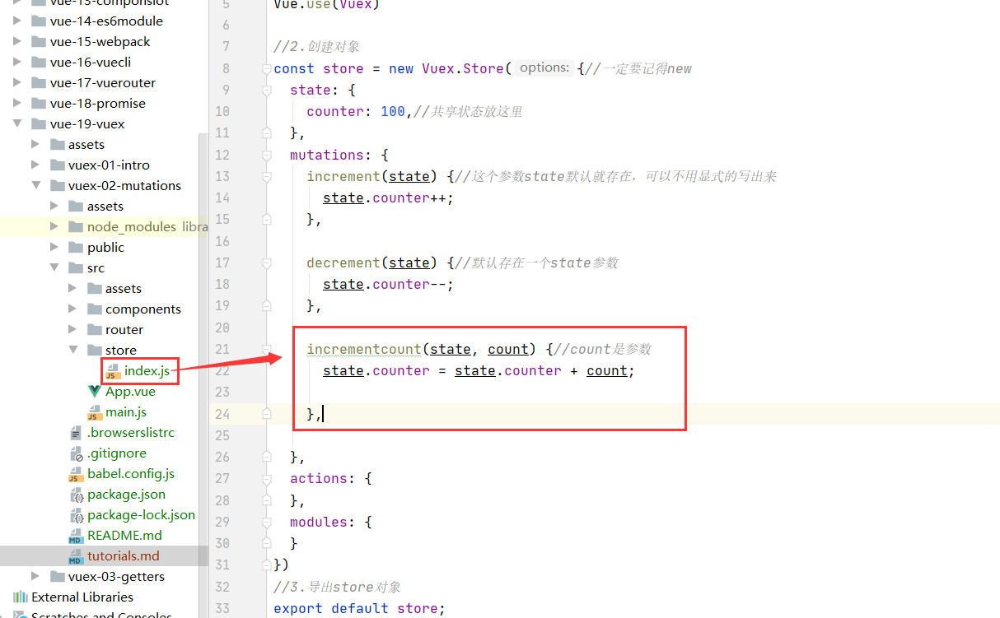

3.通过this.$store.commit('mutation中方法')来修改状态
```vue
 <button v-on:click="additioncount(6)">+6</button>
```
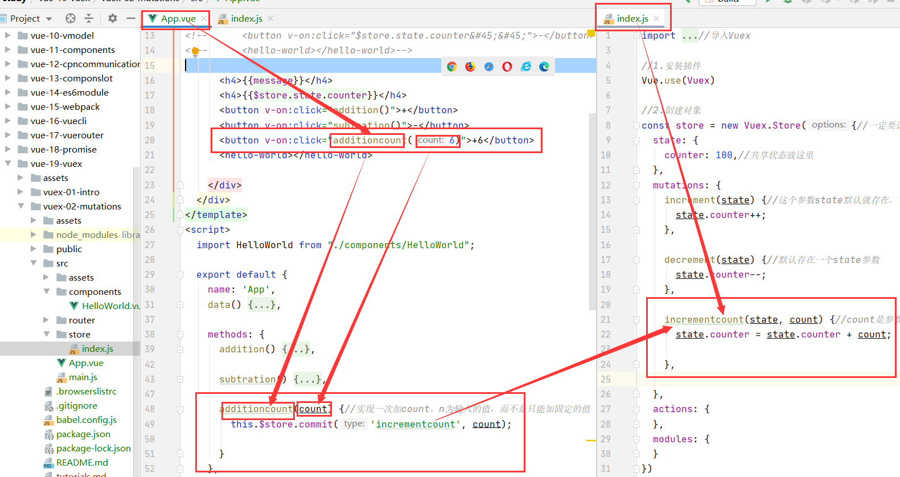

4.成果展示
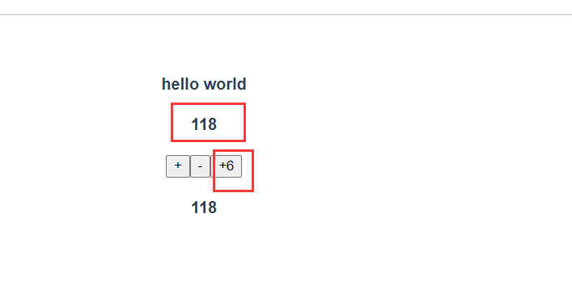

##mutations-payload(多个参数)
1.在state中定义对象数组状态
```vue
 state: {
    counter: 100,//共享状态放这里
    students: [
      {id:110,name:'liwenli',age:20, sex: 'male'},
      {id:111,name:'liwenli1',age:21, sex: 'male'},
      {id:112,name:'liwenli2',age:22, sex: 'male'},
      {id:113,name:'liwenli3',age:23, sex: 'male'},
      {id:114,name:'liwenli4',age:24, sex: 'male'},
      {id:115,name:'liwenli5',age:25, sex: 'male'},

    ],
  },
```
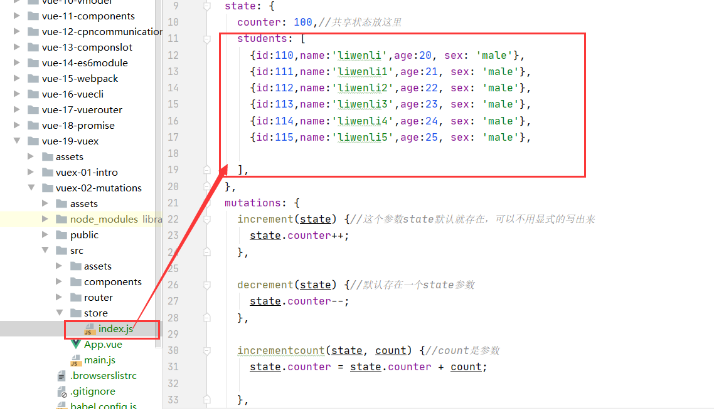

2.在mutations中定义函数
```vue
 mutations: {
    
    addstudent(state,stu) {//这个stu参数自己可以随意起！
      state.students.push(stu);//将stu学生push进入state.students里面
    },


  },
```
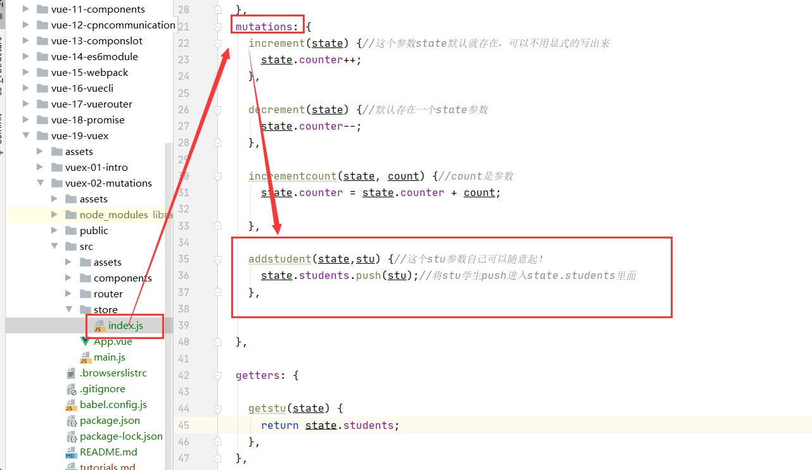

3.通过this.$store.commit('mutation中方法')来修改状态
```vue
 <button v-on:click="addstu()">添加学生</button>
```

```vue

    methods: {
      addstu() {//添加学生
        const astu = {id: 116, name: 'liwenli6', age: 27, sex: 'male'};//astu是一个学生对象
        this.$store.commit('addstudent', astu);//将astu学生对象提交到store下面的index.js中的mutations下面的addstudent函数里面。

      },
    },
```
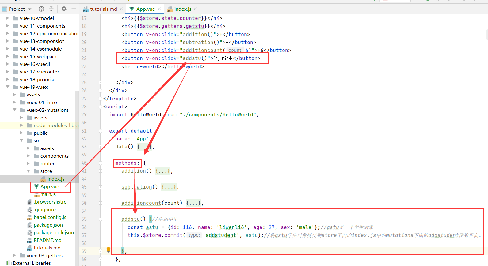

4.最终效果
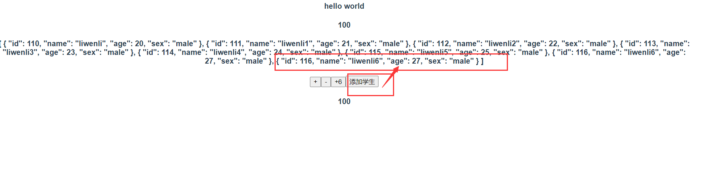

