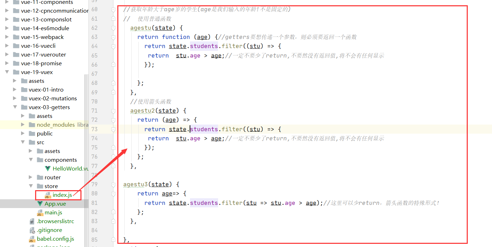

 #getters
 ##引言
 * 假如我们要获取一个共享状态(数据)的平方，我们应该怎么做呢？
 ```vue
<h4>{{$store.state.counter*$store.state.counter}}</h4>
```


* 上面的这种方法未免让template里面的内容显得太乱了，我们可以使用getters(其实就是vue组件里的computed属性)
##getters的使用
1.在getters下定义一些计算属性
```vue
 getters: {
    //相当于vue组件的computed:{}
    powerCounter(state) {//默认会有一个state参数
      return state.counter * state.counter;//注意这里有return
    },

  },
```


2.通过$store.getters获取getters中的计算属性
```vue
  <h4>{{$store.getters.powerCounter}}</h4>
```


##结合filter函数
* 获取年龄大于21岁的学生(使用计算属性getters)
* 为什么使用getters呢？因为我们默认如果不修改state,只是使用state的函数一般是放在getters里面！mutations默认是放一些修改state的函数

1.在state定义一个状态数组

```vue
 state: {
    //相当于vue组件的data()
    counter: 100,//共享状态放这里
    students: [
        {id:110,name:'liwenli',age:20, sex: 'male'},
        {id:111,name:'liwenli1',age:21, sex: 'male'},
        {id:112,name:'liwenli2',age:22, sex: 'male'},
        {id:113,name:'liwenli3',age:23, sex: 'male'},
        {id:114,name:'liwenli4',age:24, sex: 'male'},
        {id:115,name:'liwenli5',age:25, sex: 'male'},
        
    ],
  },
```


2.在getters里面定义一个agegt20函数
```vue
 getters: {
    //相当于vue组件的computed:{},一般不修改state,只是使用state
    powerCounter(state) {//默认会有一个state参数
      return state.counter * state.counter;//注意这里有return
    },

    agegt20() {
      return state.students.filter(stu => {
        return stu.age > 21;
      });
    },
    
  },
```


3.通过$store.getters获取getters中的计算属性
```vue
 <h4>{{$store.getters.agegt20}}</h4>
```


4.结果演示


## Getters作为参数
* 获取年龄大于21岁的学生个数

1.在state定义一个状态数组

```vue
 state: {
    //相当于vue组件的data()
    counter: 100,//共享状态放这里
    students: [
        {id:110,name:'liwenli',age:20, sex: 'male'},
        {id:111,name:'liwenli1',age:21, sex: 'male'},
        {id:112,name:'liwenli2',age:22, sex: 'male'},
        {id:113,name:'liwenli3',age:23, sex: 'male'},
        {id:114,name:'liwenli4',age:24, sex: 'male'},
        {id:115,name:'liwenli5',age:25, sex: 'male'},
        
    ],
  },
```


2.getters定义方法
```vue

    //返回年龄大于21岁的学生个数
    //方法1
    agegt21counts(state) {
      return state.students.filter(stu => {
        return stu.age > 21;
      }).length;
    },

 //方法2
    agegt21counts2(state,getters) {//这里的getters就是我们getters属性高！
      return getters.agegt21.length;
    },

```


3.通过$store.getters获取getters中的计算属性
```vue
 <h4>{{$store.getters.agegt21counts}}</h4>
 <h4>{{$store.getters.agegt21counts2}}</h4>
```


4.最终展示


##getters传递参数
* 获取年龄大于age岁的学生(age是我们输入的年龄!不是固定的)

1.在state定义一个状态数组

```vue
 state: {
    //相当于vue组件的data()
    counter: 100,//共享状态放这里
    students: [
        {id:110,name:'liwenli',age:20, sex: 'male'},
        {id:111,name:'liwenli1',age:21, sex: 'male'},
        {id:112,name:'liwenli2',age:22, sex: 'male'},
        {id:113,name:'liwenli3',age:23, sex: 'male'},
        {id:114,name:'liwenli4',age:24, sex: 'male'},
        {id:115,name:'liwenli5',age:25, sex: 'male'},
        
    ],
  },
```


2.getters定义函数

```vue
//获取年龄大于age岁的学生(age是我们输入的年龄!不是固定的)
  //  使用普通函数
    agestu(state) {
      return function (age) {//getters要想传递一个参数，则必须要返回一个函数
        return state.students.filter((stu) => {
         return  stu.age > age;//一定不要少了return,不要然没有返回值,将不会有任何显示
        });

      };
    },
    //使用箭头函数
    agestu2(state) {
      return (age) => {
        return state.students.filter((stu) => {
         return  stu.age > age;//一定不要少了return,不要然没有返回值,将不会有任何显示
        });
      };
    },

  agestu3(state) {
      return age=> {
        return state.students.filter(stu => stu.age > age);//这里可以少return，箭头函数的特殊形式！
      };
    },

```


3.通过$store.getters获取getters中的计算属性
```vue
    <h4>{{$store.getters.agestu(23)}}</h4>
    <h4>{{$store.getters.agestu2(23)}}</h4>
    <h4>{{$store.getters.agestu3(23)}}</h4>
```


4.最终效果

