#responsive principle(vuex的响应式原理)
* state中的属性都会被加入到响应式系统中，而响应式系统会监听属性的变化。当属性发生变化时，会通知所有界面中用到该属性的地方，
  让界面发生刷新。
  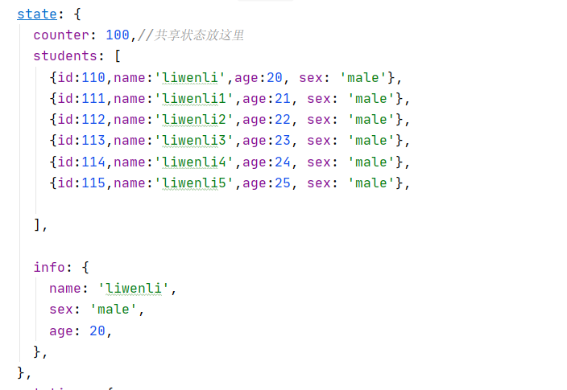


##修改state中已经定义的属性
* Vuex的store中的state是响应式的, 当state中的数据发生改变时, Vue组件会自动更新。

1.在state中定义info对象
```vue
 state: {
    info: {
      name: 'liwenli',
      sex: 'male',
      age: 20,
    },
  },
```
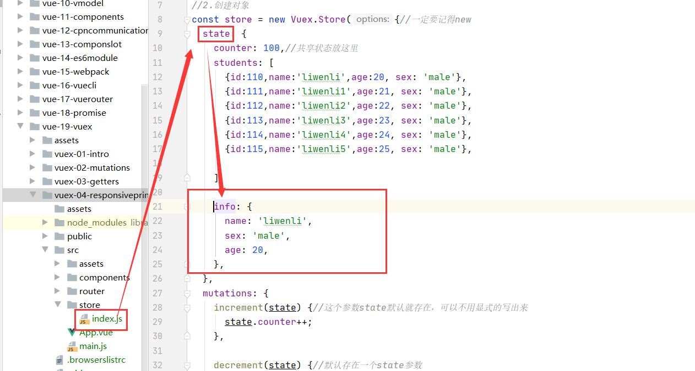

2.通过$store.state获取state中的info数据
```vue
<h4>{{$store.state.info}}</h4>
```
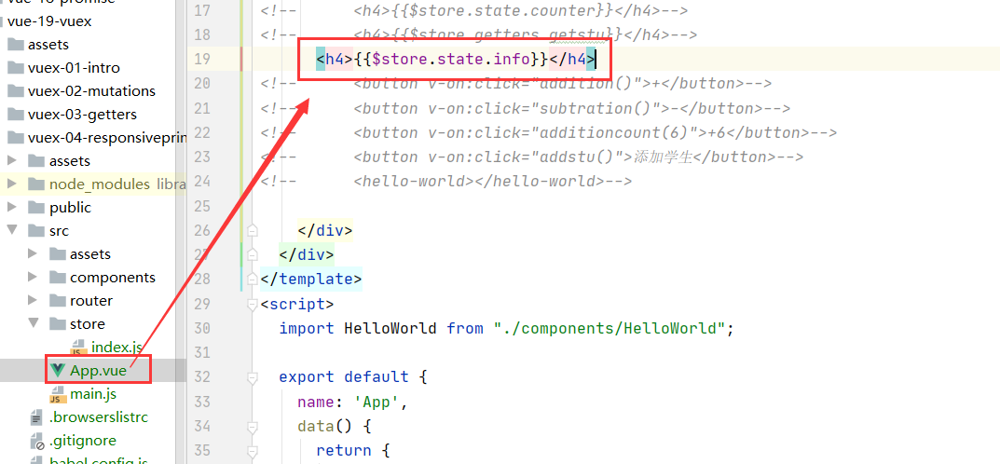

3.展示
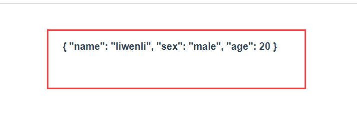

4.在mutations中定义修改state中info对象的属性的函数(假设修改info.name这个属性)
```vue
mutations: {
   
    updateproperty(state) {
      state.info.name = 'wangshuwei';

    },

  },
```
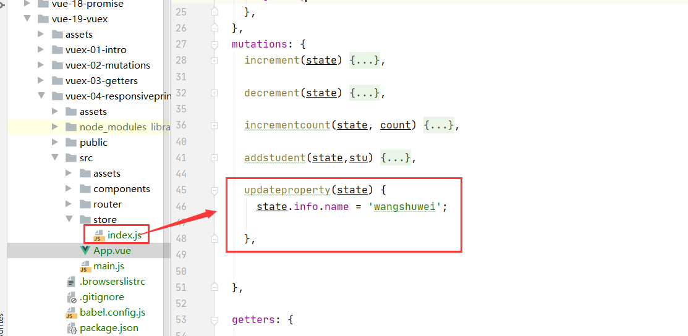

5.通过this.$store.commit()提交修改！
```vue
  <button v-on:click="updateprops()">修改属性</button>
```
 ```vue
  methods: {
      updateprops() {
        this.$store.commit('updateproperty');
      }
    },
```
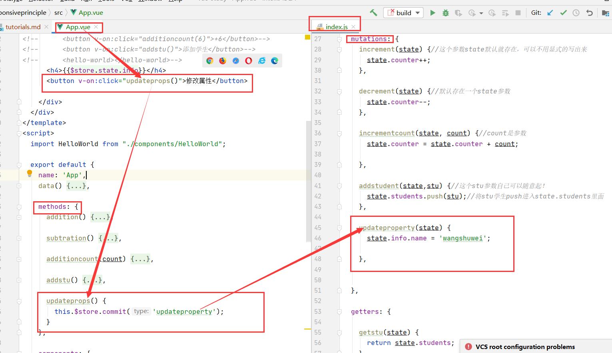

6.修改属性后展示
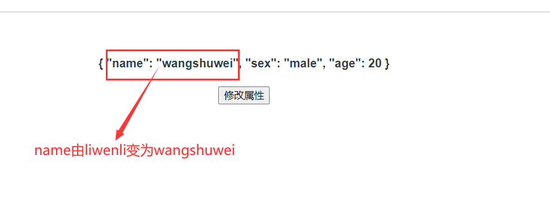

##添加state中没有定义的属性
* 然而当给state中的对象添加新属性时，vue组件不会自动更新！如何解决？

1.在state中定义info对象
```vue
 state: {
    info: {
      name: 'liwenli',
      sex: 'male',
      age: 20,
    },
  },
```


2.通过$store.state获取state中的info数据
```vue
<h4>{{$store.state.info}}</h4>
```


3.展示


4.在mutations中定义增加mutations中info对象的属性的函数(假设增加一个address属性)
```vue
 mutations: {
    
    addproperty(state) {
      state.info['address'] = 'chenzhou hunan';
    },

  },
```
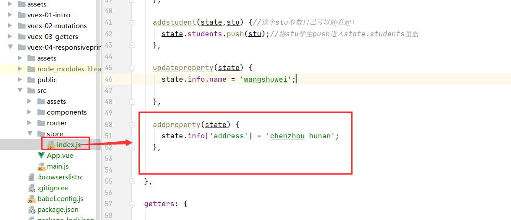

5.通过this.$store.commit()提交修改
```vue
  <button v-on:click="addprops()">增加属性</button>
```
```vue

      addprops() {
        this.$store.commit('addproperty');
      },

    },
```
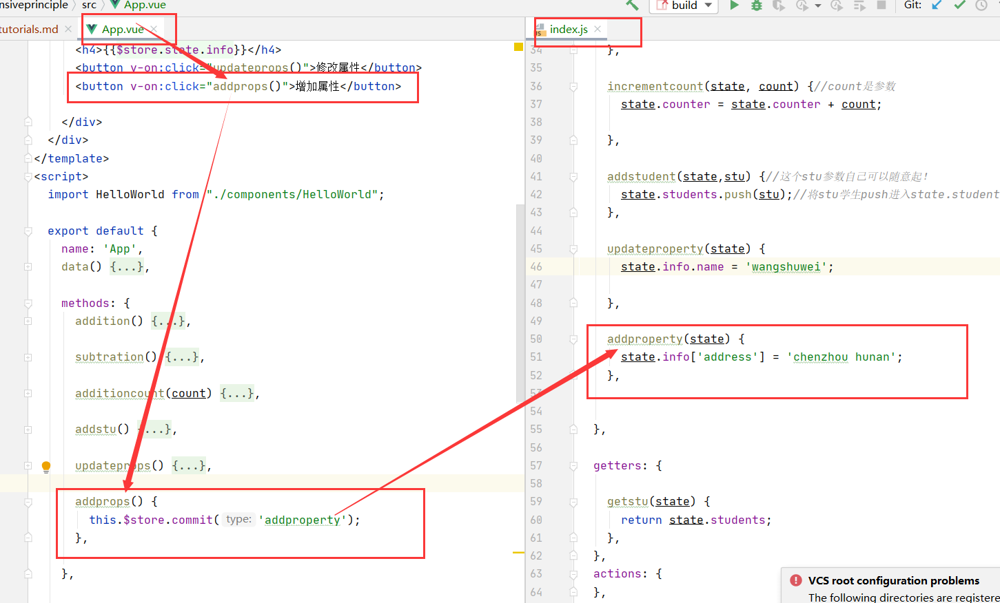

6.测试是否能够通过this.$store.commit()增加info属性
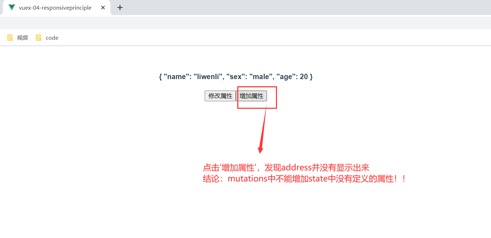


7.如何增加state中没有定义的属性呢？

 * 使用Vue.set(obj, 'key', 'value');
 
a.在mutations中定义增加info对象的属性的方法
 ```vue
   mutations: {
       
      addproperty2(state) {
  
        Vue.set(state.info, 'address', 'chenzhou hunan');//Vue.set()中V是大写字母！！
      },
  
    },

```
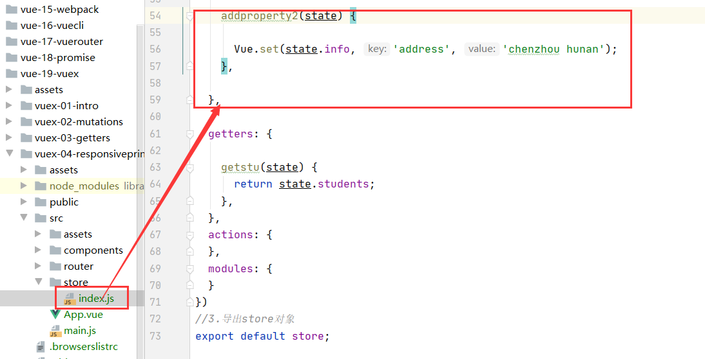

b.通过this.$store.commit()提交增加！
```vue
      <button v-on:click="addprops2()">增加属性2</button>

```
```vue
 
    methods: {
      addprops2() {
        this.$store.commit('addproperty2');
      },

    },

```
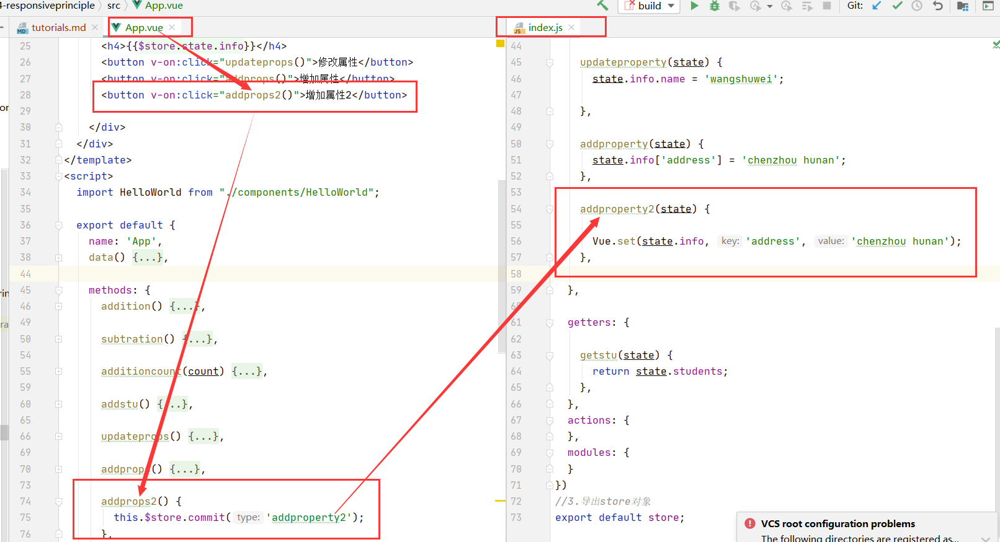

c.展示效果
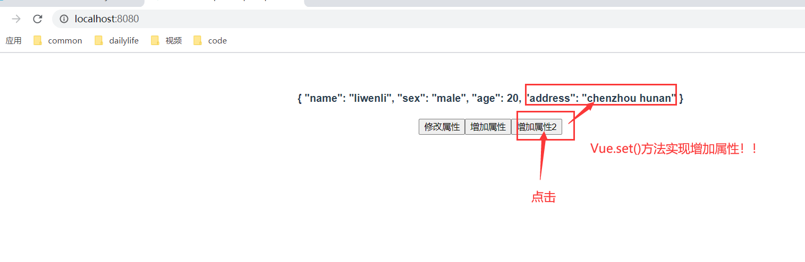
