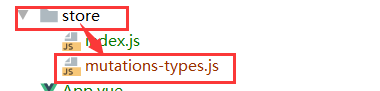
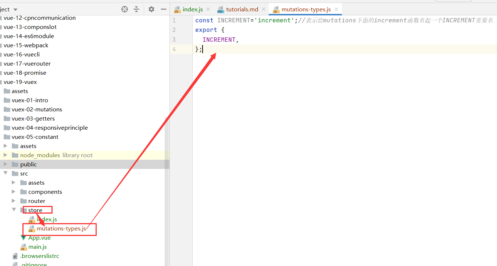
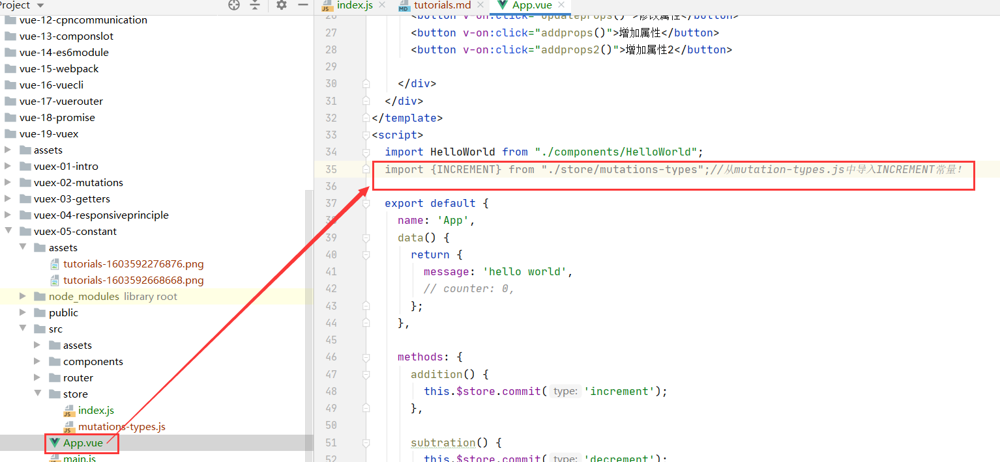
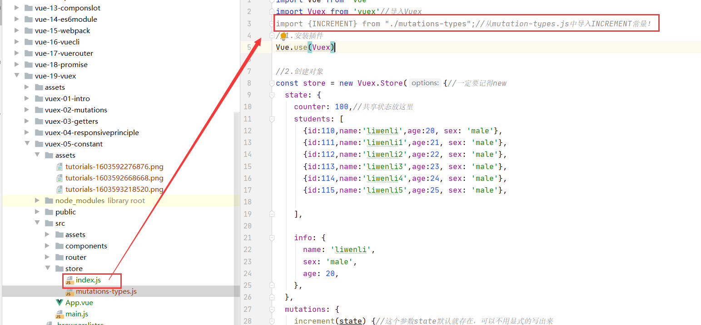
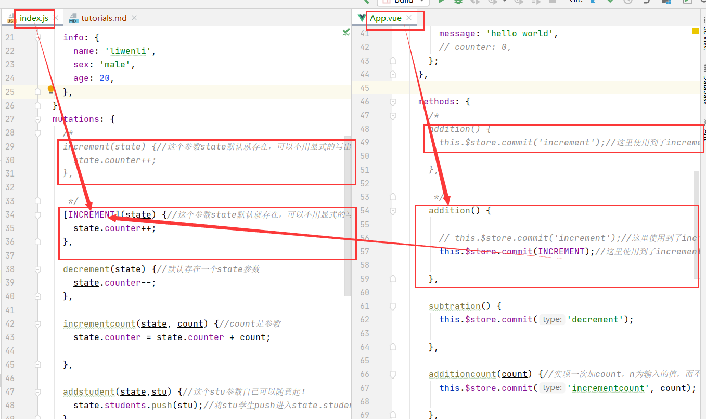
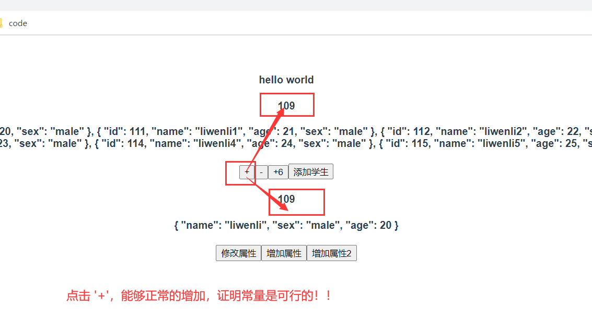

#vuex-mutations的常量类型
* 演示给vuex中的mutations中的函数名字起常量名，但是不限于vuex
##目的
大项目里面能够让我们显得规范，不容易出错！
##开始
1.在store目录下面新建一个mutations-types(表示是mutations的函数名常量！)


2.在mutations-types.js中给mutations中的increment()函数起函数常量名INCREMENT，
并导出！
```vue
const INCREMENT='increment';//表示给mutations下面的increment函数名起一个INCREMENT常量名
export {
  INCREMENT,
};
```


3.在含有mutations中increment()函数名的地方导入从mutations-types.js中导出的常量名INCREMENT
```vue
import {INCREMENT} from "./mutations-types";//从mutation-types.js中导入INCREMENT常量！
```



4.在所有使用increment的地方，全部用INCREMENT代替
```vue
  //this.$store.commit提交时候会用到increment这个名字，将它改为常量名INCREMENT
 addition() {
        //this.$store.commit('increment');
        this.$store.commit(INCREMENT);//这里使用到了increment这个函数名，我们把他用INCREMENT这个常量代替

      },
      
```
```vue
  /*
    increment(state) {//这个参数state默认就存在，可以不用显式的写出来
      state.counter++;
    },

     */
 [INCREMENT](state) {//这个参数state默认就存在，可以不用显式的写出来
      state.counter++;
    },

```


5.展示是否可行

