#actions
* actions类似mutations，但是actions可以存放异步函数，而mutation则不能！！
###假如mutations放异步函数！！
* 这里我们用setTimeout模拟异步操作
1.在state中定义info对象
```vue
 state: {

    info: {
      name: 'liwenli',
      sex: 'male',
      age: 20,
    },
  },
```
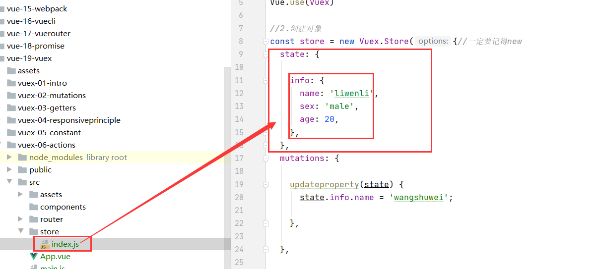

2.在mutations下定义异步操作函数
```vue
 mutations: {

    /*
    //这是一个同步操作函数，放在mutations是正确的！
    updateproperty(state) {
      state.info.name = 'wangshuwei';
    },

  },
     */

    //这是一个异步操作函数，不建议放在mutations里面！
    updateproperty(state) {
      setTimeout(() => {
        state.info.name = 'wangshuwei';
      },1000);//一秒后修改！
    },

  },
```

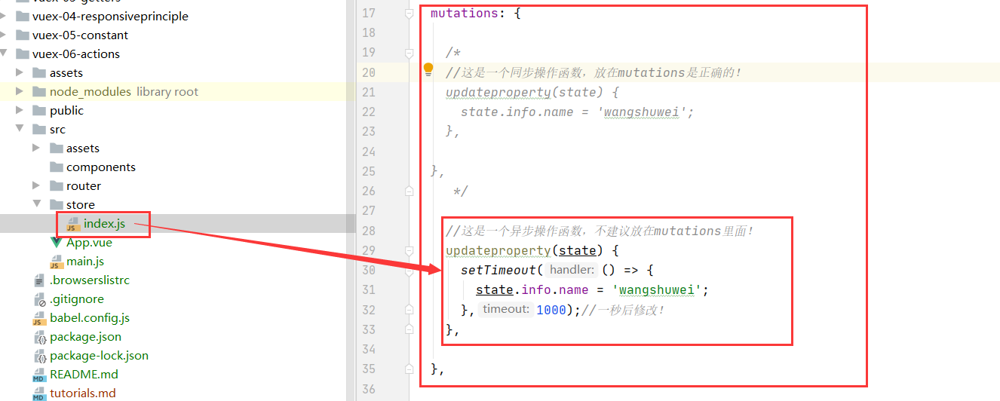


3.通过this.$store.commit,this.$store.state获取数据修改数据
```vue
 <h4>{{$store.state.info}}</h4>
      <button v-on:click="updateprops()">修改属性</button>
```
```vue

    methods: {

      updateprops() {
        this.$store.commit('updateproperty');
      },

    },

```
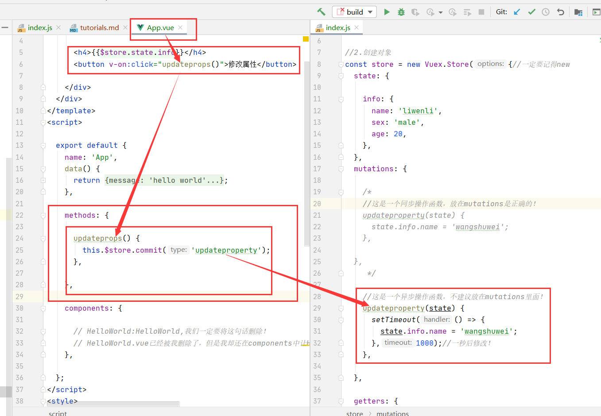

4.结果显示
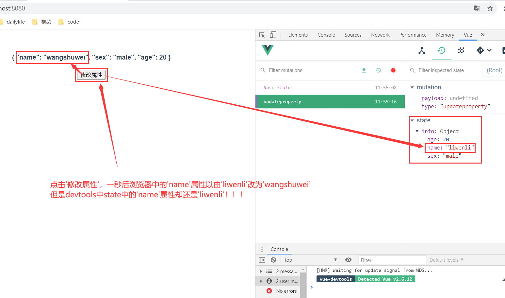

5.结论
* 通常情况下, 不要再mutation中进行异步的操作

***
##actions初步
*  如果确实希望在Vuex中进行一些异步操作, 比如网络请求, 必然是异步的，这时候我们可以是使用actions。
actions类似于mutation，但是是用来代替mutation进行异步操作的。

* context是和store对象具有相同方法和属性的对象.
  也就是说, 我们可以通过context去进行commit相关的操作, 也可以获取context.state等.
  
* 在Vue组件中, 如果我们调用action中的方法, 那么就需要使用dispatch

##使用actions进行异步操作

1.在state中定义info对象
  ```vue
   state: {
  
      info: {
        name: 'liwenli',
        sex: 'male',
        age: 20,
      },
    },
  ```
  
2.在actions下定义异步操作函数
```vue
  actions: {//处理异步操作
     actionupdateproperty(context) {//actions中的默认属性是context，注意不是state了！！
       setTimeout(() => {
         // context.state.info.name = 'wangshuwei';//这是错误的，我们不能够直接通过actions修改state，需要通过 mutations修改！！
         context.commit('updateproperty');//actions下面的异步方法actionupdateproperty需要context.commit  mutations下面的updateproperty方法来修改state
       },1000);//一秒后修改！
     },
   },
```
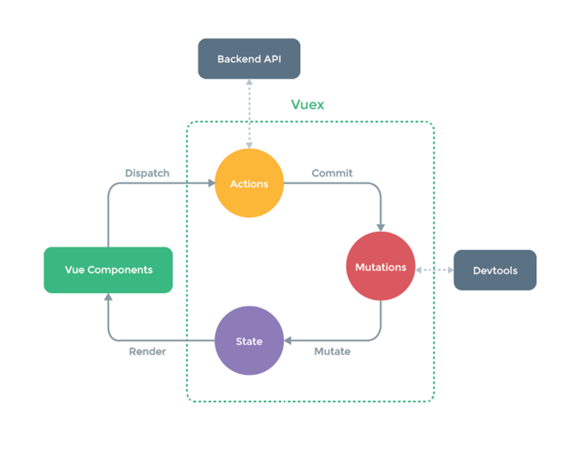

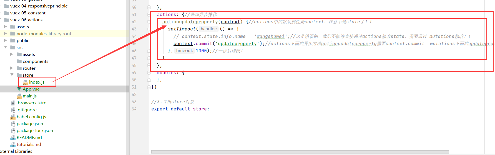

3.再mutations下定义修改states的函数
```vue
 mutations: {//修改共享数据

    //这是一个同步操作函数，放在mutations是正确的！
    updateproperty(state) {
      state.info.name = 'wangshuwei';
    },

    /*
      //这是一个异步操作函数，不建议放在mutations里面！
      updateproperty(state) {
        setTimeout(() => {
          state.info.name = 'wangshuwei';
        },1000);//一秒后修改！
      },


    },
       */
  },

```
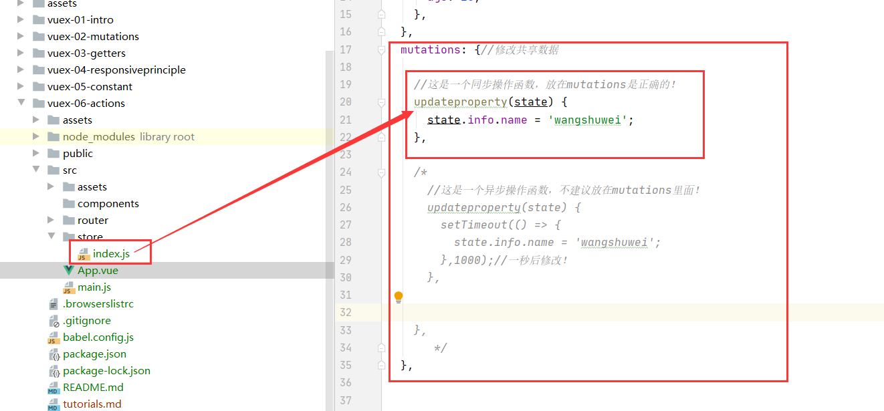

4.App.vue中通过this.$store.state.dispatch()传递给actions。
```vue
 <h4>{{$store.state.info}}</h4>
      <button v-on:click="updateprops()">修改属性</button>

```

```vue
      updateprops() {
        this.$store.dispatch('actionupdateproperty');
      },

    },
```
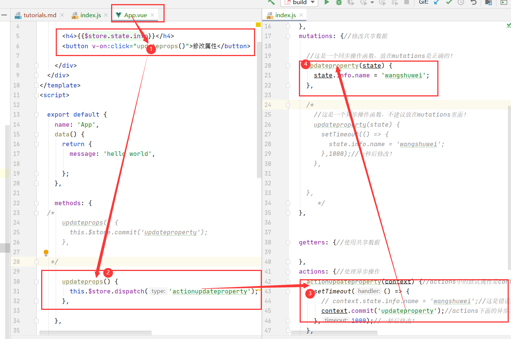

5.结果
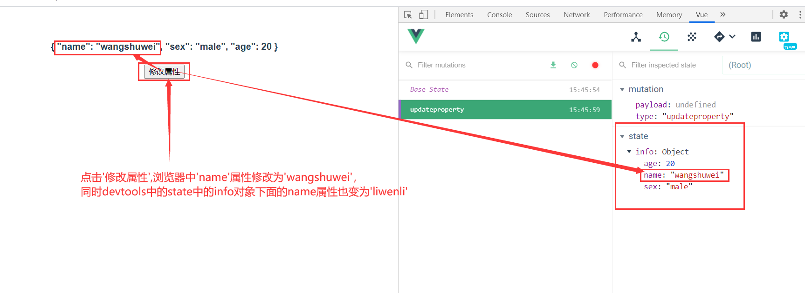

##Action返回的Promise
* 我们现在有一个需求,当我们的vuex中的actions已经将info对象属性修改成功之后，
我们想通知一下使用info共享状态的vue组件，actions已经修改成功了，我们应该怎么做？

####payload实现(只能显示消息，不能传递数据？)

1.App.vue 
```vue
  updateprops() {
        this.$store.dispatch('actionupdateproperty', {
        ` //这个对象是payload
          message: '我是携带的信息',
          info: {name:'xxxx',age:20, sex: 'male'},
          success: () => {//函数名为success
            console.log('里面已经完成了');
          }
        }  );
      },

```

2.actions中
```vue
 actions: {//处理异步操作
      //这是涉及payload的代码
      actionupdateproperty(context, payload)
      {
        setTimeout(() => {
          context.commit('updateproperty');
          console.log(payload.message);
          console.log(payload.info);
          payload.success();
        }, 1000);
      },

    //这是涉及promise的修改info属性并添加成功消息的代码！

  },
```

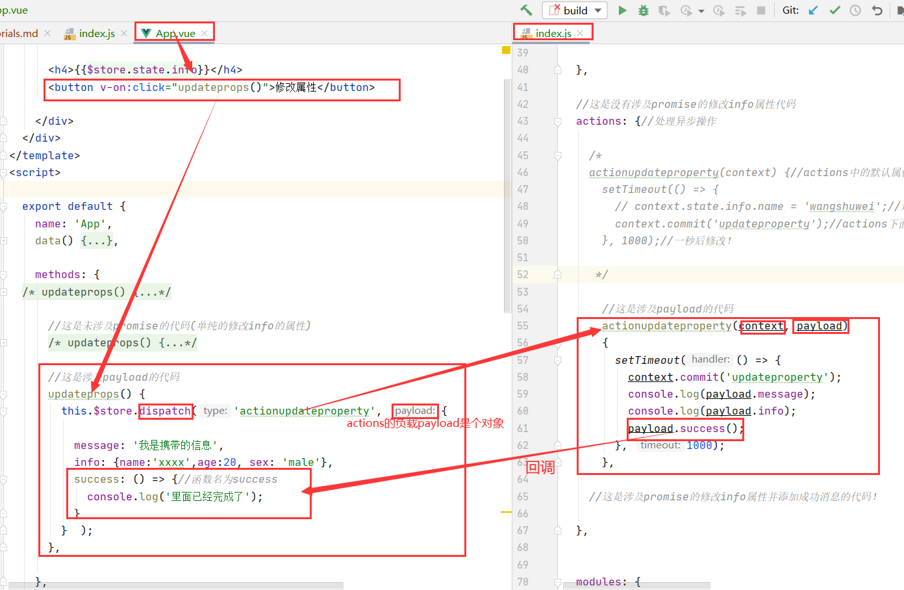

3.展示结果
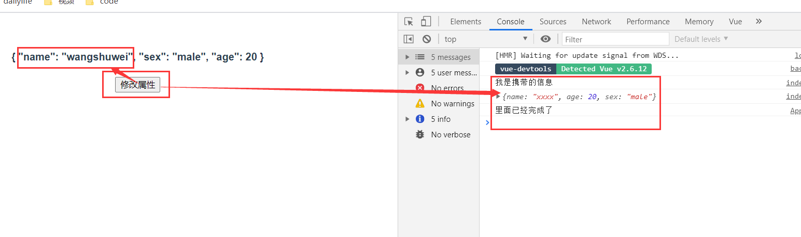


####promise实现(既能传递消息也能传递数据！)
* actions可以返回一个promise对象
1.action中
```vue
 //这是涉及promise的修改info属性并添加成功消息的代码！
    actionupdateproperty(context, payload)
    {
      return new Promise((resolve, reject) => {

        setTimeout(() => {
        context.commit('updateproperty');
        resolve('actions finish commit!!');//resolve给App.vue传递参数'actions finish commit!!'

        }, 1000);
      });//我们不在这里写then，then写在actions返回的new Promise后面，也就是dispatch的后面
    },

```
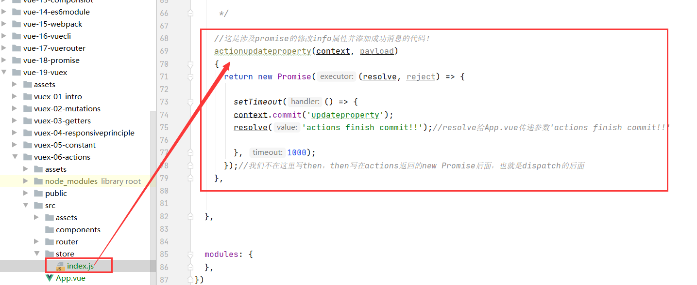

2.App.vue中
```vue
  
      //这是涉及promise的代码
      updateprops() {
        this.$store.dispatch('actionupdateproperty').then((result) => {
          //result 这个参数就是actions中的 resolve('actions finish commit!!');中的"'actions finish commit!!'"
          console.log(result);
          console.log('取得了actions传来的result参数 actions finish commit!!');
        });
      },

```
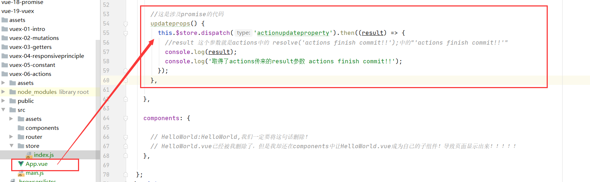

3.结果展示
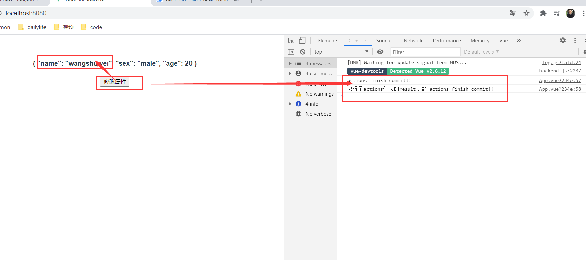
