#modules
##简介
Vue使用单一状态树，那么也意味着很多状态都会交给Vuex来管理。
当应用变得非常复杂时，store对象就有可能变得相当臃肿。
为了解决这个问题，Vuex允许我们将store分割成模块(Module)， 
而每个模块拥有自己的state、mutations、actions、getters、modules(一般都不会有modules了)等

##认识modules
```vue
import Vue from 'vue'
import Vuex from 'vuex'

Vue.use(Vuex)

const modulesA = {
  state: {},
  mutations: {},
  getters: {},
  actions: {},
  modules: {},
  
};

const modulesB = {
  state: {},
  mutations: {},
  getters: {},
  actions: {},
  modules: {},
  
};

const modulesC = {
  state: {},
  mutations: {},
  getters: {},
  actions: {},
  modules: {},
  
};


const store = new Vuex.Store({
  state: {

    info: {
      name: 'liwenli',
      sex: 'male',
      age: 20,
    },
  },
  mutations: {
  },

  getters: {
  },

  actions: {

  },

  modules: {
    modulesA:modulesA,//我们也可以直接在modules里面定义modules,modulesB,modulesC。但是为了显得代码清晰，modules里面代码不臃肿我们会在router对象外面定义modules,modulesB,modulesC
    modulesB:modulesB,
    modulesC:modulesC,
  },
})

export default store;
```
##modules-state
1.在modulesA中定义info状态对象
```vue

const modulesA = {
  state: {info:{name:'wangshuwei',age:20,sex:'female'},},
  mutations: {},
  getters: {},
  actions: {},
  modules: {},

};

```
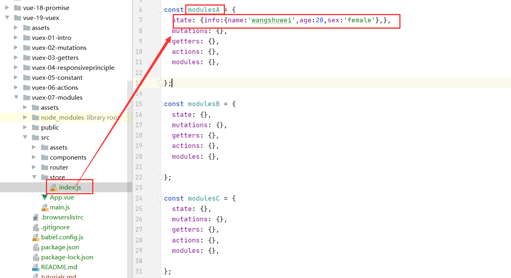

2.在App.vue中通过$store.state.modulesA获取info对象

```vue
<!--      <h4>{{$store.state.modulesA.state.info.name}}</h4>这种写法是错误的！modulesA只是store的一个对象。modulesA中的state其实就是store中的state，只是抽离了而已，所以不需要modulesA后面的state了！！-->
      <h4>{{$store.state.modulesA.info.name}}</h4>

```
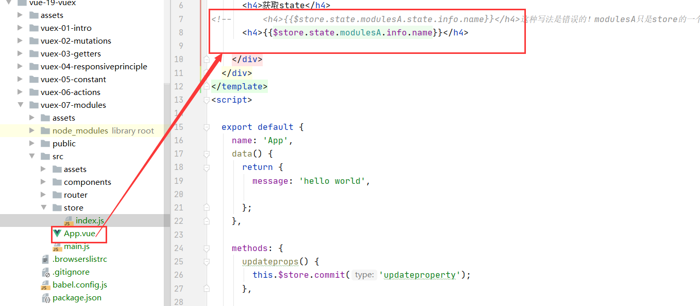

3.结果查看

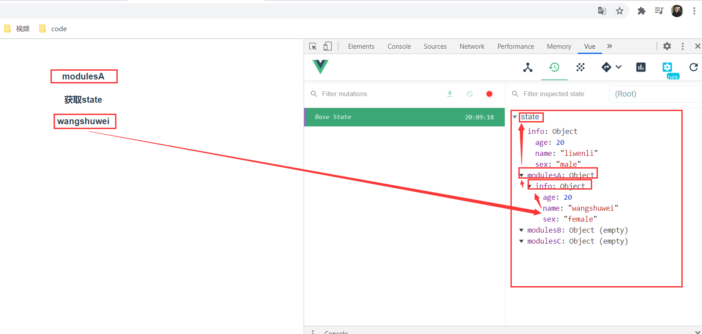

##modules-mutations
1.在modules下面的mutations定义修改info属性的函数
```vue
 mutations: {
    updateproperty(state) {
      state.info.name = 'babay';
    }
  },
```
2.在App.vue下面通过 this.$store.commit()提交修改
```vue
    <h4>====mutations=====</h4>
    <button v-on:click="updateprops()">修改属性</button>
```
```vue
    methods: {
      updateprops() {
        this.$store.commit('updateproperty');
        
        /*先去store下面的mutations找updateproperty函数，
        如果没有找到就会去modules下面的moduleA,moduleB,moduleC寻找updateproperty函数
        (因此我们store里面的mutations下面的方法不要和modulesA下面的mutations函数名相同！！！！)
         */
      },

    },
```
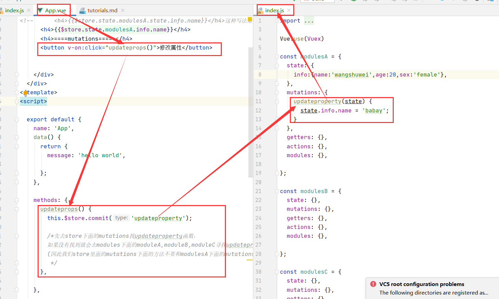

3.结果展示
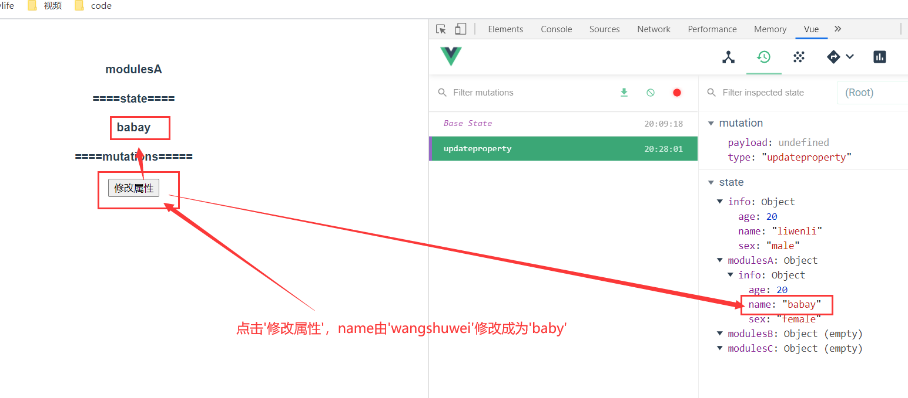


##modules-getters
1.在modulesA中的getters下定义一个getstring的函数
```vue
 getters: {
    getstring(state) {
      return state.info.name + ' love ';
    },
  },
```
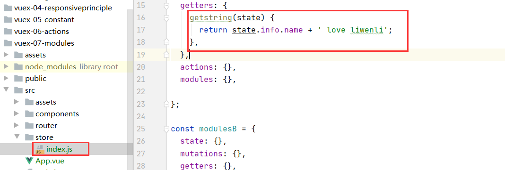

2.在App.vue中通过使用$store.getters使用getstring函数
```vue
<h4>====getters====</h4>
<h4>{{$store.getters.getstring}}</h4>

```
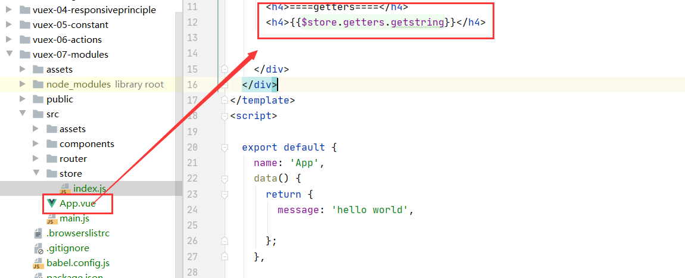

3.展示成果
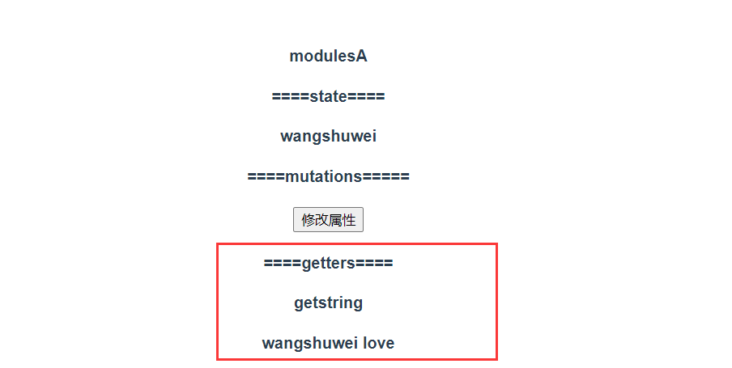


* 假如我们在modulesA中的getters想使用store中的state该怎么办呢？?可以使用rootState参数
* 需求： 在modulesA中的getters中定义一个getstring2,返回modulesA中的getter定义的getstring+store中的state下的info对象

1.在modulesA下的getters定义一个getstring2
```vue
  
    getstring2(state, getters, rootState) {
      return getters.getstring + rootState.info.name;
    },

```


2.在App.vue中通过使用$store.getters使用getstring2函数

```vue
   <h4>getstring2</h4>
   <h4>{{$store.getters.getstring2}}</h4>
```
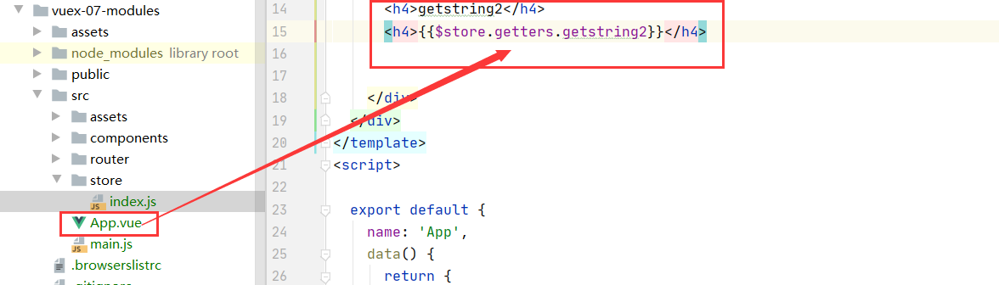

3.结果展示
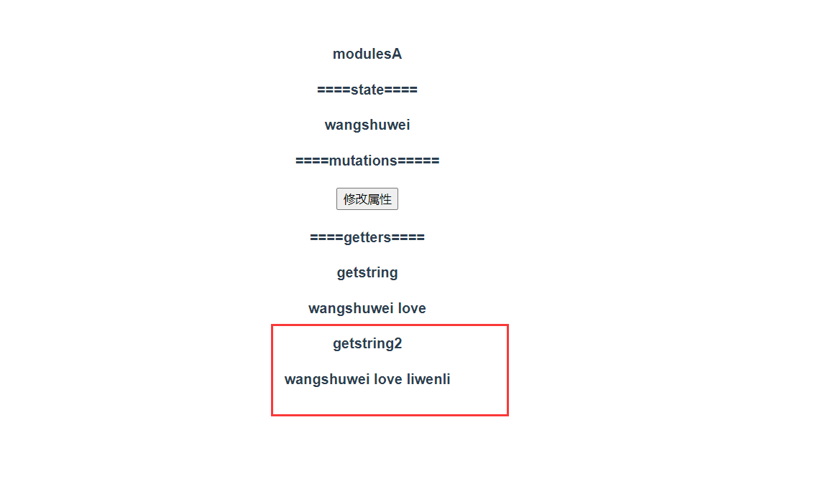

##modules-actions
* modulesA中的context.commit()只提交到modules中，
我们也可以根据context这个单词的意思猜出，它只根据上下文。
也就是context.commit()中的context如果是在store对象中则提交到store对象里面。
如果context是在modulesA中则提交到modulesA中！！

1.在modulesA中的actions中定义一个异步函数actionupdateproperty()
```vue
actions: {
    actionupdateproperty(context) {
      return new Promise((resolve, reject) => {
        setTimeout(() => {
          context.commit('updateproperty');
          resolve('异步修改属性，成功！');//给App.vue传递一个参数！
        }, 2000);
      });
    }
  },
```
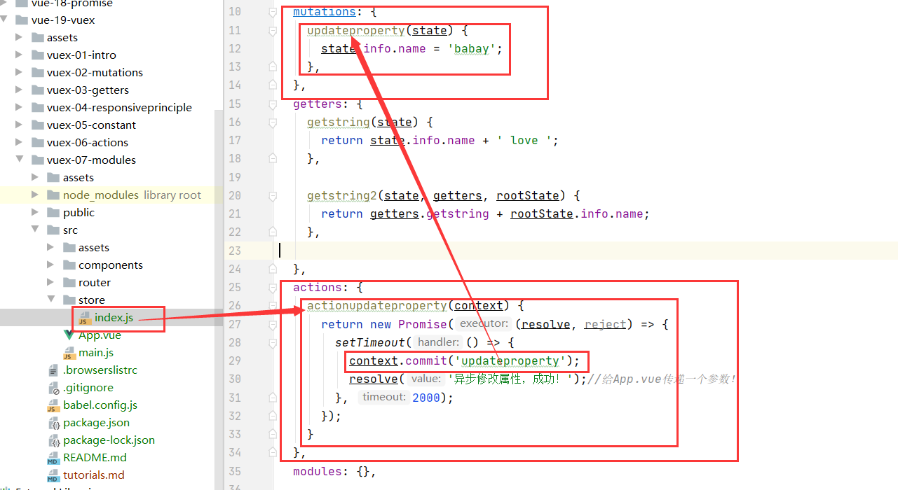

2.在App.vue中提交
```vue
<h4>异步修改属性</h4>
<button v-on:click="asyncupdateprops()">修改属性</button>
```
```vue
      asyncupdateprops() {
        this.$store.dispatch('actionupdateproperty').then((result) => {
          console.log(result);//result 参数的值就是actions中的resolve('异步修改属性，成功！');
          console.log('报告上级，resolve(\'异步修改属性，成功！\'); 传递的参数接收到了！！！内容是 异步修改属性，成功！');
        });
      },

```
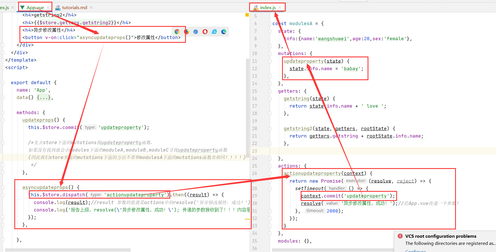

3.结果展示
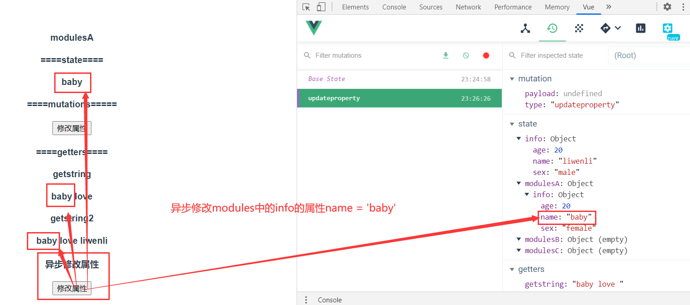
