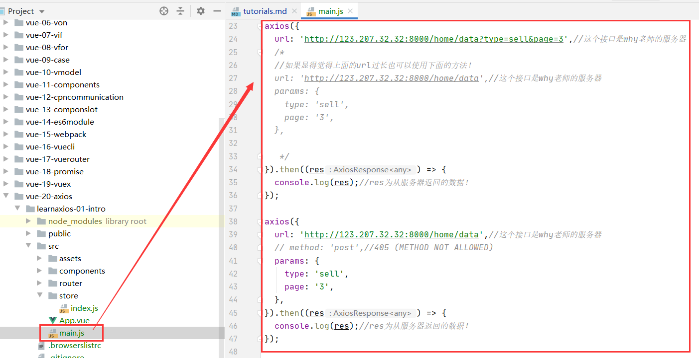
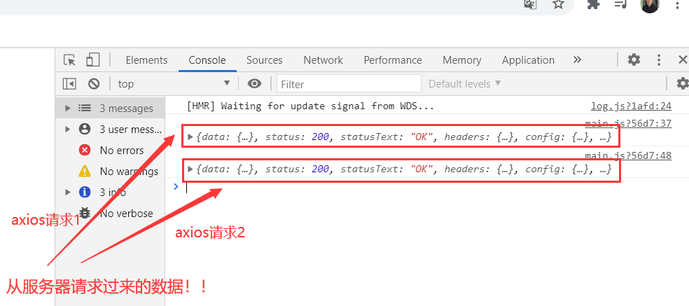

#axios-intro
##安装axios
```vue
npm install axios --save
//这里是不需要加 --dev的！因为开发和生产环境都要用到axios
```
##使用axios
```vue

axios({
  url: 'http://123.207.32.32:8000/home/data?type=sell&page=3',//这个接口是why老师的服务器
  /*
  //如果显得觉得上面的url过长也可以使用下面的方法！
  url: 'http://123.207.32.32:8000/home/data',//这个接口是why老师的服务器
  params: {
    type: 'sell',
    page: '3',
  },

   */
}).then((res) => {
  console.log(res);//res为从服务器返回的数据！
});

axios({
  url: 'http://123.207.32.32:8000/home/data',//这个接口是why老师的服务器
  // method: 'post',//405 (METHOD NOT ALLOWED)
  params: {
    type: 'sell',
    page: '3',
  },
}).then((res) => {
  console.log(res);//res为从服务器返回的数据！
});

```


##效果展示

