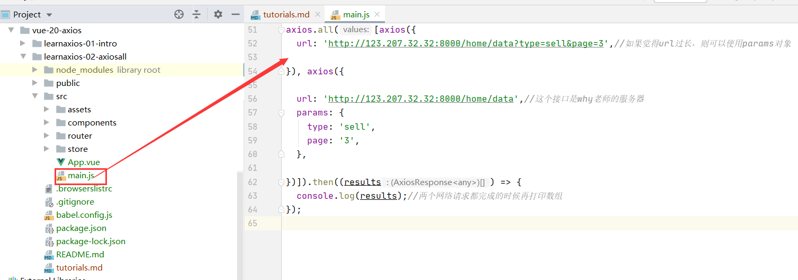
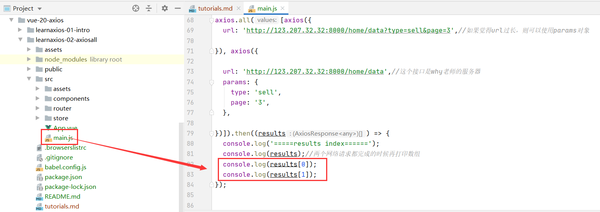
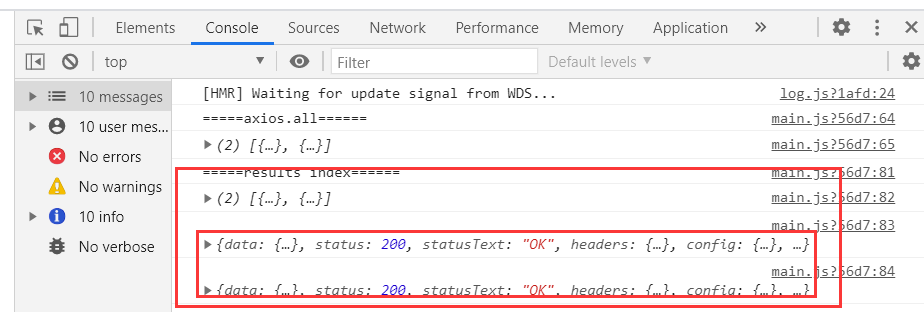
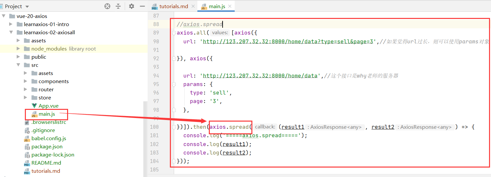
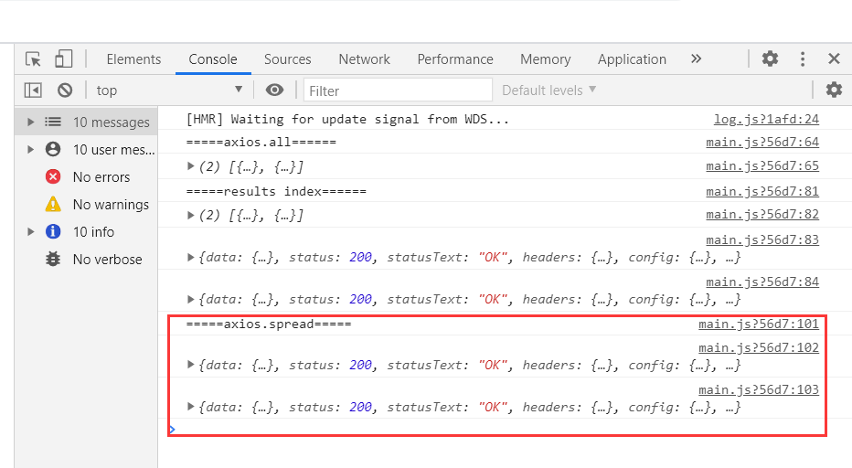

#(axios发送并发请求)
##axios.all()
* axios.all([])可以对传入的网络请求进行合并(类似于Promise.all)
* 使用axios.all, 可以放入多个请求的数组
```vue
axios.all([axios({
  url: 'http://123.207.32.32:8000/home/data?type=sell&page=3',//如果觉得url过长，则可以使用params对象

}), axios({

  url: 'http://123.207.32.32:8000/home/data',//这个接口是why老师的服务器
  params: {
    type: 'sell',
    page: '3',
  },

})]).then((results) => {
  console.log(results);//两个网络请求都完成的时候再打印数组
});

```


##axios.spread()
* 假如我们需要将axios.all([])返回的数组(假设返回数组的名字是results)展开，我们应该怎么做呢？？

1.通过返回数组的下标results[0],results[1]
```vue
axios.all([axios({
  url: 'http://123.207.32.32:8000/home/data?type=sell&page=3',//如果觉得url过长，则可以使用params对象

}), axios({

  url: 'http://123.207.32.32:8000/home/data',//这个接口是why老师的服务器
  params: {
    type: 'sell',
    page: '3',
  },

})]).then((results) => {
  console.log('=====results index======');
  console.log(results);//两个网络请求都完成的时候再打印数组
  console.log(results[0]);
  console.log(results[1]);
});

```


展示结果


2.通过axios.spread()
```vue
//axios.spread
axios.all([axios({
  url: 'http://123.207.32.32:8000/home/data?type=sell&page=3',//如果觉得url过长，则可以使用params对象

}), axios({

  url: 'http://123.207.32.32:8000/home/data',//这个接口是why老师的服务器
  params: {
    type: 'sell',
    page: '3',
  },

})]).then(axios.spread((result1, result2) => {
  console.log('=====axios.spread=====');
  console.log(result1);
  console.log(result2);
}));

```


