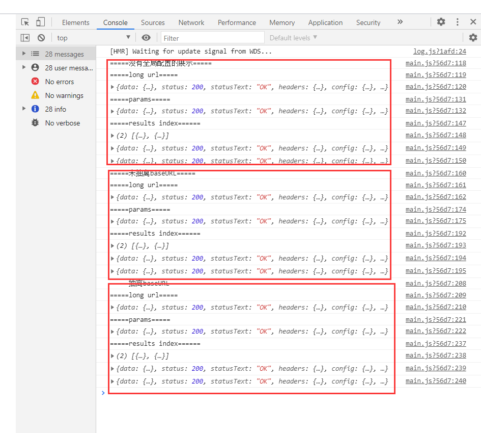
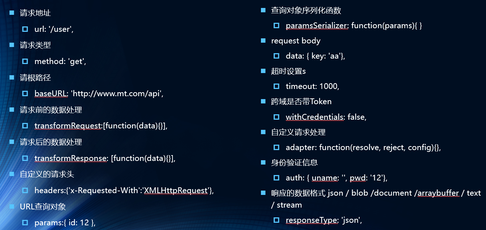

#axios-config
##引言
在开发中可能很多参数都是固定的，这个时候我们可以进行一些抽取, 也可以利用axios的全局配置

##baseURL
1. 我们发现url中有一长串是重复的！我们可以进行抽离！
```vue
http://123.207.32.32:8000/
```
```vue

axios({
  url: 'http://123.207.32.32:8000/home/data?type=sell&page=3',//这个接口是why老师的服务器

}).then((res) => {
  console.log('=====long url=====');
  console.log(res);//res为从服务器返回的数据！
});

axios({
  url: 'http://123.207.32.32:8000/home/data',//这个接口是why老师的服务器
  // method: 'post',//405 (METHOD NOT ALLOWED)
  params: {
    type: 'sell',
    page: '3',
  },
}).then((res) => {
  console.log('=====params=====');
  console.log(res);//res为从服务器返回的数据！
});

axios.all([axios({
  url: 'http://123.207.32.32:8000/home/data?type=sell&page=3',//如果觉得url过长，则可以使用params对象

}), axios({

  url: 'http://123.207.32.32:8000/home/data',//这个接口是why老师的服务器
  params: {
    type: 'sell',
    page: '3',
  },

})]).then((results) => {
  console.log('=====results index======');
  console.log(results);//两个网络请求都完成的时候再打印数组
  console.log(results[0]);
  console.log(results[1]);
});

```
2.用baseURL表示
```vue

axios({
  baseURL: 'http://123.207.32.32:8000',
  url: '/home/data?type=sell&page=3',//这个接口是why老师的服务器

}).then((res) => {
  console.log('=====有全局配置展示=====');
  console.log('=====long url=====');
  console.log(res);//res为从服务器返回的数据！
});

axios({
  baseURL: 'http://123.207.32.32:8000',
  url: '/home/data',//这个接口是why老师的服务器
  // method: 'post',//405 (METHOD NOT ALLOWED)
  params: {
    type: 'sell',
    page: '3',
  },
}).then((res) => {
  console.log('=====params=====');
  console.log(res);//res为从服务器返回的数据！
});

axios.all([axios({
  baseURL: 'http://123.207.32.32:8000',
  url: '/home/data?type=sell&page=3',//如果觉得url过长，则可以使用params对象

}), axios({

  baseURL: 'http://123.207.32.32:8000',
  url: '/home/data',//这个接口是why老师的服务器
  params: {
    type: 'sell',
    page: '3',
  },

})]).then((results) => {
  console.log('=====results index======');
  console.log(results);//两个网络请求都完成的时候再打印数组
  console.log(results[0]);
  console.log(results[1]);
});

```

3.将baseURL设置成全局参数
```vue
//抽离baseURL
axios.defaults.baseURL = 'http://123.207.32.32:8000';
axios.defaults.timeout = 5000;//这里是毫秒，axios.defaults.timeout = 5;则会超时！！
```
```vue

//抽离baseURL
axios.defaults.baseURL = 'http://123.207.32.32:8000';
axios.defaults.timeout = 5000;//这里是毫秒，axios.defaults.timeout = 5;则会超时！！
axios({
  url: '/home/data?type=sell&page=3',//这个接口是why老师的服务器

}).then((res) => {
  console.log('=====抽离baseURL=====');
  console.log('=====long url=====');
  console.log(res);//res为从服务器返回的数据！
});

axios({
  url: '/home/data',//这个接口是why老师的服务器
  // method: 'post',//405 (METHOD NOT ALLOWED)
  params: {
    type: 'sell',
    page: '3',
  },
}).then((res) => {
  console.log('=====params=====');
  console.log(res);//res为从服务器返回的数据！
});

axios.all([axios({
  url: '/home/data?type=sell&page=3',//如果觉得url过长，则可以使用params对象

}), axios({

  url: '/home/data',//这个接口是why老师的服务器
  params: {
    type: 'sell',
    page: '3',
  },

})]).then((results) => {
  console.log('=====results index======');
  console.log(results);//两个网络请求都完成的时候再打印数组
  console.log(results[0]);
  console.log(results[1]);
});

```


##其他配置


##注意事项
1.method='get'的时候，用params
```vue
 url: '/home/data',//这个接口是why老师的服务器
 method:'get',
  params: {//get请求用params
    type: 'sell',
    page: '3',
  },
```
2.method='post'的时候，用data
```vue
 url: '/home/data',//这个接口是why老师的服务器
 method:'post',
  data: {//post请求用data
    type: 'sell',
    page: '3',
  },
```
