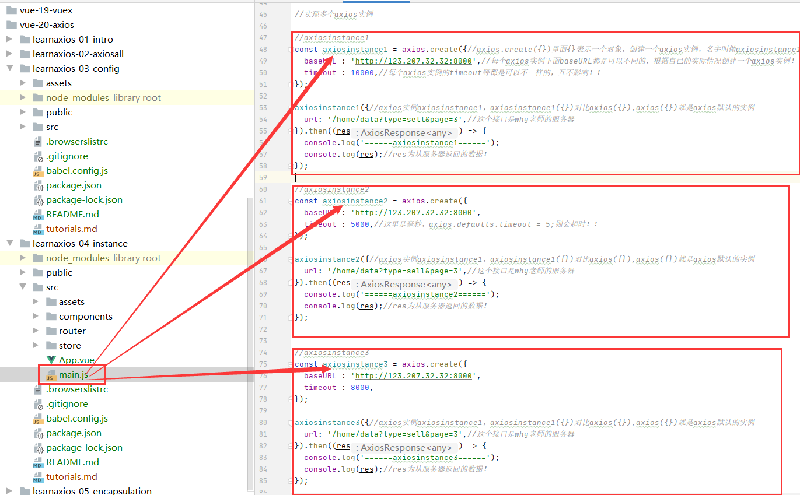

#axios-instance(axios实例)
##为什么要实现axios实例？
1.在前面的章节中我们所有的请求都是请求到默认axios实例中的全局配置里面的服务器，
但是在我们项目中可能不同的页面(不同的vue组件)请求的是不同的服务器(这样可以分担服务器压力)，
这时候只有一个默认axios实例的全局配置难以满足需求，我们需要有多个不同的baseURL和timeout等配置。
我们应该怎么实现这个需求呢？我们可以实现axios的多个实例，在多个实例中配置各自的baseURL和timeout等
配置。

```vue
 
//生成多个axios的实例，实现不同的配置
axios.defaults.baseURL = 'http://123.207.32.32:8000';
axios.defaults.timeout = 5000;//这里是毫秒，axios.defaults.timeout = 5;则会超时！！

axios({
  url: '/home/data?type=sell&page=3',//这个接口是why老师的服务器
}).then((res) => {
  console.log(res);//res为从服务器返回的数据！
});


axios({
  url: '/home/data',
  /*假设我们请求的是http://124.208.33.33:8000/home/data中的数据，
  但是我们现在只有一个默认axios实例，因此这里还是会去请求http://123.207.32.32:8000/home/data中的数据。
  为了实现请求http://124.208.33.33:8000/home/data数据，我们应该让我们这个url去拼接另外一个baseURL:'http://124.208.33.33:8000'
  因此我们要再实现一个axios实例,里面有baseURL:'http://124.208.33.33:8000'等
  
  
   */
  params: {
    type: 'sell',
    page: '3',
  },
}).then((res) => {
  console.log(res);//res为从服务器返回的数据！
});
 
```

##实现axios多个实例
```vue

//实现多个axios实例

//axiosinstance1
const axiosinstance1 = axios.create({//axios.create({})里面{}表示一个对象，创建一个axios实例，名字叫做axiosinstance1
  baseURL : 'http://123.207.32.32:8000',//每个axios实例下面baseURL都是可以不同的，根据自己的实际情况创建一个axios实例！！
  timeout : 10000,//每个axios实例的timeout等都是可以不一样的，互不影响！！
});

axiosinstance1({//axios实例axiosinstance1，axiosinstance1({})对比axios({}),axios({})就是axios默认的实例
  url: '/home/data?type=sell&page=3',//这个接口是why老师的服务器
}).then((res) => {
  console.log('======axiosinstance1======');
  console.log(res);//res为从服务器返回的数据！
});

//axiosinstance2
const axiosinstance2 = axios.create({
  baseURL : 'http://123.207.32.32:8000',
  timeout : 5000,//这里是毫秒，axios.defaults.timeout = 5;则会超时！！
});

axiosinstance2({//axios实例axiosinstance1，axiosinstance1({})对比axios({}),axios({})就是axios默认的实例
  url: '/home/data?type=sell&page=3',//这个接口是why老师的服务器
}).then((res) => {
  console.log('======axiosinstance2======');
  console.log(res);//res为从服务器返回的数据！
});


//axiosinstance3
const axiosinstance3 = axios.create({
  baseURL : 'http://123.207.32.32:8000',
  timeout : 8000,
});

axiosinstance3({//axios实例axiosinstance1，axiosinstance1({})对比axios({}),axios({})就是axios默认的实例
  url: '/home/data?type=sell&page=3',//这个接口是why老师的服务器
}).then((res) => {
  console.log('======axiosinstance3======');
  console.log(res);//res为从服务器返回的数据！
});

```


