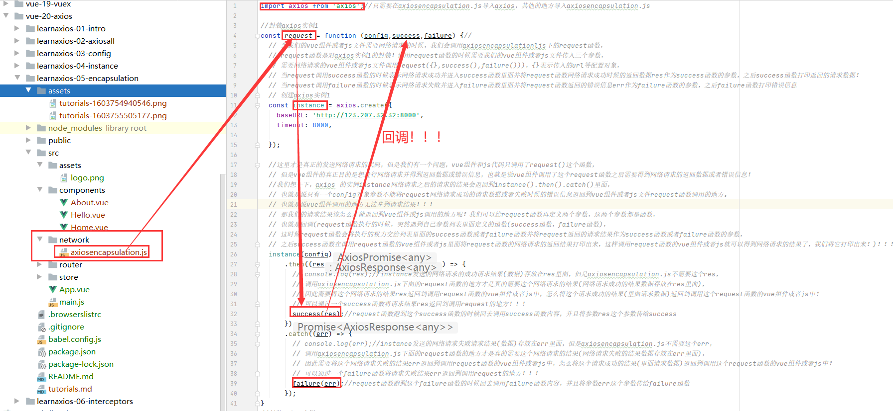

#axios-encapsulation(封装axios)
##为什么要封装axios?
1.我们想一想一个问题，当vue组件从服务器发送数据请求的时候我们需要引入axios框架，
也就是说每个发送数据请求的vue组件都需要引入一次axios框架，但是如果有一天axios框架淘汰了或者说
axios框架停止维护的时候，我们就需要更换网络请求的框架，
想想我们每个导入了axios框架的发个发送网络请求的vue组件都需要进行更换其他的网络请求框架，假如有成千上万个vue组件呢？
那我们得更换网络请求框架到什么时候？？因此这种重度依赖第三方框架的想法不可取，
也就是说我们应该在我们自己写的代码和框架之间加上一层接口(没有什么是不能加上一层解决问题的)。
这样当axios框架需要进行更换的时候我们只需要更改我们自己增加的那一层接口即可！！这就是减少对第三方框架的方法，尽量做到低耦合！！


##通过回调函数对axios进行封装
###回调函数写法一
* 第一种回调，传入三个参数config对象，success函数，failure函数


1.在src目录下面新建一个network文件夹，里面可以存放很多网络请求框架的封装。

2.在network文件夹下建一个axios的封装取名为axiosencapsulation.js

3.axiosencapsulation.js中对axios进行封装
```js
import axios from 'axios';//只需要在axiosencapsulation.js导入axios，其他的地方导入axiosencapsulation.js

//封装axios实例1
const request = function (config,success,failure) {//
  // 当我们的vue组件或者js文件需要网络请求的时候，我们会调用axiosencapsulationljs下的request函数，
  // request函数是对axios实例1的封装！调用request函数的时候需要我们的vue组件或者js文件传入三个参数，
  // 需要网络请求的vue组件或者js文件调用request({},success(),failure()))，{}表示传入的url等配置对象，
  // 当request调用success函数的时候表示网络请求成功并进入success函数里面并将request函数网络请求成功时候的返回数据res作为success函数的参数，之后success函数打印返回的请求数据！
  // 当request调用failure函数的时候表示网络请求失败并进入failure函数里面并将request函数返回的错误信息err作为failure函数的参数，之后failure函数打印错误信息
  // 创建axios实例1
  const instance = axios.create({
    baseURL: 'http://123.207.32.32:8000',
    timeout: 8000,

  });

  //这里才是真正的发送网络请求的代码，但是我们有一个问题，vue组件和js代码只调用了request()这个函数，
  // 但是vue组件的真正目的是想进行网络请求并得到返回数据或错误信息，也就是说vue组件调用了这个request函数之后需要得到网络请求的返回数据或者错误信息！
  //我们想一下，axios 的实例instance网络请求之后的请求的结果会返回到instance().then().catch()里面，
  // 也就是说只有一个config对象参数不能将request网络请求成功的请求数据或者失败时候的错误信息返回到vue组件或者js文件request函数调用的地方。
  // 也就是说vue组件调用的地方无法拿到请求结果！！！
  // 那我们的请求结果该怎么才能返回到vue组件或js调用的地方呢？我们可以给request函数再定义两个参数，这两个参数都是函数，
  // 也就是回调(request函数执行的时候，突然遇到自己参数列表里面定义的函数(success函数，failure函数)，
  // 这时候request函数会将执行的权力交给列表里面的success函数或者failure函数并将request返回的请求结果作为success函数或者failure函数的参数，
  // 之后success函数在调用request函数的vue组件或者js里面将request函数的网络请求的返回结果打印出来，这样调用request函数的vue组件或者js就可以得到网络请求的结果了，我们将它打印出来！)！！！
  instance(config)
      .then((res) => {
        // console.log(res);//instance发送的网络请求的成功请求结果(数据)存放在res里面，但是axiosencapsulation.js不需要这个res，
        // 调用axiosencapsulation.js下面的request函数的地方才是真的需要这个网络请求的结果(网络请求成功的结果数据存放在res里面)，
        // 因此需要将这个网络请求的结果res返回到调用request函数的vue组件或者js中，怎么将这个请求成功的结果(里面请求数据)返回到调用这个request函数的vue组件或者js中？
        // 可以通过一个success函数将请求结果res返回到调用request的地方！！！
        success(res);//request函数跑到这个success函数的时候回去调用success函数内容，并且将参数res这个参数传给success
      })
      .catch((err) => {
        // console.log(err);//instance发送的网络请求失败请求结果(数据)存放在err里面，但是axiosencapsulation.js不需要这个err，
        // 调用axiosencapsulation.js下面的request函数的地方才是真的需要这个网络请求的结果(网络请求失败的结果数据存放在err里面)，
        // 因此需要将这个网络请求失败的结果err返回到调用request函数的vue组件或者js中，怎么将这个请求成功的结果(里面请求数据)返回到调用这个request函数的vue组件或者js中？
        // 可以通过一个failure函数将请求失败结果err返回到调用request的地方！！！
        failure(err);//request函数跑到这个failure函数的时候回去调用failure函数内容，并且将参数err这个参数传给failure函数
      });
}
//封装axios实例2
const request2 = function (config) {
  // 创建axios实例2
  const instance2 = axios.create({
    baseURL: 'http://123.207.32.32:8000',
    timeout: 5000,
  });


}

//封装axios实例3
const request3 = function (config) {
  // 创建axios实例3
  const instance3 = axios.create({
    baseURL: 'http://123.207.32.32:8000',
    timeout: 3000,
  });
}


//导出封装的axios请求实例
export {
    request,
    request2,
    request3,
};
```



4.vue组件和js文件中需要进行网络请求的地方调用axiosencapsulation.js下面的request函数
* 这里我们假设main.js中进行网络请求。

```js

//axios encapsulation

//1通过回调函数获取返回的网络请求结果
request({//request为axios实例封装！！
  url: '/home/data?type=sell&page=3',//config对象不限于url,还可以传入其他的配置(config)
}, function success(res) {//如果request函数运行到success(res)，request函数会回调自身函数里面的success函数,并将网络请求的成功的返回结果(数据)res作为success的参数，之后success函数将res数据打印
  console.log(res);
}
, function failure(err){//如果request函数到failure(err)，request函数会回调自身函数里面的failure函数,并将网络请求失败的错误信息err作为failure的参数，之后failure函数将err信息打印
  console.log(err);
});//三个参数分别是config,success(),failure().
```


5.回调详情图


6.展示结果


###回调函数写法二
* 第二种回调方式传入一个参数，config对象(config对象里面包含baseConfig对象，success函数，failure函数)

1.axiosencapsulation.js中封装axios
```js
import axios from 'axios';//只需要在axiosencapsulation.js导入axios，其他的地方导入axiosencapsulation.js
```
```js

//封装axios实例2
const request2 = function (config) {//传入一个config对象，config对象里面包含baseConfig这个对象，success函数，failure函数！

  // 创建axios实例2
  const instance2 = axios.create({
    baseURL: 'http://123.207.32.32:8000',
    timeout: 5000,

  });

  instance2(config.baseConfig)
      .then((res) => {

        config.success(res);//request函数跑到这个success函数的时候回去调用success函数内容，并且将参数res这个参数传给success
      })
      .catch((err) => {

        config.failure(err);//request函数跑到这个failure函数的时候回去调用failure函数内容，并且将参数err这个参数传给failure函数
      });


}
```
```js
//导出封装的axios请求实例
export {   
    request2,
};
```

2.在需要网络请求的vue组件或者js中调用request2函数

```js
import {request2} from "./network/axiosencapsulation";//导入网络请求的封装，也就是request！！！！
```

```js

//2通过回调函数获取返回的网络请求结果
request2({//传入的config对象里面又包含baseConfig对象，success函数，failure函数！
  baseConfig: {
    url: '/home/data',
    params: {
      type: 'sell',
      page: '3',
    },
  },
  success:function (res) {//这是对象下面的函数写法，当然这是es5的写法，我们也可以用es6写法！   success(res){},
    console.log(res);
  },
  failure: function (err) {//这是对象下面的函数写法，当然这是es5的写法，我们也可以用es6写法！  failure(err){},
    console.log(err);
  }
}) ;
```


3.展示结果


##通过promise封装
1.axiosencapsulation.js中实现axios封装
```js
import axios from 'axios';//只需要在axiosencapsulation.js导入axios，其他的地方导入axiosencapsulation.js

```
```js

//封装axios实例3
const request3 = function (config) {
  return new Promise((resolve, reject) => {
    // 创建axios实例3
    const instance3 = axios.create({
      baseURL: 'http://123.207.32.32:8000',
      timeout: 3000,
    });

    instance3(config)
        .then((res) => {
          resolve(res);
        })
        .catch((err) => {
          reject(err);
        });
  });
};

```

```js

//导出封装的axios请求实例
export {
  request3,
};
```


2.在需要网络请求的vue组件或者js中调用request3函数
```js
import {request3} from "./network/axiosencapsulation";//导入网络请求的封装，也就是request！！！！

```
```js

//通过Promise实现网络请求结果的返回
request3({//传入的config对象里面又包含baseConfig对象，success函数，failure函数！
  url: '/home/data',
  params: {
    type: 'sell',
    page: '3',
  },

}).then((res) => {
  console.log(res);
}).catch((err) => {
  console.log(err);
});

```


3.展示结果


##直接返回axios的实例
1.我们观察request3函数
```js

    instance3(config)//axios的实例instance3为什么会有下面的instance3(config).then()方法呢？证明axios的实例本身返回的就是一个Promise实例！！！！既然这样为什么我们不直接返回这个实例呢？？这样就不需要再使用Promise对象了！！
        .then((res) => {
          resolve(res);
        })
        .catch((err) => {
          reject(err);
        });
```
```js
//封装axios实例3
const request3 = function (config) {
  return new Promise((resolve, reject) => {
    // 创建axios实例3
    const instance3 = axios.create({
      baseURL: 'http://123.207.32.32:8000',
      timeout: 3000,
    });

    instance3(config)//axios的实例instance3为什么会有下面的instance3(config).then()方法呢？证明axios的实例本身返回的就是一个Promise实例！！！！
    // 既然这样为什么我们不直接返回这个实例呢？？这样就不需要再使用Promise对象了！！
        .then((res) => {
          resolve(res);
        })
        .catch((err) => {
          reject(err);
        });
  });
};
```


2.既然知道了axios的实例instance本身就会返回一个Promise实例，那为何不直接返回这个实例呢？？
```js

//封装axios实例4，这是axios框架的终极方案！！
const request4 = function (config) {
    // 创建axios实例4
    const instance4 = axios.create({
      baseURL: 'http://123.207.32.32:8000',
      timeout: 3000,
    });
    return instance4(config);
    /*
    instance3(config)//axios的实例instance3为什么会有下面的instance3(config).then().catch()方法呢？证明axios的实例本身返回的就是一个Promise实例！！！！既然这样为什么我们不直接返回这个实例呢？？这样就不需要再使用Promise对象了！！
        .then((res) => {
          resolve(res);
        })
        .catch((err) => {
          reject(err);
        });
     */

};

```


3.在需要网络请求的vue组件或者js中调用request4函数
```js
//直接返回axios的实例
request4({//传入的config对象里面又包含baseConfig对象，success函数，failure函数！
  url: '/home/data',
  params: {
    type: 'sell',
    page: '3',
  },

}).then((res) => {
  console.log(res);
}).catch((err) => {
  console.log(err);
});
```


4.展示结果

