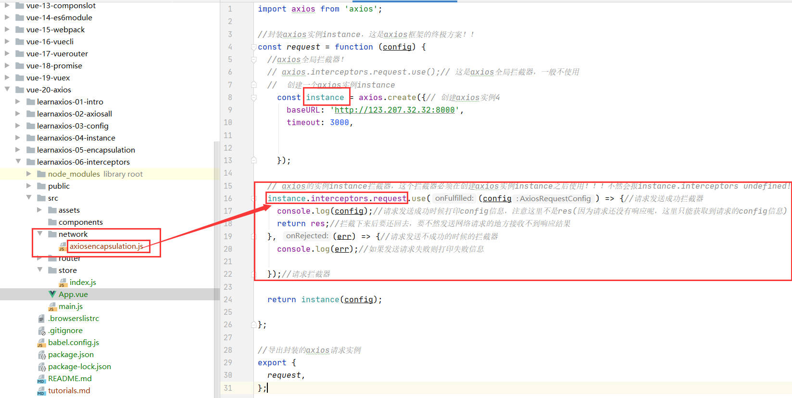
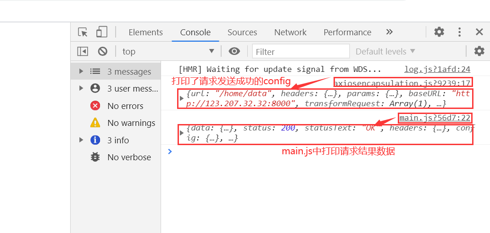
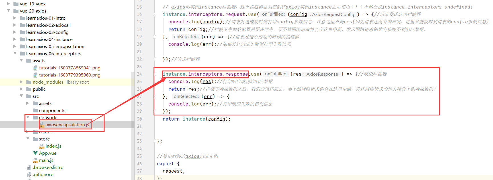
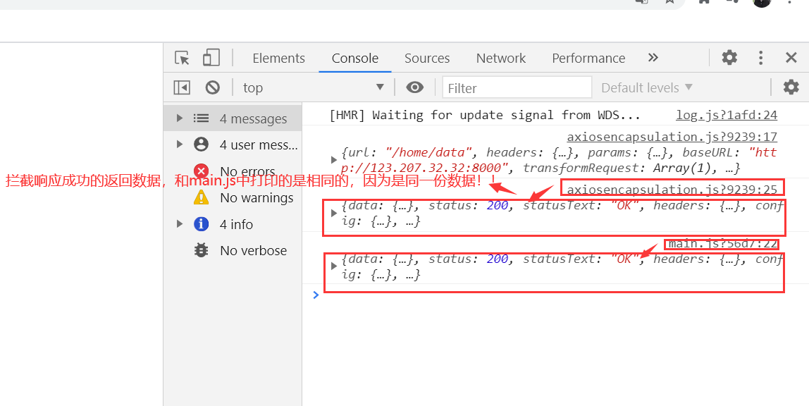
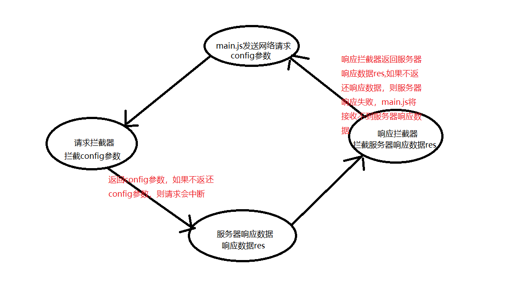

#axios-interceptors
##介绍
1.axios提供了拦截器，用于我们在发送每次请求或者得到响应后进行对应的处理。

2.拦截器分为请求成功请求失败拦截器，响应成功响应失败拦截器

## 请求拦截器
1.在axios实例instance建立请求拦截器
```js
import axios from 'axios';

//封装axios实例instance，这是axios框架的终极方案！！
const request = function (config) {
  //axios全局拦截器！
  // axios.interceptors.request.use();// 这是axios全局拦截器，一般不使用
  //  创建一个axios实例instance
    const instance = axios.create({// 创建axios实例4
      baseURL: 'http://123.207.32.32:8000',
      timeout: 3000,


    });

  // axios的实例instance拦截器，这个拦截器必须在创建axios实例instance之后使用！！！不然会报instance.interceptors undefined!
  instance.interceptors.request.use((config) => {//请求发送成功拦截器
    console.log(config);//请求发送成功时候打印config参数信息，注意这里不是res(因为请求还没有响应呢，这里只能获取到请求的config参数信息)
    return config;//拦截下来参数配置后要还回去，要不然发送网络请求的地方接收不到响应结果
  }, (err) => {//请求发送不成功的时候的拦截器
    console.log(err);//如果发送请求失败则打印失败信息

  });//请求拦截器

  return instance(config);

};

//导出封装的axios请求实例
export {
  request,
};
```


2.main.js中使用request函数发送网络请求
```js
import Vue from 'vue'
import App from './App.vue'
import router from './router'
import store from './store'
import {request} from "./network/axiosencapsulation";//导入网络请求的封装，也就是request！！！！
Vue.config.productionTip = false
new Vue({
  router, store,
  render: h => h(App)
}).$mount('#app')

//axios encapsulation
//直接返回axios的实例
request({
  url: '/home/data',
  params: {
    type: 'sell',
    page: '3',
  },

}).then((res) => {
  console.log(res);
}).catch((err) => {
  console.log(err);
});

```
3.显示请求拦截器拦截结果


4.拦截请求config参数有什么用呢？

* 如果我们发送请求的config参数不和服务器要求的时候，
也就是说我们需要更改config参数的时候，
我们可以使用请求拦截器对请求参数config进行拦截，
然后更改请求的config参数或者添加一些config参数以符合服务器要求。

* 如果我们在每次网络请求的时候都希望在界面中显示一个请求的图标，
那么我们也可以使用请求拦截器以附加一个图标的函数(show方法)！
当我们请求完成之后我们应该在响应拦截器中将图标隐藏起来！

* 当用户在网络请求的时候我们发现该用户没有登陆，
这时候我们使用请求拦截器以添加一个登录令牌(Token)，以通知用户登录后再进行请求！

##响应拦截器
1.在axios实例instance建立响应拦截器
```js
  import axios from 'axios';
  
  //封装axios实例instance，这是axios框架的终极方案！！
  const request = function (config) {
    //axios全局拦截器！
    // axios.interceptors.request.use();// 这是axios全局拦截器，一般不使用
    //  创建一个axios实例instance
      const instance = axios.create({// 创建axios实例4
        baseURL: 'http://123.207.32.32:8000',
        timeout: 3000,
  
  
      });
  
    // axios的实例instance拦截器，这个拦截器必须在创建axios实例instance之后使用！！！不然会报instance.interceptors undefined!
    instance.interceptors.request.use((config) => {//请求发送成功拦截器
      console.log(config);//请求发送成功时候打印config参数信息，注意这里不是res(因为请求还没有响应呢，这里只能获取到请求的config参数信息)
      return config;//拦截下来参数配置后要还回去，要不然网络请求将会在这里中断，发送网络请求的地方接收不到响应数据。
    }, (err) => {//请求发送不成功的时候的拦截器
      console.log(err);//如果发送请求失败则打印失败信息
  
    });//请求拦截器
  
    instance.interceptors.response.use((res) => {//响应拦截器
      console.log(res);//打印响应成功的响应数据
      return res;//拦截下响应数据之后，我们应该还回去，要不然网络请求将会在这里中断，发送网络请求的地方接收不到响应数据！
    }, (err) => {
      console.log(err);//打印响应失败的错误信息
    });
    return instance(config);
  
  
  };
  
  //导出封装的axios请求实例
  export {
    request,
  };
```



2.main.js中使用request函数发送网络请求
```js
import Vue from 'vue'
import App from './App.vue'
import router from './router'
import store from './store'
import {request} from "./network/axiosencapsulation";//导入网络请求的封装，也就是request！！！！
Vue.config.productionTip = false
new Vue({
  router, store,
  render: h => h(App)
}).$mount('#app')

//axios encapsulation
//直接返回axios的实例
request({
  url: '/home/data',
  params: {
    type: 'sell',
    page: '3',
  },

}).then((res) => {
  console.log(res);
}).catch((err) => {
  console.log(err);
});

```
3.展示


##请求响应与拦截器

