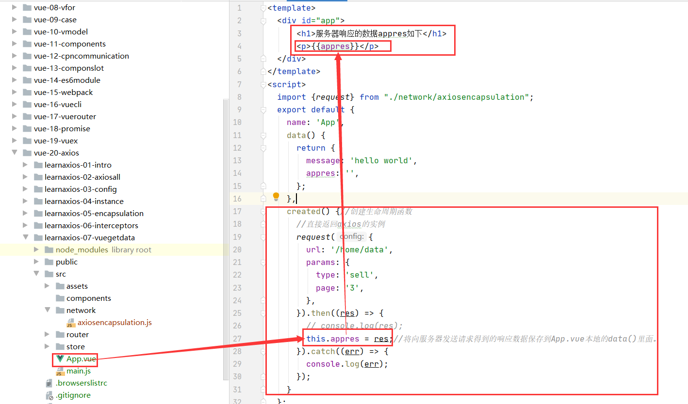
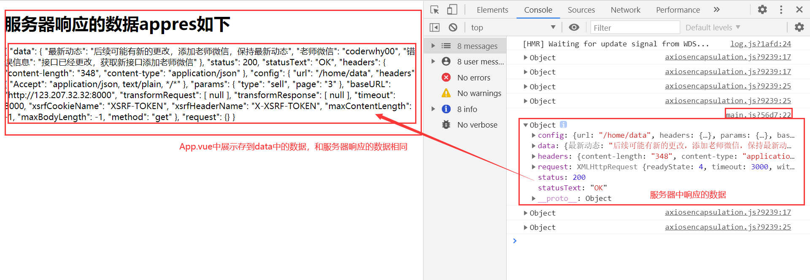

#vue组件获取服务器数据
vue组件向服务器发送网络请求并将网络请求响应的数据存放在自己的data中并展示到浏览器！

1.在vue组件中实现create生命周期函数并在生命周期函数中发送网络请求，之后展示请求的数据
```vue
<template>
  <div id="app">
      <h1>服务器响应的数据appres如下</h1>
      <p>{{appres}}</p>
  </div>
</template>
<script>
  import {request} from "./network/axiosencapsulation";
  export default {
    name: 'App',
    data() {
      return {
        message: 'hello world',
        appres: '',
      };
    },
    created() {//创建生命周期函数
      //直接返回axios的实例
      request({
        url: '/home/data',
        params: {
          type: 'sell',
          page: '3',
        },
      }).then((res) => {
        // console.log(res);
        this.appres = res;//将向服务器发送请求得到的响应数据保存到App.vue本地的data()里面。
      }).catch((err) => {
        console.log(err);
      });
    }
  };

</script>
<style>

</style>

```


2.展示结果



